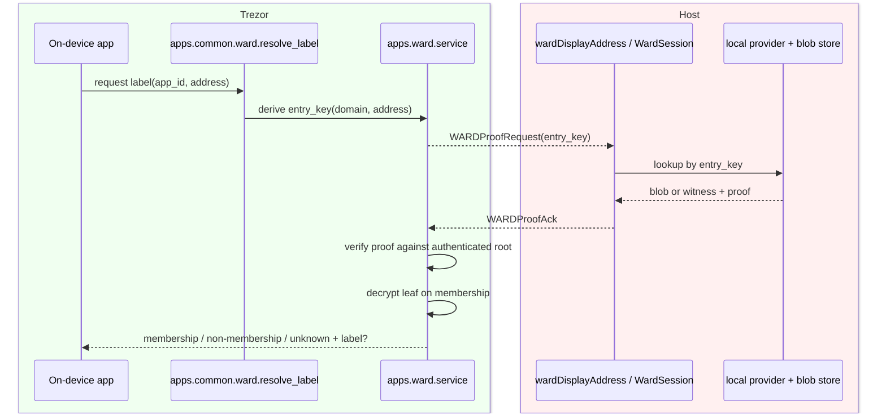
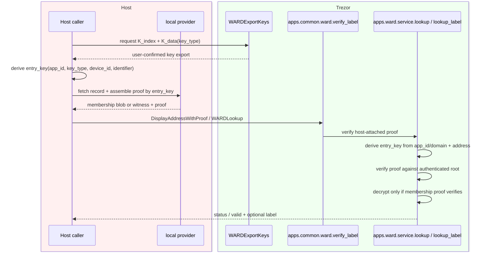
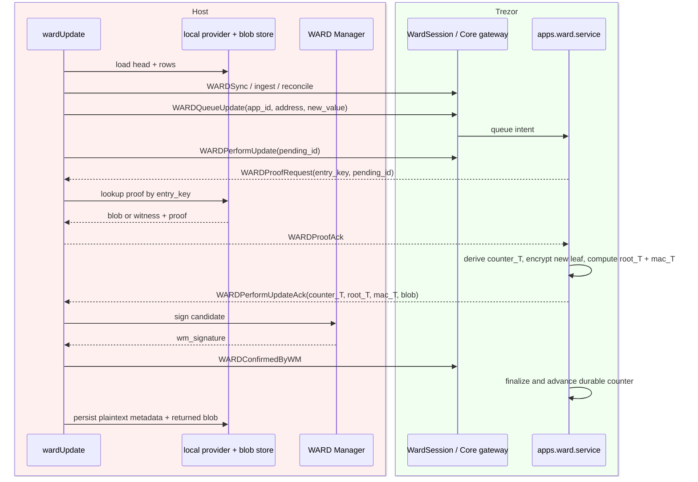
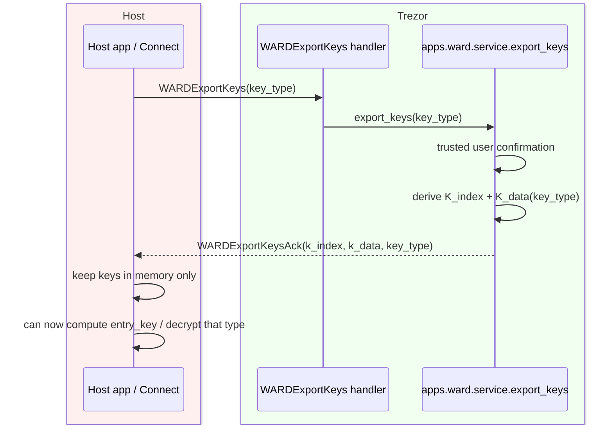

# WARD Scaffolding: Encryption + Keyed MPT Paths

This document replaces the old plaintext-leaf view in `scaffolding.md` for the
current WARD/AuthDB implementation.

It reflects the code as implemented in:

- firmware trust anchor: `trezor-firmware/core/src/apps/ward/service.py`
- firmware Core gateway: `trezor-firmware/core/src/apps/common/ward.py`
- firmware pending storage: `trezor-firmware/core/src/storage/ward_store.py`
- reference crypto/tree code: `trezor-firmware/python/src/trezorlib/ward_crypto.py`,
  `trezor-firmware/python/src/trezorlib/authdb_tree.py`
- host transport and local cache:
  `trezor-suite-petrsusil/packages/connect/src/api/wardMethods/*`,
  `trezor-suite-petrsusil/packages/ward/src/*`

It also folds in the not-yet-implemented follow-ups from `planned_fixes.md` and
`TODO_Entry_key_as_MAC.md` as planned improvements.

## 1. Current cryptographic model

The old model in `scaffolding.md`:

```text
entry_key = sha256(app_id || 0x00 || type || 0x00 || address)
value_hash = sha256(counter || value)
leaf_hash = sha256(0x00 || entry_key || value_hash)
```

is no longer the active source of truth.

The current model is:

```text
K_index              = SLIP21(seed, ["ward", "K_index"])
K_data(key_type)     = SLIP21(seed, ["ward", "K_data", key_type])

scope                = app_id || 0x00 || key_type || 0x00 || device_id(1B)
entry_key            = HMAC-SHA256(K_index, scope || identifier)

plaintext_leaf       = C_leaf(4B) || len16(identifier) || identifier
                       || len32(value) || value || zero-padding
nonce                = random 12B
aad                  = 0x02 || entry_key || entry_type
ct, tag              = ChaCha20-Poly1305(K_data(key_type), nonce, aad, plaintext_leaf)

commit               = SHA-256(0x02 || nonce || tag || len32(ct) || ct)
leaf_hash            = SHA-256(0x00 || entry_key || commit)
internal_hash        = SHA-256(0x01 || left || right)
```

Implications:

- The MPT path is now a keyed PRF output, not a raw hash of public inputs.
- The leaf value is encrypted on the device.
- The host can recompute `commit` and tree hashes from stored blobs, but cannot
  decrypt or derive `entry_key` unless keys are exported.
- Membership proofs carry `(nonce, tag, ct)` plus sibling hashes.
- Non-membership proofs carry `(witness_entry_key, witness_commit)` plus sibling
  hashes, so the witness plaintext stays hidden.

## 2. What is implemented today

### Firmware trust anchor

`service.py` is the on-device source of truth for:

- deriving `K_index` and per-type `K_data`
- deriving `entry_key(app_id, key_type, device_id, identifier)`
- encrypting/decrypting leaves
- verifying membership and non-membership proofs
- computing candidate roots for insert, update, and delete
- MAC-binding roots to `(wallet_id, counter)`
- verifying WM attestation and finalization signatures

The active entry type is still effectively `"address"`, and `device_id` is
implemented in the cryptographic formulas and wire types, but the pending-intent
store does not yet persist `key_type` or `device_id` per queued write.

### Pull model is the active model

The implemented production path is pull-oriented and key-oblivious on the host:

1. The device computes `entry_key` locally.
2. The device sends `WARDProofRequest(entry_key[, pending_id])`.
3. Connect answers by looking up stored opaque blobs by that exact `entry_key`.
4. The device verifies the proof against its authenticated root.
5. For membership, the device decrypts the leaf itself.

This is live in:

- firmware Core gateway: `apps/common/ward.py`
- host proof callback: `packages/connect/src/api/wardMethods/proofAck.ts`
- host session orchestration: `packages/connect/src/api/wardMethods/wardSession.ts`

### Host stores device-produced leaf blobs

After `WARDPerformUpdate`, the device returns the encrypted leaf blob:

```text
entry_key, entry_type, nonce, tag, ct
```

Connect persists that blob in the local provider. Future proofs are served from
those blobs, not recomputed from plaintext.

Current sqlite shape:

- table `addresses` still uses `(ward_id, app_id, address, network_symbol)` as the
  primary key
- encrypted leaf material is stored as JSON in nullable `blob`
- plaintext metadata is still stored in `data`

This means the active implementation already has encrypted leaves for tree
authenticity, but host blindness is not yet fully realized because plaintext is
still co-stored.

### WM / freshness model remains unchanged

The encryption/path migration did not remove the existing WM-backed freshness
model:

- `WARDSync` starts a round
- WM signs the freshness head
- device ingests the attestation
- device reconciles host root against attested `(counter, mac)`
- update rounds produce candidate `(counter_T, root_T, mac_T)`
- WM signs the final candidate
- device finalizes and advances the durable counter floor

So the current system is:

- encrypted leaf payloads
- keyed MPT paths
- WM-signed freshness and CAS discipline

## 3. Current component map

| Component | Plane | Current role |
| --- | --- | --- |
| `apps/ward/service.py` | Trezor | Derives keys, encrypts/decrypts leaves, verifies proofs, computes candidate roots, verifies WM signatures |
| `apps/common/ward.py` | Trezor | Gateway between apps / wire handlers and the trust anchor; runs pull proof requests |
| `storage/ward_store.py` | Trezor | Durable counter floor and pending queue |
| `storage/ward_head.py` | Trezor | Volatile authenticated root and sync-round state |
| `trezorlib/ward_crypto.py` | Reference host lib | Canonical host/reference implementation of keyed path + encrypted leaf primitives |
| `trezorlib/authdb_tree.py` | Reference host lib | Commit-based, key-first MPT |
| `packages/connect/.../wardSession.ts` | Host | All WARD transport rounds and reactive proof callback handling |
| `packages/connect/.../proofAck.ts` | Host | Builds `WARDProofAck` by opaque `entry_key` from stored blobs |
| `packages/ward/src/storage/sqlite` | Host | Local cache; stores plaintext metadata plus device-produced blob |
| WARD Manager | External | Attests freshness head and final candidate |

## 4. Current flows

### 4.1 Label lookup / display

Active trusted-screen lookup is pull-based:

1. on-device app asks Core to resolve a label
2. Core authorizes the app for lookup
3. device derives `entry_key`
4. device sends `WARDProofRequest(entry_key)`
5. host responds with:
   - membership: `entry_type, nonce, tag, ct, proof`
   - non-membership: `witness_entry_key, witness_commit, proof`
6. device verifies against the authenticated root
7. if membership, device decrypts the leaf and renders the value

This path is implemented and working.



### 4.2 PUSH label verification path

There is also a separate push-style path for label verification. In this flow the
host attaches the proof up front and the device does not send a `WARDProofRequest`.

This is the path behind the gated `verify_label(...)` helper in
`apps/common/ward.py`, which classifies a host-supplied membership or
non-membership proof against the device's authenticated root.

For a real PUSH-by-identifier flow, key export is a prerequisite. Without
`WARDExportKeys`, the host does not know how to derive the target `entry_key`, so it
does not know which record to fetch or which proof to assemble.

Important distinction:

- PUSH here means "host pushes proof material to the device".
- In the keyed-path model, that requires the host to already know `entry_key`.
- Therefore a real PUSH-by-identifier path includes prior export of
  `(K_index, K_data(key_type))`.



### 4.3 Update flow

The current authenticated write flow is:

1. host loads local rows and tree head
2. host syncs/adopts the current WM-attested head onto the device
3. host queues an intent with `app_id`, `address`, `new_value`
4. device stores the pending intent
5. device resolves the intent to `entry_key`
6. device sends `WARDProofRequest(entry_key, pending_id)`
7. host answers by `entry_key` from its stored blobs
8. device derives `counter_T = counter_loc + 1`
9. device encrypts the new leaf itself
10. device computes `root_T` and `mac_T`
11. device returns the candidate plus the new encrypted leaf blob
12. WM signs `(ward_id, counter_T, mac_T)`
13. device finalizes, installs the new root, advances the durable counter, drops
    the pending item
14. host persists plaintext metadata and the returned blob locally

The critical change from the old model is step 9 and step 11: the device is now
the encryptor, and the host must persist the exact blob returned by the device.



### 4.4 Key export flow

`WARDExportKeys` is implemented, but it is a separate capability flow and is not
part of the active pull-based label display or update rounds in Connect today.
It is, however, a prerequisite for a true host-driven PUSH-by-identifier flow.

What it does:

1. host requests export for a `key_type`
2. device shows a trusted confirmation
3. device returns `(K_index, K_data(key_type))`
4. host may then keep those keys in memory and use them to:
   - compute `entry_key` from `(app_id, key_type, device_id, identifier)`
   - decrypt/encrypt leaves for that exported type

What it does not do:

- it does not export `K_sig`
- it does not itself verify or finalize anything
- it is not currently wired into the active Connect proof/display/update flow



With key export, a host can run a truly autonomous PUSH-by-identifier path. Without
key export, the host cannot derive `entry_key` from the identifier and therefore
cannot know which record to fetch for a keyed-path proof.

## 5. Security properties of the current state

Implemented now:

- The host cannot derive trie paths without `K_index`.
- The host cannot fabricate a valid membership leaf without a blob that hashes into
  the authenticated root.
- Non-membership witnesses no longer reveal neighbour plaintext.
- The device, not the host, stamps `C_leaf` and performs encryption.
- Writes are domain-bound because `app_id` is inside the keyed `entry_key` scope
  and is shown on-device during confirmation.

Still limited today:

- Connect/sqlite still stores plaintext metadata, so the host is not blind.
- The active host data model is blob-aware, but not yet shaped around `entry_key`
  as a first-class top-level key.
- Per-device/per-type scopes are cryptographically defined, but not yet threaded
  end-to-end through queued writes.

## 6. Current gaps and divergences

### Gap A: `wardVerify` non-membership is degraded

The working pull path can prove non-membership because the device computes the
target `entry_key`.

`wardVerify` still uses a degraded push-style absent-entry branch:

- if the entry is absent locally, it returns host-side absence only
- result is `valid: false`
- a malicious host could hide an existing entry in that path

This is the main correctness/security gap in the active flows.

### Gap B: `entry_key` is not yet first-class in host storage

The host already stores `entryKey` inside `WardLeafBlob`, but only nested in the
JSON `blob` column. It is not yet:

- a dedicated column
- indexed
- the primary host record key

That is enough for the current PoC, but not enough for the intended Evolu-backed
record shape.

### Gap C: host-blindness is not yet realized

Leaves are encrypted, but the local provider still stores plaintext metadata in
parallel. So the current migration gives:

- integrity/authenticity of tree contents
- opaque proof serving by `entry_key`

but not:

- confidentiality from the host cache

### Gap D: per-type and per-device writes are not fully threaded

`key_type` and `device_id` exist in:

- wire messages
- `entry_key` derivation
- AEAD key derivation

but not in durable queued intents. `perform()` still defaults to:

```text
key_type = "address"
device_id = 0
```

### Gap E: lineage / reconstruction model is still incomplete

Today the host reconstructs the current root from all current blob rows.

What is still missing is the design-level lineage model:

- per-transition `parent_hash` / `target_hash`
- stored root MAC per transition
- optional stored WM final signature / anchor
- backward-walk reconstruction from a head root
- forward replay with per-batch root checks

So the current implementation works as a single-host current-state cache, but not
yet as the full record-lineage model described in `ward-design.md`.

## 7. Planned improvements already identified

The following are not yet implemented, but are the current intended next steps.

### 7.1 Route absent-entry verify through the device pull path

Planned from `planned_fixes.md`:

- make `wardVerify` prove non-membership via the same pull mechanism used by
  `wardDisplayAddress`
- let the device compute `entry_key`
- let Connect answer `WARDProofRequest(entry_key)`
- return `valid: true, isMember: false` for genuinely proven absence

### 7.2 Promote `entry_key` to a first-class record field

Planned from `planned_fixes.md` and `TODO_Entry_key_as_MAC.md`:

- add top-level `entry_key` storage on the host side
- index it directly
- make proof serving O(1) by `entry_key`
- align provider/Evolu records with the actual keyed-path design

This is the main host data-model cleanup needed after the crypto migration.

### 7.3 Persist batch lineage and implement proper reconstruction

Planned from `planned_fixes.md`:

- store `prev_root` / `target_root` for each committed transition
- store `target_root_mac`
- optionally store the WM final signature / anchor
- stamp entries with the transition counter that produced them
- implement backward walk from head root, forward replay, and per-batch root checks

This is the missing bridge from "current cache" to full verifiable synchronization.

### 7.4 Thread `key_type` and `device_id` through pending intents

Planned from both TODO files:

- extend `ward_store` queue framing to persist `key_type` and `device_id`
- remove the current `perform()` defaults
- make per-device and per-type records real end-to-end behavior, not just crypto
  affordances

### 7.5 Optional host-blind mode via key export

Implemented on firmware but not used in the active flow:

- `WARDExportKeys` exists
- firmware asks for trusted confirmation
- firmware returns `(K_index, K_data(key_type))`

Planned decision path:

- if host-blindness is the goal, drop plaintext metadata storage and use only blobs
- if direct host rendering is needed, allow session-scoped in-memory key export for
  the selected type

The key-export path is currently present but effectively dead code relative to the
active pull flow.

### 7.6 Evolu-backed provider

Still planned:

- implement a real Evolu `WardProvider`
- store encrypted blob records shaped around `entry_key`
- support the lineage/reconstruction model rather than the sqlite-only local cache shape

## 8. Important design clarifications

### `entry_key` is a path PRF, not an authorization MAC

Although the path is now a keyed HMAC output, it is not itself the write
authorization mechanism.

Write authorization still comes from:

- trusted on-device user confirmation
- WARD service ACL / domain binding
- WM-signed freshness/finalization flow

The keyed path gives privacy and host-unforgeability of the trie path.

### The host still sees some structure

Even with encrypted leaves, the current implementation still exposes to the host:

- row existence
- `entry_type`
- ciphertext length bucket
- current blob count
- plaintext metadata, because the current sqlite provider still stores it

So the migration is substantial, but not yet the final privacy posture.

## 9. Short status summary

Current state:

- encrypted leaves: implemented
- MPT path as keyed MAC/HMAC-derived `entry_key`: implemented
- pull proofs by opaque `entry_key`: implemented
- device-produced blob persistence: implemented
- WM freshness/finalization flow: still active and integrated
- `WARDExportKeys`: implemented but not used by active flows

Still planned:

- device-proven non-membership in `wardVerify`
- first-class `entry_key` storage shape
- per-batch lineage and reconstruction
- persistent `key_type` / `device_id` through queued writes
- optional host-blind mode
- Evolu-native provider

## 10. Relationship to `scaffolding.md`

`scaffolding.md` is still useful for the broad WARD lifecycle and WM flow, but it
is stale on the tree/leaf layer.

For any discussion of current trie semantics, proof contents, or host/device
responsibilities around entries, this file should be treated as the up-to-date
scaffolding document.

## 11. Protobuf definitions: privacy-relevant vs privacy-violating

This section is taken from the current workspace state of
`trezor-firmware/common/protob/messages-ward.proto`.

The goal here is not to restate the whole file, but to isolate the wire fields
that matter for privacy review:

- `privacy relevant`: fields that implement the keyed-path / encrypted-leaf model
- `privacy violating`: fields or flows that still expose identifiers, plaintext, or
  export secrets to the host

### 11.1 Privacy-relevant protobuf definitions

These are the wire-level changes that implement "encryption + MAC/path for
addresses".

#### `WARDProofRequest`

Privacy-relevant because the device now asks the host by opaque `entry_key`
instead of plaintext address or domain.

```proto
message WARDProofRequest {
    reserved 1;                      // was plaintext address
    optional uint32 pending_id = 2;
    reserved 3;                      // was app_id
    required bytes  entry_key  = 4;  // opaque 32B HMAC path
}
```

#### `WARDProofAck`

Privacy-relevant because membership now returns encrypted leaf material, and
non-membership returns only hashed witness material.

```proto
message WARDProofAck {
    reserved 1;                              // was plaintext value
    repeated bytes  proof             = 2;
    reserved 3;                              // was plaintext counter
    optional bytes  witness_entry_key = 4;   // opaque neighbour path
    optional bytes  witness_commit    = 5;   // commit over encrypted blob
    reserved 6;                              // was witness_counter
    reserved 7;                              // was app_id
    optional string entry_type        = 8;   // selects K_data(entry_type)
    optional bytes  nonce             = 9;   // membership leaf nonce
    optional bytes  tag               = 10;  // membership leaf tag
    optional bytes  ct                = 11;  // membership leaf ciphertext
}
```

#### `WARDLookup`

Privacy-relevant because lookup verification now uses encrypted membership blobs
and opaque witness material.

```proto
message WARDLookup {
    required bytes  address            = 1;
    reserved 2;                              // was plaintext value
    repeated bytes  proof              = 3;
    optional bytes  witness_entry_key  = 4;
    optional bytes  witness_commit     = 5;
    reserved 6;                              // was plaintext counter
    reserved 7;                              // was witness_counter
    optional string app_id             = 8;
    optional string key_type           = 9;
    optional uint32 device_id          = 10;
    optional bytes  nonce              = 11;
    optional bytes  tag                = 12;
    optional bytes  ct                 = 13;
}
```

#### `WARDPerformUpdateAck`

Privacy-relevant because the device is now the encryptor and returns the blob the
host must store.

```proto
message WARDPerformUpdateAck {
    required uint32 counter    = 1;
    optional bytes  new_root   = 2;
    optional bytes  mac        = 3;
    optional bytes  wallet_id  = 4;
    optional bytes  ward_id    = 5;
    optional bytes  entry_key  = 6;
    optional string entry_type = 7;
    optional bytes  nonce      = 8;
    optional bytes  tag        = 9;
    optional bytes  ct         = 10;
}
```

### 11.2 Privacy-violating protobuf definitions

These are the parts of the current workspace that still weaken privacy, even
after the keyed-path and encrypted-leaf migration.

#### `WARDQueueUpdate`

Privacy-violating because the host still sends the plaintext identifier and the
plaintext new value to the device.

```proto
message WARDQueueUpdate {
    required bytes  address   = 1;  // plaintext identifier
    required bytes  new_value = 2;  // plaintext value
    optional string app_id    = 3;  // plaintext domain
    optional string key_type  = 4;
    optional uint32 device_id = 5;
}
```

This is expected for the current update flow, but it means the host remains aware
of the edited identifier and content.

#### `WARDLookup`

Privacy-violating in its current API shape because the host still supplies the
plaintext `address` to the device on the PUSH verify path.

```proto
message WARDLookup {
    required bytes  address            = 1;  // plaintext identifier still on wire
    ...
    optional string app_id             = 8;  // plaintext domain still on wire
    optional string key_type           = 9;
    optional uint32 device_id          = 10;
    ...
}
```

This is fine for host-attached verification semantics, but it is not the same
privacy posture as the PULL proof request, where the host only sees `entry_key`.

#### `WARDExportKeys` / `WARDExportKeysAck`

Privacy-violating by design: they deliberately hand the host enough key material
to derive paths and decrypt values for an exported type.

```proto
message WARDExportKeys {
    optional string key_type = 1;
}

message WARDExportKeysAck {
    optional bytes  k_index  = 1;
    optional bytes  k_data   = 2;
    optional string key_type = 3;
}
```

This is the explicit downgrade that makes true host-driven PUSH possible.

### 11.3 Combined annotated view

This section shows the privacy-relevant and privacy-violating aspects together so
the wire-level tradeoff is easy to compare.

#### Proof pull vs proof push

```proto
// PULL: privacy-improving
message WARDProofRequest {
    reserved 1;                      // old plaintext address removed
    optional uint32 pending_id = 2;
    reserved 3;                      // old plaintext app_id removed
    required bytes  entry_key  = 4;  // host sees only opaque keyed path
}

message WARDProofAck {
    reserved 1;                              // old plaintext value removed
    repeated bytes  proof             = 2;
    reserved 3;                              // old plaintext counter removed
    optional bytes  witness_entry_key = 4;   // opaque witness path
    optional bytes  witness_commit    = 5;   // commit over encrypted blob
    reserved 7;                              // old plaintext app_id removed
    optional string entry_type        = 8;   // still visible
    optional bytes  nonce             = 9;
    optional bytes  tag               = 10;
    optional bytes  ct                = 11;
}

// PUSH: still privacy-weaker
message WARDLookup {
    required bytes  address            = 1;  // plaintext identifier still present
    reserved 2;                              // plaintext value removed
    repeated bytes  proof              = 3;
    optional bytes  witness_entry_key  = 4;
    optional bytes  witness_commit     = 5;
    optional string app_id             = 8;  // plaintext domain still present
    optional string key_type           = 9;
    optional uint32 device_id          = 10;
    optional bytes  nonce              = 11;
    optional bytes  tag                = 12;
    optional bytes  ct                 = 13;
}
```

#### Device-encrypted write result vs plaintext queued intent

```proto
// Privacy-violating input side: host still queues plaintext intent
message WARDQueueUpdate {
    required bytes  address   = 1;  // plaintext identifier
    required bytes  new_value = 2;  // plaintext value
    optional string app_id    = 3;  // plaintext domain
    optional string key_type  = 4;
    optional uint32 device_id = 5;
}

// Privacy-improving output side: device returns encrypted leaf blob
message WARDPerformUpdateAck {
    required uint32 counter    = 1;
    optional bytes  new_root   = 2;
    optional bytes  mac        = 3;
    optional bytes  wallet_id  = 4;
    optional bytes  ward_id    = 5;
    optional bytes  entry_key  = 6;  // keyed path
    optional string entry_type = 7;  // still visible
    optional bytes  nonce      = 8;
    optional bytes  tag        = 9;
    optional bytes  ct         = 10; // encrypted leaf payload
}
```

#### Host-blind PULL vs host-capable PUSH

```proto
// Host-blind leaning: no keys exported, host serves by opaque entry_key only
message WARDProofRequest {
    required bytes  entry_key  = 4;
}

// Host-capable PUSH: explicit privacy downgrade
message WARDExportKeys {
    optional string key_type = 1;
}

message WARDExportKeysAck {
    optional bytes  k_index  = 1;  // host can derive entry_key from identifier
    optional bytes  k_data   = 2;  // host can decrypt/encrypt exported type
    optional string key_type = 3;
}
```

### 11.4 Practical reading of the protobuf delta

At protobuf level, the privacy story is:

- improved:
  - `WARDProofRequest` no longer exposes plaintext address or `app_id`
  - `WARDProofAck` and `WARDLookup` no longer carry plaintext membership values
  - witness material is now `witness_entry_key + witness_commit`, not plaintext
    witness data
  - `WARDPerformUpdateAck` persists encrypted leaves rather than host-recomputed
    plaintext leaves

- still privacy-weaker:
  - `WARDQueueUpdate` still carries plaintext identifier/value/domain
  - `WARDLookup` PUSH verification still carries plaintext identifier/domain
  - `WARDExportKeys` deliberately exports secrets to the host

That is the exact current workspace wire-format split between the new privacy
properties and the remaining/privacy-relaxing parts.
