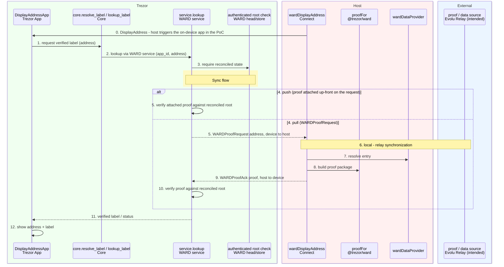
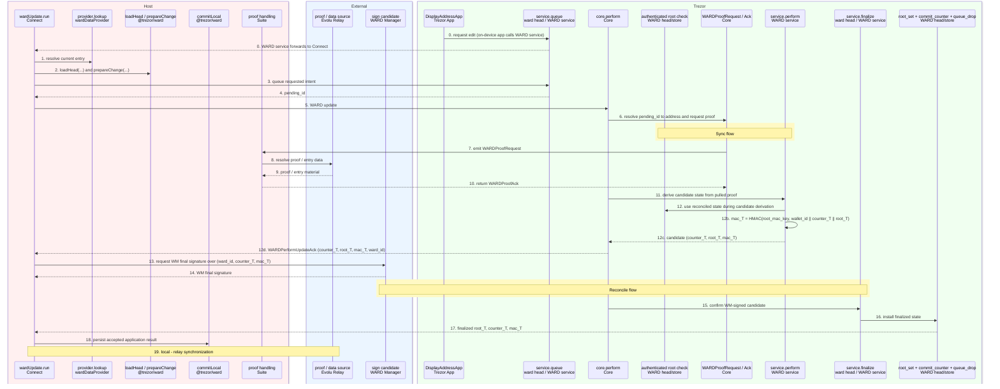
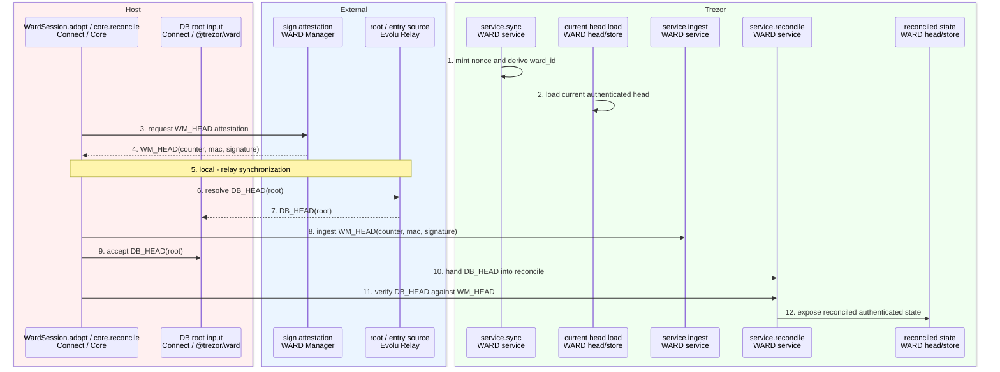
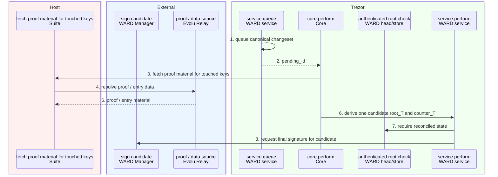

# WARD Scaffolding


>
> ```
> entry_key  = sha256(app_id || 0x00 || type || 0x00 || address)   # 32B, == trie path
> value_hash = sha256(counter(4B BE) || value)
> leaf_hash  = sha256(0x00 || entry_key || value_hash)
> ```
> ToDo:  add type into the leaf 


## Flow diagrams

These diagrams show the intended function flow

### Components

Components span three planes:
* ***Host** (Connect / `@trezor/ward`), 
* ***Trezor** (firmware),
* ***External** (the WARD Manager, and Evolu Relay). 

| component                      | layer                 | role                                                                                                                                                               | file / location                                                              |
| ------------------------------ | --------------------- | ------------------------------------------------------------------------------------------------------------------------------------------------------------------ | ---------------------------------------------------------------------------- |
| WARD Manager (WM)              | External · service    | freshness authority: signs ATTEST/FINAL preimages over `wardId` (Ed25519), compare-and-set on `(counter, mac)`                                                     | `trezor-suite-sync/src/wardManager`                                          |
| Evolu Relay                    | External · service    | encrypted entry + root-blob storage/sync; Suite pulls/pushes. In the PoC the host uses `wardDataProvider` instead                                                  | *(intended; not wired in the PoC)*                                           |
| Suite                          | Host · app            | desktop orchestrator in the intended flow; `connect-cli` stands in for it in the PoC                                                                               | *(intended; not wired in the PoC)*                                           |
| `WardSession`                  | Host · Connect        | device-transport seam: owns every WARD `typedCall` round (`sync`/`adopt`/`queue`/`perform`/`confirm`/`lookup`/`discardPending`)                                    | `packages/connect/src/api/wardMethods/wardSession.ts`                        |
| `Core gateway`                 | Trezor · firmware     | capability boundary; routes pull-style proof requests and message sequencing                                                                                       | `core/src/apps/common/ward.py`                                               |
| `WARD service`                 | Trezor · firmware     | trust anchor: derives keys, verifies proofs + WM signatures, decides every authenticated state transition                                                          | `core/src/apps/ward/service.py`                                              |
| `WARD store`                   | Trezor · firmware     | persistent (survives reboot): anti-rollback counter floor + pending-intent queue                                                                                   | `core/src/storage/ward_store.py`                                             |
| `WARD head`                    | Trezor · firmware     | volatile (cleared on lock/reboot): reconciled authenticated head (root + attested counter/mac) + in-flight sync round                                              | `core/src/storage/ward_head.py`                                              |
| `wardDataProvider`             | Host · `@trezor/ward` | untrusted local DB mirror of entries + tree state, keyed by `wardId`                                                                                               | `packages/ward/src/storage` (`InMemoryWardDb`, sqlite `WardDb`)              |
| `WardManagerService`           | Host · Connect        | WM client (`Mock`/`Http`) → `POST /ward/attest`, `/ward/commit`                                                                                                    | `packages/connect/src/api/wardMethods/wardManagerService.ts`                 |
| DisplayAddressApp / getAddress | Trezor · firmware     | on-device app that requests a verified label (the lookup driver)                                                                                                   | `core/src/apps/display_address/*.py`, `core/src/apps/bitcoin/get_address.py` |
| App layer                      | Host · `@trezor/ward` | pure, transport-free helpers: `loadHead`/`loadEntry`/`proofFor`/`prepareChange`/`commitLocal`                                                                      | `packages/ward/src/app/index.ts`                                             |
| WARD method handlers           | Host · Connect        | public entry points (`wardInit`/`wardUpdate`/`wardVerify`/`wardDisplayAddress`/`wardLookup`/`wardSetRoot`/`wardListPending`); orchestrate app layer + session + WM | `packages/connect/src/api/wardMethods/api/ward*.ts`                          |
| Wire handlers                  | Trezor · firmware     | thin adapters from protobuf messages into `Core` + `WARD service`                                                                                                  | `core/src/apps/ward/*.py`                                                    |
| connect-cli                    | Host · dev            | PoC driver (`dbinit`/`dblookup`/`dbchange`/`dbdisplay`); stands in for **Suite**                                                                                   | `packages/connect-cli`                                                       |

#### WARD store

Persistent device state that must survive power loss:

- `counter_loc`: per-wallet anti-rollback floor. No finalized or reconciled state may install a counter at or below this floor.
- pending-intent queue: durable queued edits keyed by `pending_id`, so user-approved intent is not lost across reboot.
- pending-id allocator: monotonic sequence to prevent stale perform or finalize calls from aliasing a different intent.

This module is intentionally dumb storage: no proof verification, no WM signature verification, and no key derivation.

#### WARD head

Volatile authenticated state for the current unlocked-device session (module
`ward_head`):

- authenticated root: the root currently trusted by the device for lookup and update verification.
- sync-round context: the nonce from `WARDSync`, round state, and the WM-attested freshness head for the current reconcile round.

This volatility is deliberate. Losing session state forces a new sync and re-attestation instead of silently trusting stale data after reboot.

#### WARD service

The audited module that implements authenticity and freshness:

- identity and key derivation: wallet-local scoping, `ward_id`, and MAC binding of root to counter.
- proof primitives: membership, non-membership, root reconstruction, and candidate root derivation.
- WM verification: attestation and finalization signature verification against the provisioned WM key.
- authenticated operations: `sync`, `ingest`, `reconcile`, `queue`, `perform`, `finalize`, `lookup`, `pending`, `discard`, `debug_set_root`.

It is the only module allowed to bind store state, session state, and external authenticated inputs into one decision.

#### How they fit together

```text
wire handlers (apps/ward/*.py)
        |
Core gateway (apps/common/ward.py)
        |
WARD service (apps/ward/service.py)
        |-- reads/writes --> WARD store   (durable: counter floor + pending intents)
        `-- reads/writes --> WARD head    (volatile: authenticated root + sync round)
```

This matches the two-plane model used by the flows:

- `WARD head` carries the freshness head and the current authenticated root.
- `WARD store` carries the durable counter floor and pending intents.
- `WARD service` is the only place allowed to bind those planes together and mutate either one.

### Lookup flow

Two distinct lookups exist — do not conflate them:

- **On-device label display** (this section) — an on-device app (`DisplayAddressApp` /
  `getAddress`) obtains a verified label by calling the **WARD service** via Core. The
  app NEVER calls the host directly; the WARD service verifies against the reconciled
  root and, on the pull path, requests proof material from the host on demand.
- **Host-driven verify** (`wardVerify` / connect-cli `dblookup`) — the *host* is the
  driver: it builds the proof from the provider and sends `WARDLookup` straight to the
  WARD service. No on-device app is involved (same `service.lookup` primitive — see the
  WARD flow section).

Initiated by: `DisplayAddressApp` on Trezor (a host `DisplayAddress` request triggers it
in the PoC).
Achieves: the on-device app gets a WARD-verified label from the WARD service, which
verifies against the reconciled root — pulling proof material from the host when needed.

```python
# Driver: DisplayAddressApp on Trezor
# Synchronous:
# - in-process app -> Core -> WARD service calls, all on the device
# Asynchronous:
# - WARD service <-> Host proof pull (WARDProofRequest / WARDProofAck)
# - Host <-> Evolu Relay data fetch 

async def lookup_flow(app_id, address):
    # sync on Trezor: the app asks the on-device WARD service via Core.
    
    status, label = await core.resolve_label(app_id, address)
    #   core.resolve_label -> service.lookup, which:
    #     - emits WARDProofRequest(address) to the host 
    #     - async: host answers WARDProofAck from wardDataProvider  
    #     - verifies the proof against the reconciled root

    # sync on Trezor: the app renders the address + verified label
    display_address_app.show(address, status, label)
    return status, label
```



0. In the PoC the host (`wardDisplayAddress`) sends `DisplayAddress`, which starts the on-device app. (In the intended on-device `getAddress` flow the app starts locally.)
1. The `DisplayAddressApp` asks the on-device **WARD service, via Core** (`resolve_label` / `lookup_label`) for a verified label — it does not call the host.
2. Core routes the request into `service.lookup`.
3. WARD requires reconciled authenticated state (a root in `WARD head`) before verifying.
4. The flow branches on push vs pull.
5. Push: the host attached the proof up-front on the request, so WARD verifies it directly against the reconciled root.
6. Pull: WARD emits `WARDProofRequest(address)` to the host.
7. The host resolves the entry from `wardDataProvider`…
8. …and builds the proof package (from the local provider in the PoC; from Evolu Relay in the intended flow).
9. The host answers `WARDProofAck(proof)` back to the device.
10. WARD verifies the pulled proof against the reconciled root.
11. WARD returns the verified label / status to `DisplayAddressApp`.
12. The app renders the address with its verified label.

### Update flow

Initiated by: `wardUpdate.run` on the host.
Achieves: queues an intended change, derives a candidate authenticated state, finalizes it with WM, and persists the accepted application result.

```python
# Driver: wardUpdate.run on Host
# Synchronous:
# - local host preparation and local commit
# - Trezor internal service/store transitions
# Asynchronous:
# - Host <-> Trezor transport
# - Suite <-> Evolu Relay proof fetch
# - Host <-> WARD Manager signature request

async def update_flow(address, metadata):
    # sync on Host: read current state and prepare requested change
    old_entry = provider.lookup(address)
    rows, tree = loadHead()
    change = prepareChange(rows, old_entry, metadata)

    # async Host -> Trezor
    pending_id = await session.queue(change.new_value)

    # async Host -> Trezor: start perform round
    proof_request = await core.perform.begin(pending_id)

    # async Host -> Suite -> ER -> Suite -> Host
    proof_material = await suite.fetch_proof_from_er(proof_request)

    # async Host -> Trezor: deliver WARDProofAck and get candidate
    candidate = await service.perform(proof_material)

    # sync on Trezor: candidate derivation checks authenticated root
    require_authenticated_root()

    # async Host -> WM -> Host
    wm_signature = await ward_manager.sign_candidate(candidate)

    # async Host -> Trezor
    installed = await session.confirm(candidate, wm_signature)

    # sync on Trezor: install root, commit counter, drop pending edit
    finalize_installed_candidate(installed)

    # sync on Host: persist local accepted result
    commitLocal(address, metadata, installed)
    return installed
```



0. Optionally, an on-device `DisplayAddressApp` starts the edit by calling the WARD service, which forwards the request to Connect (dashed); the host-driven steps below then run.
1. Connect resolves the current host-side entry for the address being updated.
2. Connect loads the current database head and prepares the requested application change.
3. Connect queues the requested intent on the device.
4. The device returns a durable `pending_id` for that queued intent.
5. Connect runs the WARD perform round for that pending change.
6. Core resolves the pending intent back to its address and requests proof material for it.
7. Core emits `WARDProofRequest` to Suite.
8. Suite resolves the needed proof and entry data from Evolu Relay.
9. Evolu Relay returns the proof and entry material to Suite.
10. Suite returns `WARDProofAck` to the Trezor side.
11. Core hands the pulled proof material to `service.perform` so the device can derive a candidate state.
12. Candidate derivation is checked against reconciled authenticated state.
12b. As the last step of `service.perform`, the device binds the candidate by computing `mac_T = HMAC(root_mac_key, wallet_id || counter_T || root_T)`.
12c. The service returns the candidate `(counter_T, root_T, mac_T)` to Core.
12d. Core returns it to the host in `WARDPerformUpdateAck` (`counter_T`, `root_T`, `mac_T`, `ward_id`), so Connect/Suite now hold the device-bound MAC.
13. Connect forwards `(ward_id, counter_T, mac_T)` to WARD Manager for the FINAL signature (the WM signature is taken over `mac_T`).
14. WARD Manager returns the final signature for that candidate.
15. Core confirms the WM-signed candidate with the finalize path on the device.
16. Finalize installs the authenticated state into session and store.
17. The device returns the finalized `root_T`, `counter_T`, and `mac_T` to the host.
18. Connect persists the accepted application result locally.
19. The host synchronizes the local state with Evolu Relay.

### Sync and reconcile flow

Initiated by: `wardInit.run` or an update bootstrap on the host.
Achieves: combines WM freshness state with the reconstructed database root so Trezor exposes one reconciled authenticated state for later lookup and update flows.

```python
# Driver: wardInit.run or wardUpdate bootstrap on Host
# Synchronous:
# - Trezor internal sync/ingest/reconcile state transitions
# Asynchronous:
# - Host <-> Trezor transport
# - Host <-> WARD Manager attestation request
# - Host <-> Evolu Relay root fetch

async def sync_and_reconcile_flow(counter, mac, root_hint):
    # 1-2 (async Host -> Trezor): mint nonce, derive ward_id, load current head
    sync_round = await service.sync()

    # 1-2 (sync on Trezor): mint nonce and derive ward_id
    nonce, ward_id = sync_round.nonce, sync_round.ward_id
    current_head = load_current_authenticated_head()

    # 3-4 (async Host -> WM -> Host): request + receive WM_HEAD attestation
    wm_head = await ward_manager.sign_attestation(ward_id, nonce, counter, mac)

    # 5-7 (local <-> relay sync, then async Host -> ER -> Host): resolve DB_HEAD(root)
    db_root = await evolu_relay.fetch_root(root_hint)

    # 8 (async Host -> Trezor): ingest WM_HEAD
    await service.ingest(wm_head)

    # 8 (sync on Trezor): record attested WM_HEAD
    record_attested_head(wm_head)

    # 9-11 (async Host -> Trezor): accept DB_HEAD, hand into reconcile, verify vs WM_HEAD
    reconciled = await service.reconcile(db_root)

    # 12 (sync on Trezor): bind DB_HEAD(root) to WM_HEAD(counter, mac), expose it
    expose_reconciled_state(reconciled)
    return reconciled
```



1. The device starts a sync round by minting a nonce and deriving `ward_id`.
2. The device loads its current authenticated head from session and store.
3. Connect asks WARD Manager for a freshness attestation for the current round.
4. WARD Manager returns `WM_HEAD(counter, mac, signature)`.
5. The host synchronizes local state with Evolu Relay.
6. Connect asks Evolu Relay for the database root that should be reconciled.
7. Evolu Relay returns the reconstructed `DB_HEAD(root)`.
8. Connect sends the WM attestation to the device ingest path.
9. Connect accepts the database root as the data-plane input to reconciliation.
10. The database root is handed into the WARD reconcile path.
11. WARD verifies that `DB_HEAD(root)` matches the attested `WM_HEAD`.
12. The verified result becomes the device's reconciled authenticated state for later operations.

### Rollback flow

> **Placeholder — not yet designed or implemented.**

Initiated by: Suite — either when the trusted state cannot be reconstructed (e.g. the
database root no longer reconciles against the WM-attested head), or on explicit user
request.
Accepted by: Trezor, gated behind an on-device warning that the user must confirm
(rollback discards authenticated history and is a deliberate, user-authorized action).
Achieves: reverts the authenticated state to a previously committed head, without
violating the anti-rollback counter floor. Open questions: what a "previous head" is
authorized against (WM re-attestation of an older `(counter, mac)` vs. a dedicated
rollback signature), how it interacts with the durable `counter_loc` floor in WARD
store, and whether pending queued intents are discarded or re-based.

### Batch update flow

Initiated by: the host batch-update coordinator.
Achieves: processes a canonical changeset as one authenticated transition, derives one candidate state, and obtains one WM final signature for the batch.

```python
# Driver: host batch-update coordinator
# Synchronous:
# - Trezor queueing and candidate derivation
# Asynchronous:
# - Suite <-> Evolu Relay proof fetch
# - Trezor <-> WARD Manager final-signature request

async def batch_update_flow(changeset):
    # sync / async boundary depends on caller transport; represented here as device call
    pending_id = await service.queue(canonicalize(changeset))

    # async Host -> Suite -> ER -> Suite -> Host
    proof_material = await suite.fetch_batch_proofs_from_er(changeset)

    # sync on Trezor: derive one candidate from reconciled state
    require_authenticated_root()
    candidate = service.perform_batch(pending_id, proof_material)

    # async Trezor/Host -> WM
    wm_signature = await ward_manager.sign_candidate(candidate)
    return candidate, wm_signature
```



1. WARD queues the canonical batch changeset as one durable pending intent.
2. The queued batch yields a `pending_id` for the perform round.
3. Core requests proof material for all keys touched by the batch.
4. Suite resolves the batch proof and entry data from Evolu Relay.
5. Evolu Relay returns the requested batch material to Suite.
6. WARD derives one candidate `root_T` and `counter_T` for the whole batch.
7. Candidate derivation is gated on already having reconciled authenticated state.
8. The derived candidate is sent to WARD Manager for one final signature covering the batch.

## Protobuf messages

The wire messages exchanged between Host and Trezor in the flow diagrams above. Requests
carry an `Ack` reply of the same name. `wallet_id` (RIPEMD160(SHA256(master pubkey))) is
the device-local tree scope; `ward_id` is the SLIP21-derived WM-facing anchor the host
forwards to the WM and uses to key host storage. Field comments are stripped below for
width — see the full definitions in
[`common/protob/messages-ward.proto`](/home/psusil/GitHub_authdb/trezor-firmware/common/protob/messages-ward.proto)
and [`messages-display_address.proto`](/home/psusil/GitHub_authdb/trezor-firmware/common/protob/messages-display_address.proto).

Every request is **host → device** except `WARDProofRequest`, which is the **only
device → host** message (the device pulls proof material from the host mid-round).

| message (→ `…Ack`)        | flow(s)                        | protobuf definition                                                                                                                                                                                                                                                                                                                                                                                                                                                                                                                                                                                                                                                | direction         |
| ------------------------- | ------------------------------ | ------------------------------------------------------------------------------------------------------------------------------------------------------------------------------------------------------------------------------------------------------------------------------------------------------------------------------------------------------------------------------------------------------------------------------------------------------------------------------------------------------------------------------------------------------------------------------------------------------------------------------------------------------------------ | ----------------- |
| `WARDSync`                | sync/reconcile, all bootstraps | <code>message WARDSync {}<br>message WARDSyncAck {<br>required bytes  nonce     = 1;<br>required uint32 version   = 2;<br>optional bytes  wallet_id = 3;<br>optional bytes  ward_id   = 4;<br>}</code>                                                                                                                                                                                                                                                                                                                                                                                                                                                             | host → device     |
| `WARDIngestAttestation`   | sync/reconcile                 | <code>message WARDIngestAttestation {<br>required uint32 counter      = 1;<br>optional bytes  mac          = 2;<br>required bytes  wm_signature = 3;<br>}<br><br>message WARDIngestAttestationAck {<br>required uint32 counter   = 1;<br>optional bytes  wallet_id = 2;<br>}</code>                                                                                                                                                                                                                                                                                                                                                                                | host → device     |
| `WARDReconcile`           | sync/reconcile                 | <code>message WARDReconcile {<br>optional bytes root = 1;<br>}<br><br>message WARDReconcileAck {<br>required uint32 counter   = 1;<br>optional bytes  new_root  = 2;<br>optional bytes  wallet_id = 3;<br>optional bytes  root_mac  = 4;<br>}</code>                                                                                                                                                                                                                                                                                                                                                                                                               | host → device     |
| `WARDLookup`              | lookup (push)                  | <code>message WARDLookup {<br>&nbsp;&nbsp;required bytes  address            = 1;<br>&nbsp;&nbsp;optional bytes  value              = 2;<br>&nbsp;&nbsp;repeated bytes  proof              = 3;<br>&nbsp;&nbsp;optional bytes  witness_entry_key  = 4;<br>&nbsp;&nbsp;optional bytes  witness_value_hash = 5;<br>&nbsp;&nbsp;optional uint32 counter            = 6;<br>&nbsp;&nbsp;reserved 7;<br>&nbsp;&nbsp;optional string app_id             = 8;<br>}<br><br>message WARDLookupAck {<br>&nbsp;&nbsp;required bool   valid      = 1;<br>&nbsp;&nbsp;required uint32 counter    = 2;<br>&nbsp;&nbsp;optional bool   membership = 3;<br>&nbsp;&nbsp;optional bytes  wallet_id  = 4;<br>&nbsp;&nbsp;optional bytes  ward_id    = 5;<br>}</code> | host → device     |
| `DisplayAddress`          | lookup (pull)                  | <code>message DisplayAddress {<br>&nbsp;&nbsp;required string address        = 1;<br>&nbsp;&nbsp;optional string title          = 2;<br>&nbsp;&nbsp;optional string subtitle       = 3;<br>&nbsp;&nbsp;optional bool   case_sensitive = 4 [default = true];<br>&nbsp;&nbsp;optional bool   chunkify       = 5;<br>&nbsp;&nbsp;optional string app_id         = 6;<br>}</code>                                                                                                                                                                                                                                                                                     | host → device     |
| `DisplayAddressWithProof` | lookup (push display)          | <code>message DisplayAddressWithProof {<br>&nbsp;&nbsp;required string address            = 1;<br>&nbsp;&nbsp;optional string title              = 2;<br>&nbsp;&nbsp;optional string subtitle           = 3;<br>&nbsp;&nbsp;optional bool   case_sensitive     = 4 [default = true];<br>&nbsp;&nbsp;optional bool   chunkify           = 5;<br>&nbsp;&nbsp;optional bytes  value              = 6;<br>&nbsp;&nbsp;repeated bytes  proof              = 7;<br>&nbsp;&nbsp;optional uint32 counter            = 8;<br>&nbsp;&nbsp;optional bytes  witness_entry_key  = 9;<br>&nbsp;&nbsp;optional bytes  witness_value_hash = 10;<br>&nbsp;&nbsp;reserved 11;<br>&nbsp;&nbsp;optional string app_id             = 12;<br>}</code> | host → device     |
| `WARDProofRequest`        | lookup/update (pull)           | <code>message WARDProofRequest {<br>&nbsp;&nbsp;required bytes  address    = 1;<br>&nbsp;&nbsp;optional uint32 pending_id = 2;<br>&nbsp;&nbsp;optional string app_id     = 3;<br>}</code>                                                                                                                                                                                                                                                                                                                                                                                                                                                                              | **device → host** |
| `WARDProofAck`            | lookup/update (pull)           | <code>message WARDProofAck {<br>&nbsp;&nbsp;optional bytes  value              = 1;<br>&nbsp;&nbsp;repeated bytes  proof              = 2;<br>&nbsp;&nbsp;optional uint32 counter            = 3;<br>&nbsp;&nbsp;optional bytes  witness_entry_key  = 4;<br>&nbsp;&nbsp;optional bytes  witness_value_hash = 5;<br>&nbsp;&nbsp;reserved 6;<br>&nbsp;&nbsp;optional string app_id             = 7;<br>}</code>                                                                                                                                                                                                                                                       | host → device     |
| `WARDQueueUpdate`         | update                         | <code>message WARDQueueUpdate {<br>&nbsp;&nbsp;required bytes  address   = 1;<br>&nbsp;&nbsp;required bytes  new_value = 2;<br>&nbsp;&nbsp;optional string app_id   = 3;<br>}<br>message WARDQueueUpdateAck {<br>&nbsp;&nbsp;reserved 1;<br>&nbsp;&nbsp;optional uint32 pending_id = 2;<br>&nbsp;&nbsp;optional bytes  wallet_id  = 3;<br>}</code>                                                                                                                                                                                                                                                                                                              | host → device     |
| `WARDPerformUpdate`       | update                         | <code>message WARDPerformUpdate {<br>&nbsp;&nbsp;optional uint32 pending_id = 1;<br>}<br>message WARDPerformUpdateAck {<br>&nbsp;&nbsp;required uint32 counter   = 1;<br>&nbsp;&nbsp;optional bytes  new_root  = 2;<br>&nbsp;&nbsp;optional bytes  mac       = 3;<br>&nbsp;&nbsp;optional bytes  wallet_id = 4;<br>&nbsp;&nbsp;optional bytes  ward_id   = 5;<br>}</code>                                                                                                                                                                                                                                                                                          | host → device     |
| `WARDConfirmedByWM`       | update                         | <code>message WARDConfirmedByWM {<br>&nbsp;&nbsp;required uint32 counter      = 1;<br>&nbsp;&nbsp;optional bytes  mac          = 2;<br>&nbsp;&nbsp;required bytes  wm_signature = 3;<br>&nbsp;&nbsp;optional uint32 pending_id   = 4;<br>}<br>message WARDConfirmedByWMAck {<br>&nbsp;&nbsp;required uint32 counter   = 1;<br>&nbsp;&nbsp;optional bytes  new_root  = 2;<br>&nbsp;&nbsp;optional bytes  wallet_id = 3;<br>&nbsp;&nbsp;optional bytes  root_mac  = 4;<br>}</code>                                                                                                                                                                                   | host → device     |
| `WARDDiscardPending`      | update (conflict cleanup)      | <code>message WARDDiscardPending {<br>&nbsp;&nbsp;optional uint32 pending_id = 1;<br>}<br>message WARDDiscardPendingAck {<br>&nbsp;&nbsp;optional bytes  discarded_address = 1;<br>&nbsp;&nbsp;optional bytes  wallet_id         = 2;<br>&nbsp;&nbsp;optional uint32 pending_id        = 3;<br>}</code>                                                                                                                                                                                                                                                                                                                                                            | host → device     |
| `WARDListPendingEdits`    | (introspection)                | <code>message WARDListPendingEdits {}<br>message WARDListPendingEditsAck {<br>&nbsp;&nbsp;repeated bytes  addresses   = 1;<br>&nbsp;&nbsp;optional bytes  wallet_id   = 2;<br>&nbsp;&nbsp;repeated uint32 pending_ids = 3;<br>&nbsp;&nbsp;optional bytes  ward_id     = 4;<br>}</code>                                                                                                                                                                                                                                                                                                                                                                             | host → device     |
| `WARDDebugSetRoot`        | (debug builds only)            | <code>message WARDDebugSetRoot {<br>&nbsp;&nbsp;required bytes root = 1;<br>}<br>message WARDDebugSetRootAck {<br>&nbsp;&nbsp;required uint32 counter   = 1;<br>&nbsp;&nbsp;optional bytes  new_root  = 2;<br>&nbsp;&nbsp;optional bytes  wallet_id = 3;<br>&nbsp;&nbsp;optional bytes  root_mac  = 4;<br>}</code>                                                                                                                                                                                                                                                                                                                                                 | host → device     |

Notes:

- The proof shape is shared across `WARDLookup`, `WARDProofAck`, and
  `DisplayAddressWithProof`: **membership** = `value` + leaf `counter` + `proof` (sibling
  hashes, leaf-to-root, 33 bytes each); **non-membership** = `witness_entry_key` +
  `witness_value_hash` + `proof`. `witness_value_hash = sha256(counter || value)`, so
  the witness carries no plaintext address/value across domains.
- **Push vs. pull.** Push attaches the proof on the request (`WARDLookup`,
  `DisplayAddressWithProof`); pull has the device emit `WARDProofRequest` and the host
  answer with `WARDProofAck` (`DisplayAddress`, and the `WARDPerformUpdate` proof round).
- `app_id` now scopes every lookup/update proof path on the wire. The host names the
  domain; the device derives `entry_key = sha256(app_id || 0x00 || "address" || 0x00 || address)`.
- `counter` is strict-model: `WARDPerformUpdateAck.counter` is `counter_T`, derived
  on-device as `attested counter + 1`; value bytes are counter-free.

## Application flow

This layer is responsible for host/provider/database work that exists regardless of authentication mode.

### Resolve database

Loads host DB state for a `wardId` — all rows plus the tree head — and single-entry
lookups. This is the read side the proof builders and change preparation depend on.

```python
async def load_head(
    ward_id: bytes,
) -> tuple[bytes | None, list[bytes]]:
    """Load the latest database material for ward_id.

    Called by: wardVerify.run, wardUpdate.run, wardDisplayAddress.run
    (PoC: app.loadHead in packages/ward/src/app/index.ts).

    Returns:
    - reconstructed root blob / DB_HEAD.root
    - raw rows or provider material needed for proof generation
    """
    rows = provider.get_all_entries(ward_id)
    tree = provider.get_tree_state(ward_id)
    return tree.root if tree else None, rows


async def lookup_entry(
    ward_id: bytes,
    address: bytes,
) -> tuple[bytes | None, int | None]:
    """Load the current logical entry for one address from the host database.

    Called by: wardVerify.run, wardUpdate.run, wardDisplayAddress.run
    (PoC: provider.lookup / app.loadEntry).
    """
    entry = provider.lookup(ward_id, address)
    if entry is None:
        return None, None
    return entry.value, entry.counter
```

### Lookup

The **host-driven** verify (`wardVerify` / `dblookup`): load DB state, build the proof
package, send it to the WARD service (`WARDLookup`), and project the result. (The
*on-device* label-display path — app → Core → WARD service, service pulls the proof — is
the separate "Lookup flow" above.)

```python
async def ward_verify_run(
    ward_id: bytes,
    address: bytes,
) -> tuple[bytes | None, bytes | None]:
    """Return application-visible label material for an address.

    Called by: TrezorConnect.wardVerify dispatch (PoC: the wardVerify method's run()).
    """
    root, rows = await load_head(ward_id)
    value, counter = await lookup_entry(ward_id, address)
    proof_pkg = await proof_for_lookup(ward_id, address)
    return value, proof_pkg


async def proof_for_lookup(
    ward_id: bytes,
    address: bytes,
) -> tuple[bytes | None, list[bytes], int | None, bytes | None, bytes | None, int | None]:
    """Build the proof package that WARD will later verify.

    Called by: wardVerify.run, wardDisplayAddress.run, and wardUpdate.run (via
    prepareChange). PoC: app.proofFor.
    """
    root, rows = await load_head(ward_id)
    value, counter = await lookup_entry(ward_id, address)
    if value is not None:
        return value, build_membership_proof(rows, address), counter, None, None, None
    witness = build_non_membership_witness(rows, address)
    return None, witness.proof, None, witness.address, witness.value, witness.counter
```

### Update

Host orchestration for a change: prepare the requested edit from the old/new value and
proof, then persist the accepted result locally after the device + WM finalize it.

```python
async def prepare_change_request(
    ward_id: bytes,
    address: bytes,
    new_value: bytes,
) -> tuple[bytes | None, bytes]:
    """Prepare an application-level change request from old and new value.

    Called by: wardUpdate.run (PoC: app.prepareChange).
    """
    root, rows = await load_head(ward_id)
    old_value, old_counter = await lookup_entry(ward_id, address)
    proof_pkg = await proof_for_lookup(ward_id, address)
    return old_value, encode_requested_change(new_value, old_counter, proof_pkg)


async def commit_local_update(
    ward_id: bytes,
    address: bytes,
    new_value: bytes,
    root: bytes | None,
    counter: int,
    mac: bytes | None,
) -> None:
    """Persist the accepted update to the host/provider view.

    Called by: wardUpdate.run post-finalize, and the offline branch (PoC: app.commitLocal).
    """
    provider.upsert(ward_id, address, new_value, counter)
    if root is not None:
        provider.set_tree_state(ward_id, root, counter, mac)


async def perform_update_round(
    ward_id: bytes,
    address: bytes,
    new_value: bytes,
) -> tuple[int, bytes | None]:
    """Host driver for the strict update round (mirrors the Update flow diagram, 0-19).

    Called by: wardUpdate.run (device path); connect-cli dbchange / Suite. An on-device
    DisplayAddressApp may instead initiate the edit by calling the WARD service, which
    forwards the request to Connect (step 0).
    """
    # 1-2: application flow — resolve DB state and prepare the requested change
    old_value, requested = await prepare_change_request(ward_id, address, new_value)

    # bootstrap: sync + adopt so the device holds a reconciled authenticated root
    # (steps 5-12 in the Sync/reconcile flow; includes the local <-> relay sync)
    counter, root, mac = await bootstrap_reconciled_head(ward_id)

    # 3-4: queue the intent; the device returns a durable pending_id
    pending_id = await device.queue(address, new_value)

    # 5-12d: perform — the device derives the candidate, computes
    # mac_T = HMAC(root_mac_key, wallet_id || counter_T || root_T) as the LAST step
    # (12b), and returns it to the host in WARDPerformUpdateAck (12c-12d).
    counter_t, root_t, mac_t, ward_id = await device.perform(pending_id)

    # 13-14: forward the device-bound MAC to the WM for the FINAL signature.
    # The WM signature is taken over mac_t; the host never re-derives it.
    wm_final_sig = await ward_manager.sign_final(ward_id, counter_t, mac_t)

    # 15-17: confirm — the device installs ONLY the exact WM-signed candidate and
    # returns the installed (counter, root, root_mac).
    counter, root, root_mac = await device.confirm(counter_t, mac_t, wm_final_sig, pending_id)

    # 18: persist the accepted result locally (device-confirmed counter, not a guess)
    await commit_local_update(ward_id, address, new_value, root, counter, root_mac)

    # 19: local <-> Evolu Relay synchronization
    await sync_local_with_relay(ward_id)
    return counter, root
```

## WARD flow

This layer is responsible for authentication, synchronization, trusted verification, and finalize.

### Sync

Establishes the device's reconciled authenticated state: mint a nonce and derive
`ward_id`, ingest the WM freshness head (`WM_HEAD`), and reconcile it against the DB
root (`DB_HEAD`) so later lookup/update flows have one trusted root to work from.

```python
# ---------------------------------------------------------------------------
# Identity / state helpers
# ---------------------------------------------------------------------------

async def sync() -> tuple[bytes, int, bytes, bytes]:
    """Mint nonce and derive the WM-facing ward_id from the active wallet context.

    Called by: WARDSync wire handler (apps/ward/sync.py) via the Core gateway;
    driven from the host by WardSession.sync (wardInit / wardUpdate / wardVerify /
    wardDisplayAddress bootstrap).

    Target:
    - ward_id = SLIP21[seed, "TREZOR", "WARDID", "wallet_id", wallet_id]
    - host never invents or substitutes ward_id

    Diagram steps (Sync/reconcile flow): 1 mint nonce + derive ward_id (2 loads the
    current head, see current_authenticated_head).
    """
    wallet_id = derive_wallet_id_from_seed()
    ward_id = derive_ward_id_from_seed(wallet_id)  # 1. derive ward_id
    nonce = mint_sync_nonce()  # 1. mint nonce
    store_sync_nonce(wallet_id, nonce)
    return nonce, WARD_VERSION, wallet_id, ward_id


async def current_authenticated_head() -> tuple[int, bytes | None]:
    """Return the device's current authenticated head as (counter_loc, root?).

    Called by: (target helper) lookup / perform. PoC has no standalone function —
    it is inlined via ward_head.root_get + ward_store.get_counter in service.
    """
    wallet_id = active_wallet_id()
    counter = store.get_counter(wallet_id)
    root = head.get_root(wallet_id)
    return counter, root


async def reconciled_state() -> tuple[int, bytes | None]:
    """Return the reconciled authenticated state or raise.

    Called by: (target helper) lookup / perform. PoC inlines the root-present check
    in service.lookup / service.perform (raising "no authenticated root in session").
    """
    counter, root = await current_authenticated_head()
    assert root_is_authenticated_or_empty(counter, root)
    return counter, root


async def ingest(
    counter: int,
    mac_msg: bytes | None,
    wm_signature: bytes,
) -> tuple[int, bytes]:
    """Verify and record WM_HEAD = (counter, mac, signature) for the open sync round.

    Called by: WARDIngestAttestation wire handler (apps/ward/ingest.py) via the Core
    gateway; driven from the host by WardSession.adopt.

    Diagram steps (Sync/reconcile flow): 8 ingest + record attested WM_HEAD
    (the host request carries the WM_HEAD from steps 3-4).
    """
    wallet_id = active_wallet_id()
    nonce = load_open_sync_nonce(wallet_id)
    ward_id = derive_ward_id_from_seed(wallet_id)
    verify_wm_attestation_signature(ward_id, nonce, counter, mac_msg, wm_signature)
    assert counter >= store.get_counter(wallet_id)  # anti-rollback floor
    head.set_attested_head(wallet_id, counter, mac_msg)  # 8. record attested WM_HEAD
    return counter, wallet_id


async def reconcile(
    root: bytes | None,
) -> tuple[int, bytes | None, bytes, bytes | None]:
    """Verify DB_HEAD(root) against the attested WM_HEAD and install it.

    Called by: WARDReconcile wire handler (apps/ward/reconcile.py) via the Core
    gateway; driven from the host by WardSession.adopt.

    Diagram steps (Sync/reconcile flow): 9-11 accept DB_HEAD(root), hand into
    reconcile, verify it against the attested WM_HEAD; 12 expose reconciled state
    (the host resolves the root in steps 5-7).
    """
    wallet_id = active_wallet_id()
    counter_ext, mac_ext = head.get_attested_head(wallet_id)
    verify_root_matches_attested_mac(wallet_id, counter_ext, root, mac_ext)  # 11. verify DB_HEAD vs WM_HEAD
    head.set_root(wallet_id, root)  # 12. expose reconciled authenticated state
    store.commit_counter(wallet_id, counter_ext)
    head.clear_sync_round(wallet_id)
    return counter_ext, root, wallet_id, mac_ext


async def adopt(
    counter: int,
    mac_msg: bytes | None,
    wm_signature: bytes,
    root: bytes | None,
) -> tuple[int, bytes | None, bytes, bytes | None]:
    """Composite helper for reconcile(WM_HEAD, DB_HEAD).

    Called by: the host bootstrap (wardInit / wardUpdate / wardVerify /
    wardDisplayAddress). NOTE: in the PoC this composite lives HOST-side as
    WardSession.adopt (sends WARDIngestAttestation + WARDReconcile as two wire
    messages); firmware exposes ingest and reconcile separately, with no composite.
    """
    await ingest(counter, mac_msg, wm_signature)
    return await reconcile(root)
```

### Resolve database

WARD's only database-facing role: accept the host-supplied `DB_HEAD(root)` into
reconcile. The device never "resolves the database" itself — it only authenticates the
root it is given against the attested `WM_HEAD`.

```python
async def db_root_for_reconcile(
    root: bytes | None,
) -> tuple[int, bytes | None, bytes, bytes | None]:
    """WARD-side entry point for accepting DB_HEAD(root) into reconcile.

    Called by: (target wrapper) the reconcile wire path. PoC has no separate wrapper —
    reconcile is invoked directly by the WARDReconcile handler.
    """
    return await reconcile(root)
```

### Lookup

Verifies a membership / non-membership proof against the reconciled root and returns the
result — the push variant (`WARDLookup`, host sends the proof) and the pull variant
(`resolve_label`, device requests the proof on demand).

```python
async def lookup(
    address: bytes,
    value: bytes | None,
    proof: list[bytes],
    counter: int | None,
    witness_address: bytes | None = None,
    witness_value: bytes | None = None,
    witness_counter: int | None = None,
) -> tuple[bool, int, bool, bytes, bytes]:
    """Push-style lookup: host sends proof package directly in WARDLookup.

    Called by: WARDLookup wire handler (apps/ward/lookup.py) and _classify_label
    (resolve_label / verify_label) via the Core gateway. Host push path = wardVerify.

    Diagram steps (Lookup flow): 2-3 lookup via WARD service + require reconciled
    state; 5 verify attached proof (push); 10 verify proof against reconciled root
    (pull); 11 return verified label / status.
    """
    counter_loc, root = await reconciled_state()  # 3. require reconciled state
    if root is None:
        return value is None, counter_loc, value is not None, active_wallet_id(), active_ward_id()
    if witness_address is None and value is not None:
        valid = verify_membership(root, address, value, counter, proof)  # 5 / 10
        return valid, counter_loc, True, active_wallet_id(), active_ward_id()
    valid = verify_non_membership(  # 5 / 10
        root, address, witness_address, witness_value, witness_counter, proof
    )
    return valid, counter_loc, False, active_wallet_id(), active_ward_id()  # 11


async def resolve_label(
    address: bytes,
) -> tuple[bool, bytes]:
    """Pull-style lookup: device emits WARDProofRequest and verifies WARDProofAck.

    Called by: display_address/show.py (DisplayAddress → host wardDisplayAddress) and
    bitcoin/get_address.py, via the Core gateway. Before answering, the host performs
    the local <-> Evolu Relay synchronization (Lookup flow step 6); in the PoC there is
    no Relay, so the host answers the WARDProofRequest synchronously from the local
    wardDataProvider.

    Diagram steps (Lookup flow, pull branch): 1-2 requested via WARD service; 5 emit
    WARDProofRequest; 6 local <-> relay sync; 7-8 host resolves entry + builds proof;
    9 WARDProofAck; 10 verify; 12 caller shows address + label.
    """
    # 5. WARDProofRequest -> 6. local <-> relay sync -> 7-8 resolve + build -> 9. WARDProofAck
    ack = host_request_proof_for_address(address)
    valid, _counter, membership, _wallet_id, _ward_id = await lookup(  # 10. verify
        address,
        ack.value,
        ack.proof,
        counter=ack.counter,
        witness_address=ack.witness_address,
        witness_value=ack.witness_value,
        witness_counter=ack.witness_counter,
    )
    return membership and valid, ack.value  # 11. verified label / status
```

### Update

The strict write round: `queue` stores user intent only (no proof, no counter);
`perform` derives the candidate `counter_T`/`root_T`/`mac_T` against the reconciled
state; `finalize` installs only the exact WM-confirmed candidate and advances the floor.

```python
async def queue(
    address: bytes,
    new_value: bytes,
) -> tuple[int, bytes]:
    """Queue user intent only; no proof, no candidate counter, no candidate root.

    Called by: WARDQueueUpdate wire handler (apps/ward/queue.py) via the Core gateway;
    driven from the host by WardSession.queue (wardUpdate).

    Diagram steps (Update flow): 3 queue requested intent; 4 return pending_id.
    """
    wallet_id = active_wallet_id()
    confirm_on_trusted_screen(address, new_value)  # 3. on-device trusted confirmation
    pending_id = store.allocate_pending_id(wallet_id)  # 3. queue requested intent
    store.queue_intent(wallet_id, pending_id, address, new_value)
    return pending_id, wallet_id  # 4. pending_id


async def perform_transport(
    pending_id: int | None,
) -> tuple[int, bytes, bytes | None, list[bytes], int | None, bytes | None, bytes | None, int | None]:
    """Resolve pending intent and pull the proof package from the host.

    Called by: (target split) the perform round. In the PoC the proof pull is not a
    separate function — it lives inside the Core gateway perform (apps/common/ward.py),
    which emits WARDProofRequest and awaits WARDProofAck.

    Diagram steps (Update flow): 6 resolve pending_id -> address + request proof;
    7 emit WARDProofRequest; 8-9 host resolves proof/entry (via Evolu Relay);
    10 return WARDProofAck.
    """
    wallet_id = active_wallet_id()
    resolved_pending_id, address = resolve_pending_id(wallet_id, pending_id)  # 6
    ack = host_request_proof_for_pending_intent(address, resolved_pending_id)  # 7-10
    return (
        resolved_pending_id,
        address,
        ack.value,
        ack.proof,
        ack.counter,
        ack.witness_address,
        ack.witness_value,
        ack.witness_counter,
    )


async def perform(
    pending_id: int,
    value: bytes | None,
    proof: list[bytes],
    counter: int | None,
    witness_address: bytes | None = None,
    witness_value: bytes | None = None,
    witness_counter: int | None = None,
) -> tuple[int, bytes | None, bytes | None, bytes, bytes]:
    """Derive (counter_T, root_T, mac_T, wallet_id, ward_id) for a queued intent.

    Called by: WARDPerformUpdate wire handler (apps/ward/perform.py) via the Core
    gateway; driven from the host by WardSession.perform (wardUpdate).

    Diagram steps (Update flow): 11 derive candidate from pulled proof; 12 use
    reconciled state; 12b MAC the candidate; 12c-12d return via WARDPerformUpdateAck.
    """
    wallet_id = active_wallet_id()
    ward_id = active_ward_id()
    counter_loc, root = await reconciled_state()  # 12. use reconciled state
    counter_t = counter_loc + 1
    root_t = derive_candidate_root(  # 11. derive candidate state from pulled proof
        root, address_from_pending(pending_id), value, proof, counter_t, counter,
        witness_address, witness_value, witness_counter,
    )
    # 12b. mac_T = HMAC(root_mac_key, wallet_id || counter_T || root_T)
    mac_t = derive_root_mac(wallet_id, counter_t, root_t) if root_t is not None else None
    store.mark_pending_as_computed(wallet_id, pending_id, counter_t, root_t, mac_t)
    return counter_t, root_t, mac_t, wallet_id, ward_id  # 12c-12d. WARDPerformUpdateAck


async def finalize(
    counter_msg: int,
    mac_msg: bytes | None,
    wm_signature: bytes,
    pending_id: int | None = None,
) -> tuple[int, bytes | None, bytes, bytes | None]:
    """Install finalized authenticated state and drop pending intent.

    Called by: WARDConfirmedByWM wire handler (apps/ward/finalize.py) via the Core
    gateway; driven from the host by WardSession.confirm (wardUpdate).

    Diagram steps (Update flow): 15 confirm the WM-signed candidate; 16 install
    finalized state; 17 return finalized root_T / counter_T / mac_T to the host.
    """
    wallet_id = active_wallet_id()
    ward_id = active_ward_id()
    candidate = store.get_computed_candidate(wallet_id, pending_id)  # 15. confirm
    assert candidate.matches(counter_msg, mac_msg)
    verify_wm_final_signature(ward_id, counter_msg, mac_msg, wm_signature)  # 15. verify WM FINAL
    assert counter_msg > store.get_counter(wallet_id)  # anti-rollback floor
    head.set_root(wallet_id, candidate.root)  # 16. install finalized state
    store.commit_counter(wallet_id, counter_msg)
    store.drop_pending(wallet_id, pending_id)
    return counter_msg, candidate.root, wallet_id, candidate.mac  # 17. finalized root/counter/mac
```

### Batch-ready update extension

Future batch path: queue one canonical changeset as a single intent and derive one
candidate (`root_T`/`counter_T`) plus one WM signature covering the whole set. Post-MVP —
not wired in the PoC.

```python
async def queue_changeset(
    changeset: bytes,
) -> tuple[int, bytes]:
    """Future batch-update entry point.

    Called by: a future host batch-update coordinator — NOT wired in the PoC.
    """
    wallet_id = active_wallet_id()
    confirm_changeset_on_trusted_screen(changeset)
    pending_id = store.allocate_pending_id(wallet_id)
    store.queue_changeset(wallet_id, pending_id, canonicalize(changeset))
    return pending_id, wallet_id


async def perform_changeset(
    pending_id: int,
) -> tuple[int, bytes | None, bytes | None, bytes, bytes]:
    """Future batch-update candidate derivation.

    Called by: a future host batch-update coordinator — NOT wired in the PoC.
    """
    counter_loc, root = await reconciled_state()
    proofs = host_request_proofs_for_changeset(pending_id)
    accepted_changes = resolve_changeset_against_root(root, proofs)
    counter_t = counter_loc + 1
    root_t = derive_changeset_root(root, accepted_changes, counter_t)
    mac_t = derive_root_mac(active_wallet_id(), counter_t, root_t) if root_t is not None else None
    return counter_t, root_t, mac_t, active_wallet_id(), active_ward_id()
```

## Mapping to current PoC functions

- Host/app helpers live mainly in:
  - [`packages/ward/src/app/index.ts`](/home/psusil/GitHub_authdb/trezor-suite-petrsusil/packages/ward/src/app/index.ts)
  - [wardVerify.ts](/home/psusil/GitHub_authdb/trezor-suite-petrsusil/packages/connect/src/api/wardMethods/api/wardVerify.ts)
  - [wardUpdate.ts](/home/psusil/GitHub_authdb/trezor-suite-petrsusil/packages/connect/src/api/wardMethods/api/wardUpdate.ts)

- Connect transport is centered in:
  - [wardSession.ts](/home/psusil/GitHub_authdb/trezor-suite-petrsusil/packages/connect/src/api/wardMethods/wardSession.ts)

- Firmware/Core entry points live mainly in:
  - [apps/common/ward.py](/home/psusil/GitHub_authdb/trezor-firmware/core/src/apps/common/ward.py)
  - [apps/ward/service.py](/home/psusil/GitHub_authdb/trezor-firmware/core/src/apps/ward/service.py)

- Current source-facing WARD names are:
  - `sync`, `ingest`, `reconcile`, `lookup`, `queue`, `perform`, `finalize`
  - plus `pending`, `discard`, `debug_set_root`

## PoC correspondence

The diagrams above are target-state. They differ from the implemented PoC in a few
load-bearing ways:

- **Evolu Relay is not wired in the PoC.** Where the diagrams show `Suite → Evolu Relay`
  fetching proof/root, the PoC builds them **synchronously from the local
  `wardDataProvider` (sqlite)** and answers `WARDProofRequest` from a pre-built
  `proofAck` closure — there is no async ER round-trip.
- **Two distinct lookup methods.** Push = `wardVerify` (`WARDLookup`); the label-display
  **pull** path = `wardDisplayAddress` (`DisplayAddress` → `resolve_label`). They are not
  one method.
- **`adopt` is host-side.** The `reconcile(WM_HEAD, DB_HEAD)` composite is
  `WardSession.adopt` in Connect (two wire messages); firmware exposes `ingest` and
  `reconcile` separately.
- **Every device lookup/update/display first bootstraps** (`sync → signAttestation →
  adopt`) so the device holds an authenticated root.
- **Exception handling (PoC):** post-commit provider failures return `{ localCacheError }`
  (not thrown); a `ward_id` mismatch throws via `WardSession.assertWardId`; a WM `409`
  (`WardCommitConflictError`) makes `wardUpdate` discard the stale candidate and return
  `{ conflict: true, counter }`; the proof callback is cleared in a `finally`; firmware
  raises `DataError` → `Failure` (e.g. `"no authenticated root in session"`). The section
  below breaks this down per flow.

## Exception handling

Where each flow must handle failure. **Handled** = the PoC does this today;
**Gap** = required but not yet done (tracked in `gaps.md` / `TODO(handoff)` seams). All
firmware `raise DataError(...)` sites surface host-side as a `Failure` with that message,
so "map to X" below means the host should classify the message rather than propagate it
raw.

### Lookup (`wardVerify` / `wardDisplayAddress` → `service.lookup`)

- **Bootstrap failures — Gap.** `session.sync()` and the WM `signAttestation()` call
  (a network request) can fail on transport drop / WM 5xx / timeout; neither host method
  wraps them, so they propagate opaquely.
- **`ward_id` mismatch — Handled.** `assertWardId` at sync throws; the `ack.ward_id`
  echo check throws on an explicit mismatch (an absent echo is tolerated).
- **No authenticated root — Handled via bootstrap.** `service.lookup` raises
  `"no authenticated root in session"` (service.py:636); avoided only because the flow now
  bootstraps first. If bootstrap is skipped or fails, this still surfaces as a raw failure.
- **Invalid proof is not an exception.** A failed membership / non-membership check
  returns `valid: false`, not a throw.
- **PULL proof callback — Handled.** Cleared in a `finally`, so a thrown lookup never
  leaks a dangling callback.

### Sync + reconcile (`service.sync` / `ingest` / `reconcile`)

This flow has the most firmware rejections, and today they fire **late** inside firmware
with no host-side pre-check (this is gaps.md #3/#4):

- `ingest`: `"WM attestation verification failed"`, `"attested counter is older than
  counter_loc"` (anti-rollback floor).
- `reconcile`: `"no attested sync round to merge"`, the empty-vs-non-empty pair
  (`"attested tree is empty but a root was supplied"` / `"...non-empty but no root was
  supplied"`), `"root must be exactly 32 bytes"`, `"root does not match the attested mac"`.
- **Gap.** Required handling: validate `(WM_HEAD, DB_HEAD)` consistency host-side
  **before** `adopt`, and map the counter-floor rejection to a meaningful
  "device is ahead → resync" outcome instead of a raw failure.

### Update (`wardUpdate` → `queue` / `perform` / `finalize`)

- **WM `409` conflict — Handled (B2).** `WardCommitConflictError` → discard the stale
  candidate and return `{ conflict: true, counter }`. Full automatic resync + re-perform +
  retry is a `TODO(handoff)`.
- **Other WM `signCandidate` failures — Gap.** Network / 5xx are rethrown *after*
  `queue` + `perform` already ran, leaving a stale candidate on the device; the cleanup
  the 409 path performs (`discardPending`) is not applied to non-409 failures.
- **`localCacheError` — Handled.** A post-commit provider failure returns the
  device-confirmed `counter`/`root` rather than throwing.
- **User cancellation — Unhandled (by design).** The `queue` / `_confirm_update` trusted
  screen can be declined, surfacing `ActionCancelled`; no flow special-cases it (callers
  treat cancel as terminal).
- **Finalize rejections — Firmware, propagate raw.** `"confirmation does not match the
  committed candidate"`, `"WM final attestation verification failed"`, `"counter_T is not
  ahead of counter_loc"` (anti-rollback floor at commit). The floor case should be
  distinguished from a generic failure.

### Fresh device / no database (cold start)

When the device is fresh (`counter_loc == 0`) or the host has no `wardDataProvider`
entries yet, there is no database and no prior reconciled head. This is a normal state,
not an error, but it needs explicit handling:

- **Host has no head — Handled (degrades cleanly).** `loadHead` returns empty rows and a
  null tree, so bootstrap runs with `counter = 0`, `mac = undefined`, `root = undefined`;
  firmware reconciles this to an authenticated **empty tree**. A lookup then returns
  non-membership (`valid: true`), and the first update inserts into the empty tree.
- **First write cold-starts without an attested round — Gap (gaps.md #1).**
  `service.perform` treats "no session root and `counter_loc == 0`" as an authenticated
  empty tree and proceeds (service.py:732), so the first write is not gated by a
  reconciled `WM_HEAD`/`DB_HEAD` in firmware — it relies on the WM co-signature and the
  server CAS instead. Required handling: require an attested/reconciled round in-session
  before the first perform is allowed.
- **Empty-tree attestation must stay consistent — Handled (firmware backstop).** If the
  host supplies a root alongside an empty-tree attestation (or vice versa), `reconcile`
  rejects it (`"attested tree is empty but a root was supplied"` /
  `"...non-empty but no root was supplied"`). A cheap host-side pre-check would fail fast
  (gap 3).
- **Known `wardId` re-appearing at `counter_loc == 0` — Handled (server CAS).** A wiped
  device whose `wardId` the WM already tracks at a higher counter is rejected by the WM
  `casCommit`, surfacing as the `409` conflict path above. Genuinely-new `wardId`s init
  freely.

### Cross-cutting gaps

1. WM / transport failures during **bootstrap** (all device flows) and non-409 WM
   failures in update are not wrapped.
2. No host-side **pre-adopt `(WM_HEAD, DB_HEAD)` consistency check** (gap 3), so reconcile
   rejections fire late as opaque failures.
3. **Counter-floor** rejections (`counter older than counter_loc`, `counter_T not ahead`)
   are not mapped to a "device ahead → resync" outcome.
