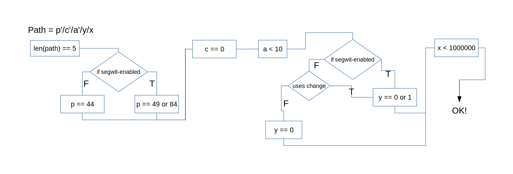

# BIP-44 derivation paths

Each coin uses [BIP-44](https://github.com/bitcoin/bips/blob/master/bip-0044.mediawiki) derivation path scheme. If the coin is UTXO-based the path should have all five parts, precisely as defined in [BIP-32](https://github.com/bitcoin/bips/blob/master/bip-0032.mediawiki). If it is account-based we follow Stellar's [SEP-0005](https://github.com/stellar/stellar-protocol/blob/master/ecosystem/sep-0005.md) - paths have only three parts `44'/c'/a'`. Unfortunately, lot of exceptions occur due to compatibility reasons.

## List of used derivation paths

| coin           | curve          | getPublicKey   | getAddress       | sign             | derivation      | note         |
|----------------|----------------|----------------|------------------|------------------|-----------------|--------------|
| Bitcoin        | secp256k       | 44'/0'/a'      | 44'/0'/a'/y/i    | 44'/0'/a'/y/i    | BIP-32          | [6](#BitcoinDiagram) |
| Ethereum       | secp256k       | 44'/60'/0'     | 44'/60'/0'/0/i   | 44'/60'/0'/0/i   | BIP-32          | [1](#Ethereum)|
| Ripple         | secp256k       |       -        | 44'/144'/a'/0/0  | 44'/144'/a'/0/0  | BIP-32          | [2](#Ripple) |
| Cardano        | ed25519        | 44'/1815'/a'   | 44'/1815'/a'/0/i | 44'/1815'/a'/0/i | [Cardano's own](https://cardanolaunch.com/assets/Ed25519_BIP.pdf)[3](#Cardano) |  |
| Stellar        | ed25519        |       -        | 44'/148'/a'      | 44'/148'/a'      | SLIP-0010       |  |
| Lisk           | ed25519        | 44'/134'/a'    | 44'/134'/a'      | 44'/134'/a'      | SLIP-0010       |  |
| NEM            | ed25519        |       -        | 44'/43'/a'       | 44'/43'/a'       | SLIP-0010       | [4](#NEM)  |
| Monero         | ed25519        | 44'/128'/a'[5](#Monero) | 44'/128'/a'      | 44'/128'/a'      | SLIP-0010         | |

Paths that do not conform to this table are allowed, but user needs to confirm a warning on Trezor. For getPublicKey we do not check if the path is followed by other non-hardened items (anyone can derive those anyway). This is beneficial  for Ethereum and its MEW compatibility, which sends `44'/60'/0'/0` for getPublicKey.

## Notes

1.  We believe this should be `44'/60'/a'`, because Ethereum is account-based, rather than UTXO-based. Unfortunately, lot of Ethereum tools (MEW, Metamask) do not use such scheme and set `a = 0` and then iterate the address index `i`. Therefore for compatibility reasons we use the same scheme: `44'/60'/0'/0/i` and only the `i` is being iterated.

2.  Similar to Ethereum this should be `44'/144'/a'`. But for compatibility with other HW vendors we use `44'/144'/a'/0/0`.

3.  Which allows non-hardened derivation on ed25519.

4.  NEM's path should be `44'/60'/a'` as per SEP-0005, but we allow `44'/60'/a'/0'/0'` as well for compatibility reasons with NanoWallet.

5.  Actually it is GetWatchKey for Monero.

6.  It is a bit more complicated for Bitcoin-like coins. The following diagram shows how path should be validated for Bitcoin-like coins:

