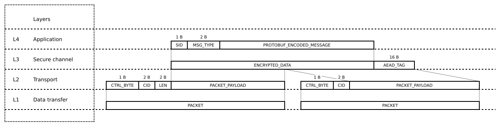
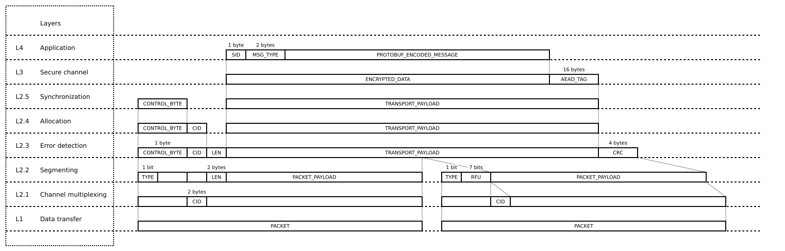

# Trezor–Host Protocol

This document specifies a secure protocol for encrypted and authenticated communication between a host application, such as *Trezor Suite*, and new *Trezor* models. This protocol replaces the unencrypted protocol known as Codec v1 used in earlier Trezor models (see [protocol.md](../../../common/protob/protocol.md)).

# Intended audience

This document defines the format and internal workings of the communication protocol. It is intended for system integrators and security analysts. Those who wish to integrate Trezor in their application should use [Trezor Connect](https://github.com/trezor/connect/) or [python-trezor](https://pypi.org/project/trezor/), both of which implement this specification.

# Table of contents

- [Introduction](#introduction)
- [Data transfer layer](#data-transfer-layer)
  - [USB](#usb)
  - [Bluetooth](#bluetooth)
- [Transport layer](#transport-layer)
  - [Channel identifier](#channel-identifier)
  - [Transport packet structure](#transport-packet-structure)
  - [Transport layer structure](#transport-layer-structure)
    - [Channel multiplexing layer](#channel-multiplexing-layer)
    - [Segmenting layer](#segmenting-layer)
    - [Error detection layer](#error-detection-layer)
    - [Allocation layer](#allocation-layer)
    - [Synchronization layer](#synchronization-layer)
    - [Alternating Bit Protocol](#alternating-bit-protocol)
    - [ABP State machine](#abp-state-machine)

# Introduction

The purpose of this protocol is to establish a secure communication channel between a host application, such as Trezor Suite, and a Trezor device. When a given host establishes a secure channel with a Trezor for the first time, the two engage in a pairing procedure, which requires the user to complete one of the pairing methods listed in Section [TODO]. After a successful pairing, the host may request the issuance of a pairing credential from the Trezor. The credential allows reestablishment of the secure channel without user interaction in the future.

This protocol is designed to be compatible with various means of data transfer, such as USB or Bluetooth. It is split into the following layers:

- **L1 Data transfer** represents either USB or Bluetooth data transfer.
- **L2 Transport** is responsible for multiplexing transport connections onto the data transfer layer, segmenting of transport payloads, error detection and synchronization. It is divided into five sub-layers, which are described in the Transport layer section ([Transport layer](https://www.notion.so/Transport-layer-203dc5260606802f8dfcd3ff16b74940?pvs=21)).
- **L3 Secure channel** is responsible for the encryption and the decryption of messages.
- **L4 Application** handles sessions and the encoding of application messages in Protocol Buffers wire format.



# Data transfer layer

This protocol is designed to be compatible with various data transfer services, such as USB or Bluetooth, which transmit *packets* of a fixed maximum size. The data transfer service must preserve the order of packets transferred, but does not need to guarantee their delivery or integrity.

## USB

All Trezor models support USB communication. To allow web applications to connect to Trezor, [WebUSB](https://wicg.github.io/webusb/) is used for data transfer:

### USB packets size

Trezor utilizes packets with a size of 64 bytes.

## Bluetooth

Some Trezor models support Bluetooth. This section briefly describes the technology used and highlights important features.

### Supported Bluetooth technology

The Bluetooth technology used is Bluetooth Low-Energy (BLE). The minimum supported version is 5.0. Trezor does not support BLE versions 4.x and below due to lack of features and security concerns.

### BLE Pairing methods

Trezor devices use *Secure Simple Pairing* with the *Numeric Comparison* association model. Legacy Pairing methods are not allowed or supported.

### Privacy feature

Trezor devices use the *LE Privacy* feature by default. ([LE Privacy](https://www.bluetooth.com/blog/bluetooth-technology-protecting-your-privacy/))

> Bluetooth LE supports a feature that reduces the ability to track a LE device over a period of time by changing the Bluetooth Device Address on a frequent basis.
>
> — Bluetooth Core_v5.3 specification, section 5.4.5, page 275
>

### BLE packets size

As Bluetooth technology is used mainly for mobile devices, Trezor utilizes packets of 244 bytes in size.

# Transport layer

The transport layer performs the segmenting of transport payloads into multiple packets that are transmitted over the data transfer layer. It is possible for several applications to communicate with Trezor using distinct transport connections, which are referred to as *channels*. The transport layer is responsible for the establishment and release of channels, multiplexing channels onto the data transfer layer, and channel synchronization.

## Channel identifier

Channels are identified by a 16-bit *channel identifier* (CID). The CID `0xFFFF` is reserved for the broadcast channel, which is used for channel allocation requests and responses. CIDs from `0xFFF0` to `0xFFFE`, and `0x0000`, are reserved for future use. Trezor allocates the remaining CIDs to individual host applications.

## Transport packet structure

Transport packets start with a *control byte* to determine how to handle the received packet. The recognized control byte values (with appropriate masks) are denoted in the following table.

| **Name** | **Control byte (binary)** | **Mask (&)** | **Masked value** | **Description** | Handled by layer |
|:------------------------------|:----------:|:----:|:----:|:-----------------------------------------------------------|:------------------------|
| initiation_packet             | `0XXXXXXX` | 0x80 | 0x00 | Identifies an initiation packet.                           | L 2.2 - Segmenting      |
| continuation_packet           | `1XXXXXXX` | 0x80 | 0x80 | Identifies a continuation packet.                          | L 2.2 - Segmenting      |
| channel_allocation_request    | `01000000` | 0xFF | 0x40 | Request for a new channel identifier.                      | L 2.4 - Allocation      |
| channel_allocation_response   | `01000001` | 0xFF | 0x41 | Response with a new channel identifier.                    | L 2.4 - Allocation      |
| transport_error               | `01000010` | 0xFF | 0x42 | Transport layer errors (e.g. UNALLOCATED_CHANNEL).         | L 2.4 - Allocation      |
| ping                          | `01000011` | 0xFF | 0x43 | Transport level ping-pong messages                         | L 2                     |
| pong                          | `01000100` | 0xFF | 0x44 | Transport level ping-pong messages                         | L 2                     |
| codec_v1                      | `00111111` | 0xFF | 0x3F | Codec v1 message legacy protocol.                          | L 2                     |
| ack                           | `0010X000` | 0xF7 | 0x20 | Acknowledgement message.                                   | L 2.5 - Synchronization |
| handshake_init_request        | `000XX000` | 0xE7 | 0x00 | First message in the handshake process (see Section TODO)  | L 3                     |
| handshake_init_response       | `000XX001` | 0xE7 | 0x01 | Second message in the handshake process (see Section TODO) | L 3                     |
| handshake_completion_request  | `000XX010` | 0xE7 | 0x02 | Third message in the handshake process (see Section TODO)  | L 3                     |
| handshake_completion_response | `000XX011` | 0xE7 | 0x03 | Fourth message in the handshake process (see Section TODO) | L 3                     |
| encrypted_transport           | `000XX100` | 0xE7 | 0x04 | Noise message, i.e. encrypted application message.         | L 3                     |


The transport layer distinguishes two basic types of transport packets: *initiation packets* and *continuation packets*. The highest bit of the control byte specifies whether the packet is an *initiation packet* or a *continuation packet.*

- *type* = 0  *→ initiation packet*
- *type* = 1  *→ continuation packet*

Let *n* be the packet size in bytes supported by the data transfer layer.

### **Initiation Packet**

An initiation packet is the first packet to be sent when transmitting a transport payload. It has the following structure:

| **Offset** | **Size** | **Field name**   | **Description**                                                                                                |
|:----------:|:--------:|:-----------------|:---------------------------------------------------------------------------------------------------------------|
| 0          | 1        | *control_byte*   | Control byte is used on multiple layers. For recognized values, see table [TODO](#transport-packet-structure)  |
| 1          | 2        | *cid*            | Channel identifier as a 16-bit integer in big-endian byte order.                                               |
| 3          | 2        | *length*         | Total size of the *transport payload with CRC* in bytes. Encoded as a 16-bit integer in big-endian byte order. |
| 5          | *n*−5    | *packet_payload* | First part of the *transport payload with CRC*. Padded with null bytes, if no continuation packets follow.     |

### **Continuation Packet**

Continuation packets are sent after the initiation packet in cases where the transport payload does not fit in the initiation packet. Each continuation packet contains the following information:

| **Offset** | **Size** | **Field name**   | **Description**                                                                                                |
|:----------:|:--------:|:-----------------|:---------------------------------------------------------------------------------------------------------------|
| 0          | 1        | *control_byte*   | The control byte set to 0x80.                                                                                  |
| 1          | 2        | *cid*            | Channel identifier as a 16-bit integer in big-endian byte order.                                               |
| 3          | *n*−3    | *packet_payload* | Continuation part of the *transport payload with CRC*. Padded with null bytes in the last continuation packet. |

The seven least significant bits of the control byte in a continuation packet are reserved for future use. The reserved bits should be set to zero when transmitting a continuation packet, and ignored when receiving a continuation packet.

## Transport layer structure

The transport layer is further divided into five sub-layers.


### Channel multiplexing layer

Multiplexing enables one data transfer connection to support more than one channel. This layer manages the identification of the channel for each packet transferred over the data transfer connection, in order to ensure that packet payloads from the various multiplexed channels are not mixed. The receiver groups the packets based on their *channel identifier* (CID) field. The channel multiplexing layer does not provide any packet filtering or error handling. (TODO add relevant part of session locking)

### Segmenting layer

The segmenting layer is responsible for mapping one *transport payload with CRC* onto an initiation packet and zero or more continuation packets.

The sender segments the *transport payload with CRC* into one or more packet payloads, starting with an initiation packet, followed by the least possible number of continuation packets. The last packet payload is padded with null bytes.

The receiver reassembles the *transport payload with CRC* by concatenating the packet payloads, starting with an initiation packet and awaiting continuation packets on the same channel until the expected length of the *transport payload with CRC* has been received. Any padding in the last packed payload is discarded.

If a new initiation packet is received on a given channel before enough continuation packets have been received to reassemble the previous transport payload on that channel, then the receiver will discard the previous *transport payload with CRC* and begin reassembling the new *transport payload with CRC*.

If an initiation packet is received on a channel CID2 while reassembling the *transport payload with CRC* on a different channel CID1, then the receiver should reassemble both transport payloads with CRC in parallel independently for each channel. 

If the receiver is not able to reassemble multiple payloads in parallel, then it should measure the time that elapsed since the last packet was received on channel CID1. If that time exceeds MIN_CONTINUATION_WAIT_MS, it should abort the reassembly of the *transport payload with CRC*, discard any previously reassembled data and begin reassembling the transport payload on channel CID2. If MIN_CONTINUATION_WAIT_MS is not exceeded, then it should notify the allocation layer to send a TRANSPORT_BUSY error on channel CID2. 

If a continuation packet is received on a given channel when none is expected on that channel, then the receiver will discard the continuation packet.

### Error detection layer

A cyclic redundancy check (CRC) error detection code is used to detect data corruption or the loss of continuation packets by the data transfer layer. The algorithm used to compute the CRC is CRC-32-IEEE (TODO *add reference*), which utilizes the polynomial 0x04C11DB7 with its reversed form equal to 0xEDB88320. The CRC is computed over the header of the initiation packet and the transport payload as outlined in the table below. The result is encoded as 4 bytes in big-endian byte order and appended to the transport payload, which is referred to as *transport payload with CRC*.

The CRC is computed over the following data:

| **Offset** | **Size**     | **Field name**      | **Description**                                                                                                |
|:----------:|:------------:|:--------------------|:---------------------------------------------------------------------------------------------------------------|
| 0          | 1            | *control_byte*      | The control byte of the initiation packet.                                                                     |
| 1          | 2            | *cid*               | Channel identifier as a 16-bit integer in big-endian byte order.                                               |
| 3          | 2            | *length*            | Total size of the *transport payload with CRC* in bytes. Encoded as a 16-bit integer in big-endian byte order. |
| 5          | *length – 4* | *transport_payload* | The transport payload. (Does not include CRC or padding.)                                                      |

The receiver validates the CRC. If invalid, then the transport payload is discarded.

### Allocation layer

The allocation layer handles the establishment and release of channels and transport error handling. Host applications initiate communication with Trezor by requesting the establishment of a channel. The Trezor is responsible for the allocation of a unique channel identifier to each host application.

If Trezor receives a transport payload with a channel identifier that is not allocated, it will respond with an UNALLOCATED_CHANNEL error using the same channel identifier. Note: Implementation can respond to not allocated channel already after receiving an initiation packet (with unknown/unallocated CID). 

A host application will ignore any data transmitted on a channel that has not been allocated to it.

Since Trezor maintains a channel allocation table of limited size, it may release a channel without warning, on a least-recently-used basis. The host application is not given any notification of channel release. The application will detect the release of the channel the next time it attempts to use the channel identifier, since it will receive an UNALLOCATED_CHANNEL error.

The host application requests the establishment of a new channel with Trezor by using the broadcast channel to send a `ChannelAllocationRequest` with a randomly generated 8-byte `nonce`. Trezor responds by using the broadcast channel to send a `ChannelAllocationResponse` consisting of a new channel identifier, the same `nonce` and Trezor’s device properties. When the response is received, the host application compares the sent nonce with the received one. In case of a positive match, the application stores the received channel identifier and uses that for subsequent communication with Trezor. If the received nonce differs from the sent nonce, the host application ignores the response and keeps waiting for a `ChannelAllocationdResponse` that has a matching nonce.

`ChannelAllocationRequest` uses the `channel_allocation_request` control byte and has the following transport payload:

| **Offset** | **Size** | **Field name** | **Description**                                   |
|:----------:|:--------:|:---------------|:--------------------------------------------------|
| 0          | 8        | *nonce*        | A random nonce to identify the Trezor's response. |

`ChannelAllocationResponse` uses the `channel_allocation_response` control byte and has the following transport payload:

| **Offset** | **Size** | **Field name**      | **Description**                                                                                                                                                                  |
|:----------:|:--------:|:--------------------|:---------------------------------------------------------------------------------------------------------------------------------------------------------------------------------|
| 0          | 8        | *nonce*             | The nonce from the `ChannelAllocationRequest`.                                                                                                                                     |
| 8          | 2        | *cid*               | A new channel identifier.                                                                                                                                                        |
| 10         | var      | *device_properties* | Properties of the Trezor device containing a basic description of the device (model, device color) and capabilities (supported protocol version and pairing methods), see below. |

The `ThpDeviceProperties` are encoded using the [Protocol Buffers](https://protobuf.dev/) version 2 wire format as a message with the following definition:

```protobuf
message ThpDeviceProperties {
    required string internal_model = 1;               // Internal model name e.g. "T2B1".
    optional uint32 model_variant = 2 [default=0];    // Encodes the device properties such as color.
    required uint32 protocol_version_major = 3;       // The major version of the communication protocol used by the firmware.
    required uint32 protocol_version_minor = 4;       // The minor version of the communication protocol used by the firmware.
    repeated ThpPairingMethod pairing_methods = 5;    // The pairing methods supported by the Trezor.
}
```

The pairing methods are further described in the [Pairing phase] TODO section.

```protobuf
// Numeric identifiers of pairing methods.
enum ThpPairingMethod {
    SkipPairing = 1;          // Trust without MITM protection.
    CodeEntry = 2;            // User types code diplayed on Trezor into the host application.
    QrCode = 3;               // User scans code displayed on Trezor into host application.
    NFC = 4;                  // Trezor and host application exchange authentication secrets via NFC.
}
```

The supported pairing methods are not implied by the model because some may be disabled by user settings or device mode. Trezor may also indicate a different set of pairing methods depending on the underlying means of data transfer, e.g. USB and Bluetooth.

`TransportError` uses the `transport_error` control byte and has the following transport payload:

| **Offset** | **Size** | **Field name** | **Description**                                           |
|:----------:|:--------:|:---------------|:----------------------------------------------------------|
| 0          | 1        | *error_code*   | The code of the transport error encoded as a single byte. |

Recognized transport error codes are:

| **Code** | **Name**            | **Description**                                                                                                                                         |
|:--------:|:--------------------|:--------------------------------------------------------------------------------------------------------------------------------------------------------|
| 0        |                     | Reserved for future use.                                                                                                                                |
| 1        | TRANSPORT_BUSY      | Issued by a recipient when the transport layer is busy reassembling a message on another channel.                                                       |
| 2        | UNALLOCATED_CHANNEL | Issued by Trezor in response to messages that have a channel identifier that is not allocated.                                                          |
| 3        | DECRYPTION_FAILED   | Issued by Trezor in response to messages that have an invalid authentication tag. Decryption error results in termination of the channel.               |
| 4        | INVALID_DATA        | TBD                                                                                                                                                     |
| 5        | DEVICE_LOCKED       | Issued by Trezor in response to handshake messages (`HandshakeInitiationRequest`, `HandshakeContinuationRequest`) that are sent to a **locked** device. |

When the sender receives a TRANSPORT_BUSY error, it should notify the segmenting layer to cease transmitting packets and notify the synchronization layer to increase the timeout for the next retransmission of the transport payload by a random value in the range [0, MAX_BUSY_BACKOFF_MS].

When the host receives an UNALLOCATED_CHANNEL or DECRYPTION_FAILED error, it should consider the channel released, destroy any channel context and establish a new channel with Trezor.

In addtion, THP supports sending and receiving keep-alive messages (`Ping` and `Pong`) over a channel. `Ping` is sent with a random 8-byte nonce, to make sure the peer is available and responsive when `Pong` response is received (with the same nonce). Since it is a single packet message, no payload reassembly is required. This mechanism can be used by both sides (for example, the device can check that the channel is still responsive, and close it if needed).

### Synchronization layer

The synchronization layer handles acknowledgement messages, which allow the receiver to inform the sender of the receipt of each transport payload. If acknowledgement is not received within a defined time, the sender infers the non-receipt of a transport payload and the need to re-transmit it. The sender may re-transmit the transport payload indefinitely, however implementations can set a limit on the number of retransmissions (MAX_RETRANSMISSION_COUNT) to prevent power drainage or blocking of system resources. In particular, if the sender needs to transmit a transport payload on another channel and does not have the system resources to do so in parallel on both channels, then it should terminate retransmission on the unresponsive channel as long as at least MIN_RETRANSMISSION_COUNT retransmissions have been attempted. When retransmission is

- **terminated** without having received acknowledgement, the sender should release the unresponsive channel.
- **interrupted** (e.g. by losing BLE connection), the sender could continue the retransmission when the connection is (possibly) restored (or terminate the channel).

Sender should not assume a message to be received without a receipt of an acknowledgement message.

The primary function of the synchronization layer is to work as the Alternating Bit Protocol (ABP) to ensure reliable communication. As such, it handles sequence numbers, ACK messages, retransmissions and timeouts. Secondly, it provides the higher layers (e.g., the Secure channel layer) with data payloads (and notifications).

It is possible that some packets are lost by the Data transfer layer (L1). In order to guarantee reliable communication, THP uses the *Alternating Bit Protocol* in combination with a *CRC32* checksum.

### Alternating Bit Protocol

The *Alternating Bit Protocol* (ABP) is a protocol between a sender and a receiver over an unreliable channel. The channel is unreliable in the sense that it can discard or duplicate messages, but it cannot change their order or content. The protocol guarantees the eventual and non-duplicative delivery of messages.

After sending a message, the sender doesn't send any further messages until it receives an *acknowledgement message* (ACK). After receiving a valid message, the receiver sends an ACK. If the ACK does not reach the sender before a timeout, the sender re-transmits the message. THP uses a 1-bit sequence number that is part of the header of the initialization packet. This sequence number alternates (from 0 to 1) in subsequent messages. When the receiver sends an ACK, it includes the sequence number of the message it received. 

The receiver can detect duplicated frames by checking if the message sequence numbers alternate. If two subsequent messages have the same sequence number, they are duplicates, and the second message is discarded. Similarly, if two subsequent ACKs reference the same sequence number, they are acknowledging the same message.

The situation is described by the following state machine.

### ABP State machine

The sender alternates among states S0a, S0b, S1a and S1b. The sender also keeps the state of a stopwatch. The sender starts in the state S0b.

The behavior of the sender in the state S0a is defined as follows:

- When the acknowledgment message is received and its sequence number equals 0, take the following actions:
    - Consider the message to be a duplicate acknowledgment of the message sent before the previously sent one.
    - Transition to the state S0a.
- When the stopwatch exceeds *timeout*, take the following actions:
    - Consider the previously sent message or the corresponding acknowledgment to be lost.
    - Resend the previously sent message, which is the last message with the sequence number equal to 1.
    - Reset and start the stopwatch. (Note that the *timeout* does not need to be constant.)
    - Transition to the state S0a.
- When the acknowledgment message is received and its sequence number equals 1, take the following actions:
    - Consider the previously sent message to be delivered.
    - Transition to the state S0b.

The behavior of the sender in the state S0b is defined as follows:

- If there is a message that needs to be sent, take the following actions:
    - Send the message with the sequence number equal to 1.
    - Switch to state S1a.
    - Reset and starts the stopwatch.
- When the acknowledgment message is received and its sequence number equals 1, take the following actions:
    - Consider the message to be a duplicate acknowledgment of the previously sent message.
    - Transition to the state S0b.
- When the acknowledgment message is received and its sequence number equals 0, take the following actions:
    - Consider the message to be an acknowledgment received out of order.
    - Transition to the state S0b.

The behavior of the sender in the state S1 is analogous. The full finite-state transducer of the sender is depicted in the following diagram: