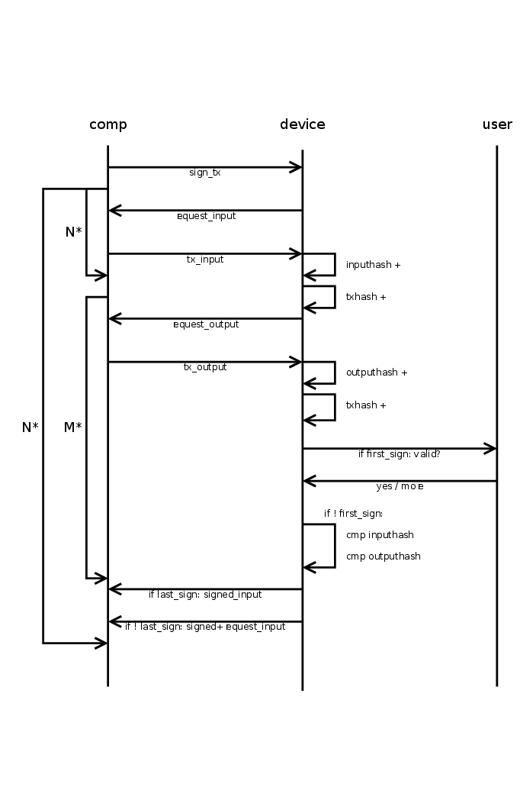

# Message Workflows

> This page was migrated from the Trezor Wiki. The content here may contain
outdated information.

In general, the API implements a simple request-response protocol. The
computer sends a request to the device and the device sends back a
response. The response can be a simple Success message, a Failure
message, or an answer to the request giving the requested data.
Moreover, the response can be a request from the device to the computer,
e.g., for entering the PIN, the
passphrase or giving some other information. In
that case the computer should send the corresponding Ack packet to
answer the request and wait for another response.

## Initialize/Features

As first message, the computer should send an empty Initialize packet
and expect a Features packet as response. The Initialize packet will
cause the device to stop what it is currently doing and should work at
any time. Thus, it can also be used to recover from previous errors.

## Button meta-workflow

If the device requires the user to press a button, it will reply with a
ButtonRequest to the computer. The computer should immediately send a
ButtonAck acknowledging the request. But it should also display an
indication to the user that it should follow the instruction on the
device. The field code in the ButtonRequest message explains what type
of request the user should acknowledge with a button.

If the user never presses the button, there will never be a reply to the
ButtonAck message. The computer can use Cancel to abort the current
operation. This should result in a Failure response.

## PinMatrix meta-workflow

If the device requires the user to unlock the device with a PIN, it will
reply with a PinMatrixRequest. The field type gives some explanation
what PIN is required (current pin, new pin, or confirmation of new pin).
The computer should display an empty pin matrix and let the user enter
the pin. The computer should encode the PIN as if the numbers are
ordered like they are on the numeric keypad. The encoded PIN should then
be send with a PinMatrixAck message.

## Passphrase meta-workflow

If the device requires the user to enter the passphrase, it will reply
with a PassphraseRequest. The computer should ask the user for the
passphrase and send it in clear text with a PassphraseAck message.

## GetAddress

The message GetAddress (send from the computer to the device) serves two
purposes. It can be used to get a valid address or to display the
address on the device. The field address_n gives the bip-32
path to the
address. The field coin_name should be set to some
supported coin (see the Feature message for a list of supported coins).
For multisig addresses multisig must be filled out with all
participating master public keys and their bip-32 path. The script_type
field has the same meaning as for transaction inputs when signing:

-   SPENDADDRESS (standard P2PKH address)
-   SPENDMULTISIG (P2SH multisig address)
-   SPENDWITNESS (native segwit P2WPKH or
    multisig p2wsh address)
-   SPENDP2SHWITNESS (segwit encapsulated in a p2sh
    address)

If show_display is set the address is displayed to the user. In any
case, it is also sent to the computer with an Address response.

## GetPublicKey

The message GetPublicKey can be used to get a bip-32 master public key
from the trezor or to display it to the user. The field address_n gives
the bip-32 path to the master key. The field ecdsa_curve_name can be
used to get Ed25519 or
NIST256P1 public keys.

## SignTx

> The following may contain imprecise/obsolete information. Refer to
[Bitcoin signing flow](communication/bitcoin-signing.md) for more relevant
information.

Signing a transaction is a little bit complicated. The reason is that
transactions can be several hundred kilobytes in size, but Trezor has
only 64 kilobytes memory. So it is the task of the computer to split the
transactions in small pieces and send only those pieces that Trezor
requested. The general workflow is given below

The computer starts the transaction signing process by sending a SignTx
message. From then on, the device drives all further communications by
sending requests to the computer until it finally sends a TxRequest with
request set to TXFINISHED. This final message should not be acknowledged
by the computer.

The SignTx message contains only the meta data of the transaction that
should be signed, i.e., the number of inputs and outputs, the coin name,
the version number, and lock_time (only for pre-signed time locked
transactions). If the device was not unlocked before, it will respond
with the usual PinMatrixRequest and PasswordRequest messages to
authenticate the user. See the corresponding sections above. It may also
send a ButtonRequest at any time to indicate that the user should
confirm a transaction output or the total fee.

Then the main process begins and Trezor will respond with TxRequest
messages, which should be answered by TxAck message. A TxRequest message
has up to three parts.

1.  Parts of the signed transactions.
2.  A signature for one of the inputs.
3.  A request for one piece of the new transaction or a previous
    transaction.

If the field serialized.serialized_tx is set, it contains a chunk of the
signed transaction in serialized format. The chunks are returned in the
right order and just concatenating all returned chunks will result in
the signed transaction.

If the field serialized.signature is set, it contains a signature for
one of the inputs. The signatures are returned in the same order as they
appear in the serialized transactions. I.e., the non-segwit signatures
come before the segwit signatures, since the latter are part of the
witness, which is serialized at the end. Apart from that, the signatures
are returned in the order the inputs appear in the transaction. The
signatures are not really needed, as they are already in the serialized
transaction. They can be useful for combining multisig signatures
without having to parse the transactions again.

If the field request equals TXFINISHED, this message contained the last
chunk of the transaction. The signing is finished and the computer must
not reply to this packet. In any other case, the device requested some
piece of some transaction, which is specified by request and details.
This request must be answered by a TxAck package containing the
requested piece of data.

If the field details.tx_hash is not set, some piece of the transaction
that should be signed is requested. Otherwise, this field contains the
hash of some input transaction and some piece of that transaction is
requested.

For request = TXMETA, the fields tx.version, tx.lock_time, tx.inputs_cnt
(number of inputs), and tx.outputs_cnt must be filled. For ZCash
transactions also tx.extra_data_len must be given. This will only be
requested for input transactions (for the signed transaction it was
given in the SignTx call).

For request = TXINPUT, the field details.request_index contains the
number of the input requested (starting with zero). The reply must fill
the structure tx.inputs\[0\] (there must be exactly one input in the
reply). Which fields must be set depends on whether details.tx_hash is
set (an input of some previous transaction is requested, that is spend
in the new transaction), or whether an input of the new transaction is
requested. In both cases prev_hash, prev_index and sequence must be set.
For a previous transaction, the script_sig must be set to the raw
signature data.

But if details.tx_hash is unset, the data must instead describe the
private key that should be used to sign the input. This is specified by
address_n (the bip-32 path to the private key), script_type and
multisig. The field multisig is only given for multisig transactions and
contains the master public keys and the derivation paths for all
signers. The field script_type can be

-   SPENDADDRESS (standard p2pkh address)
-   SPENDMULTISIG (p2sh multisig address)
-   SPENDWITNESS (native segwit p2wpkh or multisig p2wsh address)
-   SPENDP2SHWITNESS (segwit encapsulated in a p2sh address)

Note, that for segwit script_type does not distinguish between multisig
or p2wpkh addresses. Instead the presence of the multisig decides this.
For segwit inputs also the amount field must be set to the amount of
satoshis in the input transaction.

For request = TXOUTPUT, the field details.request_index contains the
number of the output requested (starting with zero). If details.tx_hash
is set, this is an output of a previous transaction and the
tx.bin_outputs\[0\] field must be filled in the TxAck reply. Otherwise,
the tx.outputs\[0\] field must be filled. For change outputs, the field
address_n must be filled and address must be omitted. If the change is
multisig, the multisig must be filled and it must use the same extended
public keys as all inputs. For a change address, the script_type should
be PAYTOADDRESS, PAYTOMULTISIG, PAYTOWITNESS or PAYTOP2SHWITNESS
matching the corresponding cases SPEND... for inputs. For
OP_RETURN outputs, set script_type =
PAYTOOPRETURN and set the op_return_data field. Otherwise address should
be set to a base58 encoded address and
script_type to PAYTOADDRESS. Older firmware required script_type =
PAYTOSCRIPTHASH for p2sh addresses, though (and newer firmware still
support this).

## SignMessage/VerifyMessage

### Sign message

Signing messages can be used to prove ownership of a specific address.
To sign message with Trezor device, it is needed to send the message
which the user wants to sign and also specify BIP-32 path which to use
for message signing. There are also two optional arguments: to specify
coin (Bitcoin is default, for more information about available coins
check this GitHub
[page](https://github.com/trezor/trezor-firmware/blob/master/core/src/apps/common/coininfo.py))
and specify script type (0 = SPENDADDRESS/standard P2PKH address, 1 =
SPENDMULTISIG/P2SH multisig address, 2 = EXTERNAL/reserved for external
inputs (coinjoin), 3 = SPENDWITNESS/native SegWit, 4 =
SPENDP2SHWITNESS/SegWit over P2SH (backward compatible))

### Verify message

Verify message asks device to verify if the signature is a signed
message with the given address. The arguments of the message are
signature, message being verified, address and coin which should be used
for verifying.

## CipherKeyValue

Cipher key value provides symmetric encryption in the Trezor device,
where the key doesn't exit the device, and where the user might be
forced to confirm the encryption/decryption on the display. The data
sent to the device are The following data are BIP-32 derivation path,
key (that is being shown on the device), value, encrypt/decrypt
direction, should user confirm on encrypt?, should user confirm on
decrypt? and optional IV. Value is what is actually being encrypted. The
key for the encryption is constructed from the private key on the BIP
address, the key displayed on the device, and the two informations about
whether to ask for confirmation. It is constructed in such a way, that
different path, key or the confirm information will get a different
encryption key and IV. So, you cannot "skip" the confirmation by using
different input. IV can be either manually set, or it is computed
together with the key. The value must be divisible into 16-byte blocks.
The application has to pad the blocks itself and ensure safety; for
example, by using PKCS7. See
<https://github.com/satoshilabs/slips/blob/master/slip-0011.md>.

## ResetDevice

The ResetDevice message performs Trezor device
setup and generates a new wallet with a new recovery
seed. The device must be in unitialized state, meaning that
the firmware is already installed but it has not been initialized
yet. If it is initialized and the user wants to perform a device reset,
the device must be wiped first. If the Trezor is prepared for its
initialization, the screen is showing "Go to trezor.io". The device reset
can be done in the Trezor Suite interface (https://trezor.io/start) or
using Python trezorctl command. After sending the ResetDevice
message to the device, the device warns the user to never make a digital copy
of their recovery seed and never upload it online, this message has to be
confirmed by pressing "I understand" on the device. After confirmation,
the device produces internal entropy which is a random value of 32 bytes,
requests external entropy which is produced in the host computer and computes
the mnemonic (recovery seed) using internal, external entropy and the given
strength (12, 18 or 24 words). Trezor Suite
interface doesn't provide an option to choose how many words there should
be in the generated mnemonic (recovery seed). It is hardcoded to 12
words for Trezor Model T but if done with python's trezorctl command it
can be chosen (for initialization with python's trezorctl command, 24
words mnemonic is default). After showing mnemonic on the Trezor device,
Trezor Model T requires the user to enter several words at random positions
in the mnemonic to confirm that the user has written down the
mnemonic properly. If there are errors in the entered words, the device
shows the recovery seed again. If the backup check is successful, the
setup is finished. If the Trezor Wallet interface is used, the user is asked
to set the label and PIN (setting up the PIN can be skipped) for the
wallet, this is optional when using python trezorctl command.

The ResetDevice command supports two types of workflows.

### Simple ResetDevice workflow

1. H -> T `ResetDevice` (Host specifies strength, backup type, etc.)
2. H <- T `EntropyRequest` (No parameters.)
3. H -> T `EntropyAck` (Host provides external entropy.)
4. H <- T `Success`

###  Entropy check workflow

The purpose of this workflow is for the host to verify that when Trezor
generates the seed, it correctly includes the external entropy from the host.
The host performs a randomized test asking Trezor to generate several seeds,
checking that they were generated correctly and using the last one as the final
seed. The workflow is triggered by setting `ResetDevice.entropy_check` to true.

The host chooses a small random number *n*, e.g. from 1 to 5, and proceeds as follows:
1. H -> T `ResetDevice` (Host specifies strength, backup type, etc.)
2. H <- T `EntropyRequest` (Trezor commits to an internal entropy value.)
3. H -> T `EntropyAck` (Host provides external entropy.)
4. H <- T `EntropyCheckReady` (Trezor stores the seed in storage cache.)
5. Host obtains the XPUBs for several accounts that the user intends to use:
    1. H -> T `GetPublicKey`
    2. H <- T `PublicKey`
6. If this step was executed less than *n* times, then:
    1. H -> T `EntropyCheckContinue(finish=False)` (Host instructs Trezor to prove seed correctness.)
    2. H <- T `EntropyRequest` (Trezor reveals previous internal entropy and commits to a new internal entropy value.)
    3. The host verifies that the entropy commitment is valid, derives the seed and checks that it produces the same XPUBs as Trezor provided in step 5.
    4. Go to step 3.
7. Host instructs trezor to store the current seed in flash memory.
    1. H -> T `EntropyCheckContinue(finish=True)`
    2. H <- T `Success`

The host should record the XPUBs that it received in the last repetition of
step 5. Every time the user connects the Trezor to the host, it should verify
that the XPUBs for the given accounts remain the same in order to prevent a
fake malicious Trezor from changing the seed.

The purpose of Trezor's commitment to internal entropy is to enforce that
Trezor chooses its internal entropy before the host provides the external
entropy. This ensures that Trezor cannot choose its internal entropy based on
the external entropy and manipulate the value of the resulting seed. The
commitment is computed as
`entropy_commitment=HMAC-SHA256(key=internal_entropy, msg="")`.

## RecoveryDevice

Recovery device lets user to recover BIP39 seed into
empty Trezor device. First the device asks user for the number of words
in recovered seed, the words are typed in one by one - on the device
screen when using Trezor model T, with Trezor One the user can decide to
do the advanced recovery (with entering seed using matrix similarly to
entering PIN) or standard recovery (with entering the seed to the host
computer one by one in random order). The process continues with
optional check of the seed validity and optional setting up the PIN,
which has to be confirmed. Finally the recovered wallet is saved into
device storage.

The same process is used with the dry run recovery, the
differences are that this process can be done only with already
initialized device and that the mnemonic is not saved into the device
but it is only compared to the mnemonic already loaded into the device
with the successful result (The seed is valid and matches the one in the
device) or unsuccessful result (The seed is valid but does not match the
one in the device).

A third kind of recovery is one that is done in order to
unlock a repeated backup. This is similar to the dry run recovery in that
the device needs to be already initialized and that the mnemonic entered
is compared against the one stored in the device. Once successful,
a special mode is activated, which allows an additional backup
to be performed. This is useful for upgrading SLIP39 backups
to multiple shares.

## LoadDevice

Load device lets user to load the device with the specific recovery
seed. This command is the subset of the recovery device and it can not
be done with Trezor Wallet interface, only with python command
trezorctl. This message can be used only if the device is not
initialized.

## WipeDevice

Wipe device lets user wipe the device. It is possible to wipe only
user's wallet or erase all the data from the Trezor device including
installed firmware. Wiping device in Trezor Wallet interface wipes only
user's wallet. It is also possible to wipe the firmware with python
trezorctl command, Trezor device must be in bootloader mode.

## ApplySettings

Apply settings lets user change settings on the Trezor device, mainly
its homescreen, label and passphrase settings. Passphrase can be set to
enabled or disabled. Furthermore it can be set that passphrase is
entered solely on device or solely on host, by default the device always
ask where the user wants to enter the passphrase. All these settings
have to be confirmed by user on the device.

## ChangePin

This message lets user change, remove or set new PIN. First the user is
asked to enter old PIN if it was set before. The user is then asked to
enter new PIN and re-enter it to confirm match. It is also possible to
not enter new PIN, so the Change PIN message will just remove the old
one. The action has to be confirmed by user.
