# Trezor–Host Protocol

This document specifies a secure protocol for encrypted and authenticated communication between a host application, such as *Trezor Suite*, and new *Trezor* models. This protocol replaces the unencrypted Codec v1 protocol used in earlier Trezor models (see [protocol.md](../../../common/protob/protocol.md)).

# Intended audience

This document defines the format and internal workings of the communication protocol. It is intended for system integrators and security analysts. Those who wish to integrate Trezor in their application should use [Trezor Connect](https://github.com/trezor/connect/) or [python-trezor](https://pypi.org/project/trezor/), both of which implement this specification.

# Table of contents

- [Introduction](#introduction)
- [Data transfer layer](#data-transfer-layer)
  - [USB](#usb)
  - [Bluetooth](#bluetooth)
- [Transport layer](#transport-layer)
  - [Channel identifier](#channel-identifier)
  - [Transport packet structure](#transport-packet-structure)
  - [Transport layer structure](#transport-layer-structure)
    - [Channel multiplexing layer](#channel-multiplexing-layer)
    - [Segmenting layer](#segmenting-layer)
    - [Error detection layer](#error-detection-layer)
    - [Allocation layer](#allocation-layer)
    - [Synchronization layer](#synchronization-layer)
    - [Alternating Bit Protocol](#alternating-bit-protocol)
    - [ABP State machine](#abp-state-machine)
    - [ACK Message structure](#ack-message-structure)
    - [ACK Piggybacking](#ack-piggybacking)
    - [Protocol parameters](#protocol-parameters)
- [Secure channel layer](#secure-channel-layer)
  - [Connection process](#connection-process)
  - [Handshake phase](#handshake-phase)
    - [Common definitions](#common-definitions)
    - [Messages](#messages)
      - [Handshake initiation request](#handshake-initiation-request-handshakeinitiationreq)
      - [Handshake initiation response](#handshake-initiation-response-handshakeinitiationresp)
      - [Handshake completion request](#handshake-completion-request-handshakecompletionreq)
      - [Handshake completion response](#handshake-completion-response-handshakecompletionresp)
      - [Trezor's state machine](#trezors-state-machine)
      - [Host's state machine](#hosts-state-machine)
    - [Notes](#notes)
  - [Pairing phase](#pairing-phase)
    - [Messages](#messages-1)
    - [Trezor's state machine - Option 1](#trezors-state-machine---option-1)
    - [Trezor's state machine - Option 2](#trezors-state-machine---option-2)
    - [Host's state machine](#hosts-state-machine-1)
    - [NFC pairing sequence](#nfc-pairing-sequence)
    - [QR Code pairing sequence](#qr-code-pairing-sequence)
    - [Code Entry pairing sequence](#code-entry-pairing-sequence)
  - [Credential phase](#credential-phase)
    - [Messages](#messages-2)
    - [Trezor’s state machine](#trezors-state-machine-1)
    - [Host’s state machine](#hosts-state-machine-2)
    - [Credential validation](#credential-validation)
    - [Credential issuance](#credential-issuance)
    - [Autoconnect credential issuance](#autoconnect-credential-issuance)
    - [Trezor’s state machine](#trezors-state-machine-1)
    - [Host's state machine](#hosts-state-machine-2)
- [Other features](#other-features)
  - [Channel replacement](#channel-replacement)

# Introduction

The purpose of this protocol is to establish a secure communication channel between a host application, such as Trezor Suite, and a Trezor device. When a given host establishes a secure channel with a Trezor for the first time, the two engage in a pairing procedure, which requires the user to complete one of the pairing methods listed in Section [Pairing phase](#pairing-phase). After a successful pairing, the host may request that the Trezor issue a pairing credential. The credential allows reestablishment of the secure channel without user interaction in the future.

This protocol is designed to be compatible with various means of data transfer, such as USB or Bluetooth. It is split into the following layers:

- **L1 Data transfer** represents either USB or Bluetooth data transfer.
- **L2 Transport** is responsible for multiplexing transport connections onto the data transfer layer, segmenting of transport payloads, error detection and synchronization. It is divided into five sub-layers, which are described in the Transport layer section ([Transport layer](#transport-layer)).
- **L3 Secure channel** is responsible for the encryption and the decryption of messages (see [Secure channel layer](#secure-channel-layer)).
- **L4 Application** handles sessions and the encoding of application messages in Protocol Buffers wire format. It is described in [sessions.md](sessions.md)

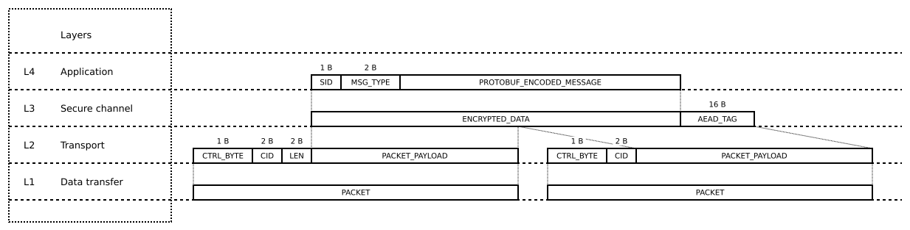

# Data transfer layer

This protocol is designed to be compatible with various data transfer services, such as USB or Bluetooth, which transmit *packets* of a fixed maximum size. The data transfer service must preserve the order of packets transferred, but does not need to guarantee their delivery or integrity.

## USB

All Trezor models support USB communication. To allow web applications to connect to Trezor, [WebUSB](https://wicg.github.io/webusb/) is used for data transfer:

### USB packet size

Trezor utilizes packets with a size of 64 bytes.

## Bluetooth

Some Trezor models support Bluetooth. This section briefly describes the technology used and highlights important features.

### Supported Bluetooth technology

The Bluetooth technology used is Bluetooth Low-Energy (BLE). The minimum supported version is 5.0. Trezor does not support BLE versions 4.x and below due to a lack of features and security concerns.

### BLE Pairing methods

Trezor devices use *Secure Simple Pairing* with the *Numeric Comparison* association model. Legacy Pairing methods are not allowed or supported.

### Privacy feature

Trezor devices use the *LE Privacy* feature by default. ([LE Privacy](https://www.bluetooth.com/blog/bluetooth-technology-protecting-your-privacy/))

> Bluetooth LE supports a feature that reduces the ability to track a LE device over a period of time by changing the Bluetooth Device Address on a frequent basis.
>
> — Bluetooth Core_v5.3 specification, section 5.4.5, page 275
>

### BLE packet size

Trezor utilizes packets of 244 bytes in size.

# Transport layer

The transport layer performs the segmentation of transport payloads into multiple packets that are transmitted over the data transfer layer. It is possible for several applications to communicate with Trezor using distinct transport connections, which are referred to as *channels*. The transport layer is responsible for the establishment and release of channels, multiplexing channels onto the data transfer layer, and channel synchronization.

## Channel identifier

Channels are identified by a 16-bit *channel identifier* (CID). The CID `0xFFFF` is reserved for the broadcast channel, which is used for channel allocation requests and responses. CIDs from `0xFFF0` to `0xFFFE`, and `0x0000`, are reserved for future use. Trezor allocates the remaining CIDs to individual host applications.

## Transport packet structure

Transport packets start with a *control byte* to determine how to handle the received packet. The recognized control byte values (with appropriate masks) are denoted in the following table.

| **Name** | **Control byte (binary)** | **Mask (&)** | **Masked value** | **Description** | Handled by layer |
|:------------------------------|:----------:|:----:|:----:|:-----------------------------------------------------------|:----------------------------------|
| initiation_packet             | `0XXXXXXX` | 0x80 | 0x00 | Identifies an initiation packet.                   | L 2.2 - Segmenting                        |
| continuation_packet           | `1XXXXXXX` | 0x80 | 0x80 | Identifies a continuation packet.                  | L 2.2 - Segmenting                        |
| channel_allocation_request    | `01000000` | 0xFF | 0x40 | Request for a new channel identifier.              | L 2.4 - Allocation                        |
| channel_allocation_response   | `01000001` | 0xFF | 0x41 | Response with a new channel identifier.            | L 2.4 - Allocation                        |
| transport_error               | `01000010` | 0xFF | 0x42 | Transport layer errors (e.g. UNALLOCATED_CHANNEL). | L 2.4 - Allocation                        |
| ping                          | `01000011` | 0xFF | 0x43 | Transport level ping-pong messages                 | L 2                                       |
| pong                          | `01000100` | 0xFF | 0x44 | Transport level ping-pong messages                 | L 2                                       |
| codec_v1                      | `00111111` | 0xFF | 0x3F | Codec v1 message legacy protocol.                  | L 2                                       |
| ack                           | `0010X000` | 0xF7 | 0x20 | Acknowledgement message.                           | L 2.5 - Synchronization                   |
| handshake_init_request        | `000XX000` | 0xE7 | 0x00 | First message in the handshake process             | L 3 - [Handshake phase](#handshake-phase) |
| handshake_init_response       | `000XX001` | 0xE7 | 0x01 | Second message in the handshake process            | L 3 - [Handshake phase](#handshake-phase) |
| handshake_completion_request  | `000XX010` | 0xE7 | 0x02 | Third message in the handshake process             | L 3 - [Handshake phase](#handshake-phase) |
| handshake_completion_response | `000XX011` | 0xE7 | 0x03 | Fourth message in the handshake process            | L 3 - [Handshake phase](#handshake-phase) |
| encrypted_transport           | `000XX100` | 0xE7 | 0x04 | Noise message, i.e. encrypted application message. | L 3                                       |

The transport layer distinguishes two basic types of transport packets: *initiation packets* and *continuation packets*. The highest bit of the control byte specifies whether the packet is an *initiation packet* or a *continuation packet.*

- *type* = 0  *→ initiation packet*
- *type* = 1  *→ continuation packet*

Let *n* be the packet size in bytes supported by the data transfer layer.

### **Initiation Packet**

An initiation packet is the first packet to be sent when transmitting a transport payload. It has the following structure:

| **Offset** | **Size** | **Field name**   | **Description**                                                                                                                      |
|:----------:|:--------:|:-----------------|:-------------------------------------------------------------------------------------------------------------------------------------|
| 0          | 1        | *control_byte*   | Control byte is used on multiple layers. For recognized values, see table [Transport packet structure](#transport-packet-structure)  |
| 1          | 2        | *cid*            | Channel identifier as a 16-bit integer in big-endian byte order.                                                                     |
| 3          | 2        | *length*         | Total size of the *transport payload with CRC* in bytes. Encoded as a 16-bit integer in big-endian byte order.                       |
| 5          | *n*−5    | *packet_payload* | First part of the *transport payload with CRC*. Padded with null bytes if no continuation packets follow.                            |

### **Continuation Packet**

Continuation packets are sent after the initiation packet in cases where the transport payload does not fit in the initiation packet. Each continuation packet contains the following information:

| **Offset** | **Size** | **Field name**   | **Description**                                                                                                |
|:----------:|:--------:|:-----------------|:---------------------------------------------------------------------------------------------------------------|
| 0          | 1        | *control_byte*   | The control byte set to 0x80.                                                                                  |
| 1          | 2        | *cid*            | Channel identifier as a 16-bit integer in big-endian byte order.                                               |
| 3          | *n*−3    | *packet_payload* | Continuation part of the *transport payload with CRC*. Padded with null bytes in the last continuation packet. |

The seven least significant bits of the control byte in a continuation packet are reserved for future use. The reserved bits should be set to zero when transmitting a continuation packet, and ignored when receiving a continuation packet.

## Transport layer structure

The transport layer is further divided into five sub-layers.

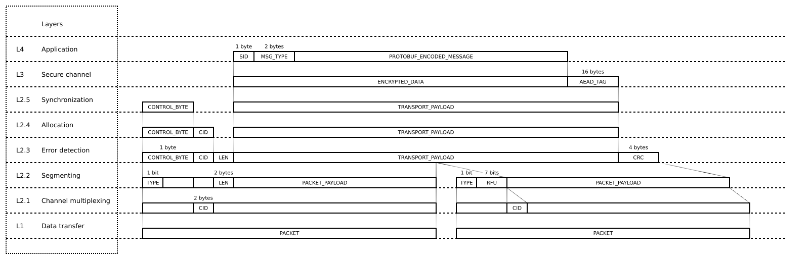
### Channel multiplexing layer

Multiplexing enables one data transfer connection to support more than one channel. This layer manages the identification of the channel for each packet transferred over the data transfer connection, in order to ensure that packet payloads from the various multiplexed channels are not mixed. The receiver groups the packets based on their *channel identifier* (CID) field. The channel multiplexing layer does not provide any packet filtering or error handling. (TODO add relevant part of session locking)

### Segmenting layer

The segmenting layer is responsible for mapping one *transport payload with CRC* onto an initiation packet and zero or more continuation packets.

The sender segments the *transport payload with CRC* into one or more packet payloads, starting with an initiation packet, followed by the least possible number of continuation packets. The last packet payload is padded with null bytes.

The receiver reassembles the *transport payload with CRC* by concatenating the packet payloads, starting with an initiation packet and awaiting continuation packets on the same channel until the expected length of the *transport payload with CRC* has been received. Any padding in the last packed payload is discarded.

If a new initiation packet is received on a given channel before enough continuation packets have been received to reassemble the previous transport payload on that channel, then the receiver will discard the previous *transport payload with CRC* and begin reassembling the new *transport payload with CRC*.

If an initiation packet is received on a channel CID2 while reassembling the *transport payload with CRC* on a different channel CID1, then the receiver should reassemble both transport payloads with CRC in parallel independently for each channel. 

If the receiver is not able to reassemble multiple payloads in parallel, then it should measure the time that elapsed since the last packet was received on channel CID1. If that time exceeds MIN_CONTINUATION_WAIT_MS, it should abort the reassembly of the *transport payload with CRC*, discard any previously reassembled data and begin reassembling the transport payload on channel CID2. If MIN_CONTINUATION_WAIT_MS is not exceeded, then it should notify the allocation layer to send a TRANSPORT_BUSY error on channel CID2. 

If a continuation packet is received on a given channel when none is expected on that channel, then the receiver will discard the continuation packet.

### Error detection layer

A cyclic redundancy check (CRC) error detection code is used to detect data corruption or the loss of continuation packets by the data transfer layer. The algorithm used to compute the CRC is CRC-32-IEEE, which utilizes the polynomial 0x04C11DB7 with its reversed form equal to 0xEDB88320. The CRC is computed over the header of the initiation packet and the transport payload as outlined in the table below. The result is encoded as 4 bytes in big-endian byte order and appended to the transport payload, which is referred to as *transport payload with CRC*.

The CRC is computed over the following data:

| **Offset** | **Size**     | **Field name**      | **Description**                                                                                                |
|:----------:|:------------:|:--------------------|:---------------------------------------------------------------------------------------------------------------|
| 0          | 1            | *control_byte*      | The control byte of the initiation packet.                                                                     |
| 1          | 2            | *cid*               | Channel identifier as a 16-bit integer in big-endian byte order.                                               |
| 3          | 2            | *length*            | Total size of the *transport payload with CRC* in bytes. Encoded as a 16-bit integer in big-endian byte order. |
| 5          | *length* – 4 | *transport_payload* | The transport payload. (Does not include CRC or padding.)                                                      |

The receiver validates the CRC. If invalid, then the transport payload is discarded.

### Allocation layer

The allocation layer handles the establishment and release of channels and transport error handling. Host applications initiate communication with Trezor by requesting the establishment of a channel. The Trezor is responsible for the allocation of a unique channel identifier to each host application.

If Trezor receives a transport payload with a channel identifier that is not allocated, it will respond with an UNALLOCATED_CHANNEL error using the same channel identifier. Note: Implementation can respond to not allocated channel already after receiving an initiation packet (with unknown/unallocated CID). 

A host application will ignore any data transmitted on a channel that has not been allocated to it.

Since Trezor maintains a channel allocation table of limited size, it may release a channel without warning, on a least-recently-used basis. The host application is not given any notification of channel release. The application will detect the release of the channel the next time it attempts to use the channel identifier, since it will receive an UNALLOCATED_CHANNEL error.

The host application requests the establishment of a new channel with Trezor by using the broadcast channel to send a `ChannelAllocationRequest` with a randomly generated 8-byte `nonce`. Trezor responds by using the broadcast channel to send a `ChannelAllocationResponse` consisting of a new channel identifier, the same `nonce`, and Trezor’s device properties. When the response is received, the host application compares the sent nonce with the received one. In case of a positive match, the application stores the received channel identifier and uses that for subsequent communication with Trezor. If the received nonce differs from the sent nonce, the host application ignores the response and keeps waiting for a `ChannelAllocationResponse` that has a matching nonce.

`ChannelAllocationRequest` uses the `channel_allocation_request` control byte and has the following transport payload:

| **Offset** | **Size** | **Field name** | **Description**                                   |
|:----------:|:--------:|:---------------|:--------------------------------------------------|
| 0          | 8        | *nonce*        | A random nonce to identify the Trezor's response. |

`ChannelAllocationResponse` uses the `channel_allocation_response` control byte and has the following transport payload:

| **Offset** | **Size** | **Field name**      | **Description**                                                                                                                                                                  |
|:----------:|:--------:|:--------------------|:---------------------------------------------------------------------------------------------------------------------------------------------------------------------------------|
| 0          | 8        | *nonce*             | The nonce from the `ChannelAllocationRequest`.                                                                                                                                   |
| 8          | 2        | *cid*               | A new channel identifier.                                                                                                                                                        |
| 10         | var      | *device_properties* | Properties of the Trezor device containing a basic description of the device (model, device color) and capabilities (supported protocol version and pairing methods), see below. |

The `ThpDeviceProperties` are encoded using the [Protocol Buffers](https://protobuf.dev/) version 2 wire format as a message with the following definition:

```protobuf
message ThpDeviceProperties {
    required string internal_model = 1;               // Internal model name e.g. "T2B1".
    optional uint32 model_variant = 2 [default=0];    // Encodes the device properties such as color.
    required uint32 protocol_version_major = 3;       // The major version of the communication protocol used by the firmware.
    required uint32 protocol_version_minor = 4;       // The minor version of the communication protocol used by the firmware.
    repeated ThpPairingMethod pairing_methods = 5;    // The pairing methods supported by the Trezor.
}
```

The pairing methods are further described in the [Pairing phase](#pairing-phase).

```protobuf
// Numeric identifiers of pairing methods.
enum ThpPairingMethod {
    SkipPairing = 1;          // Trust without MITM protection.
    CodeEntry = 2;            // User types code displayed on Trezor into the host application.
    QrCode = 3;               // User scans code displayed on Trezor into host application.
    NFC = 4;                  // Trezor and host application exchange authentication secrets via NFC.
}
```

The supported pairing methods are not implied by the model because some may be disabled by user settings or device mode. Trezor may also indicate a different set of pairing methods depending on the underlying means of data transfer, e.g., USB and Bluetooth.

`TransportError` uses the `transport_error` control byte and has the following transport payload:

| **Offset** | **Size** | **Field name** | **Description**                                           |
|:----------:|:--------:|:---------------|:----------------------------------------------------------|
| 0          | 1        | *error_code*   | The code of the transport error encoded as a single byte. |

Recognized transport error codes are:

| **Code** | **Name**            | **Description**                                                                                                                                         |
|:--------:|:--------------------|:--------------------------------------------------------------------------------------------------------------------------------------------------------|
| 0        |                     | Reserved for future use.                                                                                                                                |
| 1        | TRANSPORT_BUSY      | Issued by a recipient when the transport layer is busy reassembling a message on another channel.                                                       |
| 2        | UNALLOCATED_CHANNEL | Issued by Trezor in response to messages that have a channel identifier that is not allocated.                                                          |
| 3        | DECRYPTION_FAILED   | Issued by Trezor in response to messages that have an invalid authentication tag. Decryption error results in termination of the channel.               |
| 4        |                     | Reserved for future use.                                                                                                                                |
| 5        | DEVICE_LOCKED       | Issued by Trezor in response to handshake messages (`HandshakeInitiationRequest`, `HandshakeContinuationRequest`) that are sent to a **locked** device. |

When the sender receives a TRANSPORT_BUSY error, it should notify the segmenting layer to cease transmitting packets and notify the synchronization layer to increase the timeout for the next retransmission of the transport payload by a random value in the range [0, MAX_BUSY_BACKOFF_MS].

When the host receives an UNALLOCATED_CHANNEL or DECRYPTION_FAILED error, it should consider the channel released, destroy any channel context, and establish a new channel with Trezor.

In addition, THP supports sending and receiving keep-alive messages (`Ping` and `Pong`) over a channel. `Ping` is sent with a random 8-byte nonce, to make sure the peer is available and responsive when `Pong` response is received (with the same nonce). Since it is a single packet message, no payload reassembly is required. This mechanism can be used by both sides (for example, the device can check that the channel is still responsive, and close it if needed).

### Synchronization layer

The synchronization layer handles acknowledgement messages, which allow the receiver to inform the sender of the receipt of each transport payload. If acknowledgement is not received within a defined time, the sender infers the non-receipt of a transport payload and the need to re-transmit it. The sender may re-transmit the transport payload indefinitely. However, implementations can set a limit on the number of retransmissions (MAX_RETRANSMISSION_COUNT) to prevent power drainage or blocking of system resources. In particular, if the sender needs to transmit a transport payload on another channel and does not have the system resources to do so in parallel on both channels, then it should terminate retransmission on the unresponsive channel as long as at least MIN_RETRANSMISSION_COUNT retransmissions have been attempted. When retransmission is

- **terminated** without having received acknowledgement, the sender should release the unresponsive channel.
- **interrupted** (e.g. by losing BLE connection), the sender could continue the retransmission when the connection is (possibly) restored (or terminate the channel).

Sender should not assume a message to be received without a receipt of an acknowledgement message.

The primary function of the synchronization layer is to work as the Alternating Bit Protocol (ABP) to ensure reliable communication. As such, it handles sequence numbers, ACK messages, retransmissions, and timeouts. Secondly, it provides the higher layers (e.g., the Secure channel layer) with data payloads (and notifications).

It is possible that some packets are lost by the Data transfer layer (L1). In order to guarantee reliable communication, THP uses the *Alternating Bit Protocol* in combination with a *CRC32* checksum.

### Alternating Bit Protocol

The *Alternating Bit Protocol* (ABP) is a protocol between a sender and a receiver over an unreliable channel. The channel is unreliable in the sense that it can discard or duplicate messages, but it cannot change their order or content. The protocol guarantees the eventual and non-duplicative delivery of messages.

After sending a message, the sender doesn't send any further messages until it receives an *acknowledgement message* (ACK). After receiving a valid message, the receiver sends an ACK. If the ACK does not reach the sender before a timeout, the sender re-transmits the message. THP uses a 1-bit sequence number that is part of the header of the initialization packet. This sequence number alternates (from 0 to 1) in subsequent messages. When the receiver sends an ACK, it includes the sequence number of the message it received. 

The receiver can detect duplicated frames by checking if the message sequence numbers alternate. If two subsequent messages have the same sequence number, they are duplicates, and the second message is discarded. Similarly, if two subsequent ACKs reference the same sequence number, they are acknowledging the same message.

The situation is described by the following state machine.

### ABP State machine

The sender alternates among states S0a, S0b, S1a, and S1b. The sender also keeps the state of a stopwatch. The sender starts in the state S0b.

The behavior of the sender in the state S0a is defined as follows:

- When the acknowledgment message is received and its sequence number equals 0, take the following actions:
    - Consider the message to be a duplicate acknowledgment of the message sent before the previously sent one.
    - Transition to the state S0a.
- When the stopwatch exceeds *timeout*, take the following actions:
    - Consider the previously sent message or the corresponding acknowledgment to be lost.
    - Resend the previously sent message, which is the last message with the sequence number equal to 1.
    - Reset and start the stopwatch. (Note that the *timeout* does not need to be constant.)
    - Transition to the state S0a.
- When the acknowledgment message is received and its sequence number equals 1, take the following actions:
    - Consider the previously sent message to be delivered.
    - Transition to the state S0b.

The behavior of the sender in the state S0b is defined as follows:

- If there is a message that needs to be sent, take the following actions:
    - Send the message with the sequence number equal to 1.
    - Switch to state S1a.
    - Reset and start the stopwatch.
- When the acknowledgment message is received and its sequence number equals 1, take the following actions:
    - Consider the message to be a duplicate acknowledgment of the previously sent message.
    - Transition to the state S0b.
- When the acknowledgment message is received and its sequence number equals 0, take the following actions:
    - Consider the message to be an acknowledgment received out of order.
    - Transition to the state S0b.

The behavior of the sender in the state S1 is analogous. The full finite-state transducer of the sender is depicted in the following diagram:

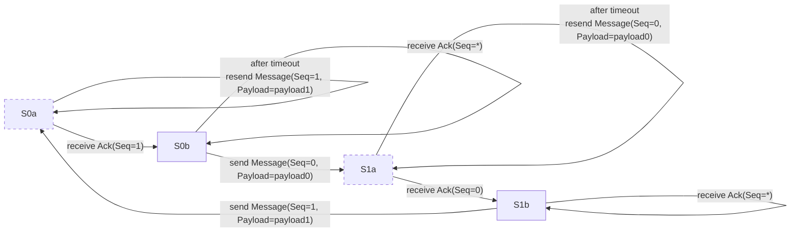

The receiver alternates between states R0 and R1. The receiver starts in the state R0.

The behavior of the receiver in the state R0 is defined as follows:

- When the message is received and its sequence number equals 0, take the following actions:
    - Submits the received message to further processing.
    - Reply with an acknowledgement message with the sequence number equal to 0.
    - Transition to the state R1.
- When the message is received and its sequence number equals 1, take the following actions:
    - Consider the message to be a duplicate of the previously received message.
    - Reply with an acknowledgement message with the sequence number equal to 1.
    - Transition to the state R1.

The behavior of the receiver in the state R1 is analogous. The full finite-state transducer of the sender is depicted in the following diagram:

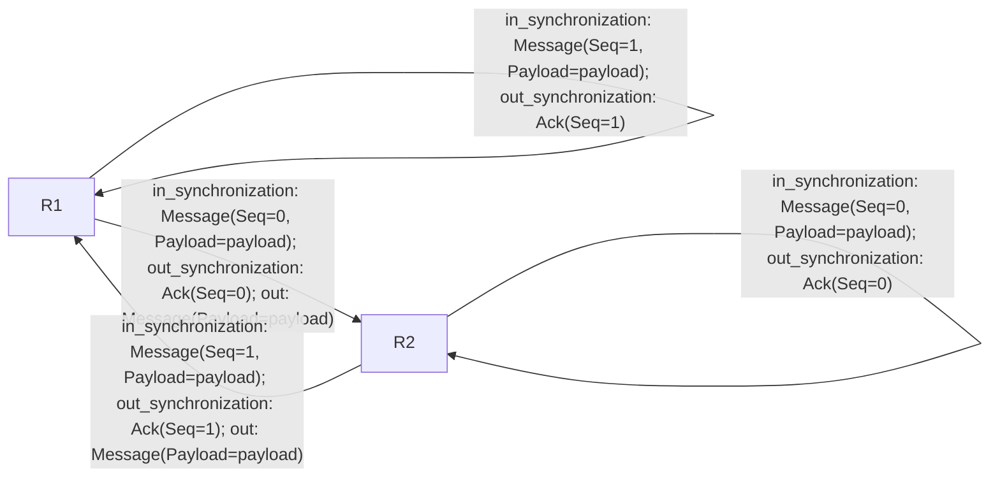

### ACK Message structure

The ACK message has no payload except for the CRC. Its *control_byte* is set to *ack* with the appropriate sequence number, i.e. <code>ACK_0 = 0010<b>0</b>000</code> and <code>ACK_1 = 0010<b>1</b>000</code>. The ACK message has the same sequence number as the message it acknowledges.

### ACK piggybacking

ACK piggybacking is an optional feature. It allows to use a regular transport message to work as an ACK of the latest message received by using the ACK bit in the transport message control byte. ACK piggybacking significantly reduces the number of messages sent which is useful for longer flows - e.g. signing a transaction with a pletothora of inputs/outputs.

### Protocol parameters

| **Parameter name**        | **Default/suggested value**  | **Description** |
|---------------------------|----------|----------------------------------------------------------------------------------------------------------------------------------------------------------------------------------------------------|
| MIN_RETRANSMISSION_COUNT  | 2        | The minimum number of transport payload retransmissions that the sender should attempt, if under pressure to release system resources.                                                             |
| MAX_RETRANSMISSION_COUNT  | 50       | The maximum number of transport payload retransmissions that the sender should attempt.                                                                                                            |
| RETRANSMISSION_TIMEOUT_MS | variable | The interval between transport payload retransmissions in milliseconds.                                                                                                                            |
| MAX_BUSY_BACKOFF_MS       | 500      | Maximum backoff time in milliseconds that the sender should add to the retransmission timeout when the receiver is busy receiving on another channel.                                              |
| MIN_CONTINUATION_WAIT_MS  | 200      | The minimum time in milliseconds that the receiver should wait for a continuation packet before terminating transport payload reassembly in favor of packets that are arriving on another channel. |

# Secure channel layer

## Connection process

The connection process involves the following steps:

1. The parties establish communication over the data transfer layer.
2. The host requests the allocation of a new communication channel by sending a `ChannelAllocationRequest`, see [Allocation layer](#allocation-layer).
3. The host initiates a secure channel handshake in order for the two parties to establish encrypted communication, see [Handshake phase](#handshake-phase).
4. If the host and the Trezor have not paired in the past, they mutually authenticate to protect against man-in-the-middle (MITM) attacks, see [Pairing phase](#pairing-phase).
5. After a successful pairing/connection, the host can ask Trezor for a long-time pairing credential. The credential allows the host to skip the pairing procedure when connecting from the same app and the same host device in the future, see [Credential phase](#credential-phase).

Trezor keeps a state machine of the channel. The possible states are the following: 
- UNALLOCATED: Trezor does not recognize a channel with given `channel id`.
- Handshake states - TH1, TH2: Channel is in a *handshake phase*.
- Pairing states - TP0, TP1, TP2, TP3a, TP3b, TP3c, TP4: Channel is in a *pairing phase*.
- TC1: Channel is in a *credential phase*.
- ENCRYPTED_TRANSPORT: Channel is fully prepared for encrypted application communication.

Similarly, Host state machine has the following states: UNALLOCATED, HH0, HH1, HH2, HP0, HP1, HP2, HP3a, HP3b, HP4, HP5, HP6, HP7, HC0, HC1, ENCRYPTED_TRANSPORT. 
The meaning of the UNALLOCATED and ENCRYPTED_TRANSPORT states is the same for both the Trezor and the host. Detailed information about the handshake, pairing, and credential phase states is provided in their respective sections.

The Trezor and the host each have a static X25519 key pair that they use to mutually authenticate one another when establishing a secure communication channel. The Trezor’s static key pair is denoted by $(S_{T,pub}, S_{T,priv})$ and the host’s static key pair is denoted $(S_{H,pub}, S_{H,priv})$. The process for establishing the secure channel is referred to as a *handshake*. This process results in a pair of AES encryption keys $k_{req}$ and $k_{resp}$, which are used to encrypt request messages sent by the host to the Trezor and responses from Trezor to the host. During the handshake, the parties determine whether they have paired in the past. If not, then a pairing phase follows the handshake. After these phases have been successfully completed, the parties enter the application traffic phase.

If either party encounters any error in the secure channel communication, such as unexpected messages, invalid message format, failure to decrypt data, or verify a MAC, it should terminate the handshake process and transition the channel to UNALLOCATED state.

## Handshake phase

The handshake is based on the `XX` handshake pattern as specified by the [Noise Protocol Framework](https://noiseprotocol.org/noise.html). Trezor’s static key pair is not used directly in the handshake. A masked public key is used instead. It is derived as shown below from the Trezor’s ephemeral public key, which is generated during the handshake.

*trezor_masked_static_pubkey* = X25519(SHA-256(*trezor_static_pubkey* || *trezor_ephemeral_pubkey*), *trezor_static_pubkey*).

## Common definitions

The X25519 function, Curve25519, and key pair generation are specified in [RFC 7748](https://datatracker.ietf.org/doc/html/rfc7748). In this section, *B* denotes the base point of Curve25519, which is encoded as a byte(0x09) followed by 31 zero bytes.

Let *protocol_name* = `Noise_XX_25519_AESGCM_SHA256\\x00\\x00\\x00\\x00`.

Let HKDF(*ck*, *input*) be the function defined as follows:

1. Let *temp_key* = HMAC-SHA-256(*ck*, *input*).
2. Let *output_1* = HMAC-SHA-256(*temp_key*, byte(0x01)).
3. Let *output_2* = HMAC-SHA-256(*temp_key*, *output_1* || byte(0x02)).
4. Return (*output_1*, *output_2*).

## Messages

The following messages are handled by the secure channel layer. The receiver of the messages `HandshakeInitiationRequest`, `HandshakeInitiationResponse`, `HandshakeCompletionRequest` and `HandshakeCompletionResponse` must assert that their control byte corresponds to the expected message given by the state machine.

| Message                     | Control byte                  | Sender |
|-----------------------------|-------------------------------|--------|
| HandshakeInitiationRequest  | handshake_init_request        | host   |
| HandshakeInitiationResponse | handshake_init_response       | Trezor |
| HandshakeCompletionRequest  | handshake_completion_request  | host   |
| HandshakeCompletionResponse | handshake_completion_response | Trezor |

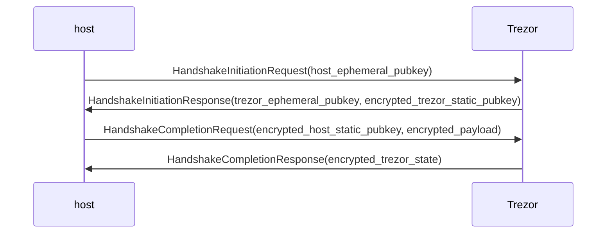

### Handshake initiation request (HandshakeInitiationRequest)

The message is sent from the host to the Trezor.

| Offset | Size | Field name              | Description                                                                     |
|--------|------|-------------------------|---------------------------------------------------------------------------------|
| 0      | 32   | *host_ephemeral_pubkey* | host’s ephemeral public key                                                     |
| 32     | 1    | *try_to_unlock*         | do not raise error on locked device, show pin_entry screen, used with 0x01 mask |

### Handshake initiation response (HandshakeInitiationResponse)

The message is sent from the Trezor to the host.

| Offset | Size | Field name | Description                                                                         |
|--------|------|----------------------------------|---------------------------------------------------------------|
| 0      | 32   | *trezor_ephemeral_pubkey*        | Trezor’s ephemeral public key                                 |
| 32     | 48   | *encrypted_trezor_static_pubkey* | encrypted and authenticated Trezor’s masked static public key |
| 80     | 16   | *tag*                            | encrypted and authenticated empty string                      |

### Handshake completion request (HandshakeCompletionRequest)

The message is sent from the host to the Trezor.

| Offset | Size | Field name                     | Description                                          |
|--------|------|--------------------------------|------------------------------------------------------|
| 0      | 48   | *encrypted_host_static_pubkey* | encrypted and authenticated host’s static public key |
| 48     | var  | *encrypted_payload*            | encrypted authenticated message payload              |

Before the payload is encrypted, it is encoded using the Protocol Buffers version 2 wire format as a message with the following definition:

```protobuf
message ThpHandshakeCompletionReqNoisePayload {
    optional bytes host_pairing_credential = 1;       // Host's pairing credential
}
```

### Handshake completion response (HandshakeCompletionResponse)

The message is sent from the Trezor to the host. It is sent as an encrypted payload.

| Offset | Size | Field name               | Description                                |
|--------|------|--------------------------|--------------------------------------------|
| 0      | 17   | *encrypted_trezor_state* | encrypted and authenticated Trezor’s state |

## Trezor’s state machine

Let *device_properties* be the properties advertised by the Trezor in ChannelAllocationResponse.

Let (*trezor_static_privkey*, *trezor_static_pubkey*) be a X25519 key pair that persists Trezor restarts.

Let *cred_auth_key* be a symmetric 16-byte key that persists Trezor's restarts.

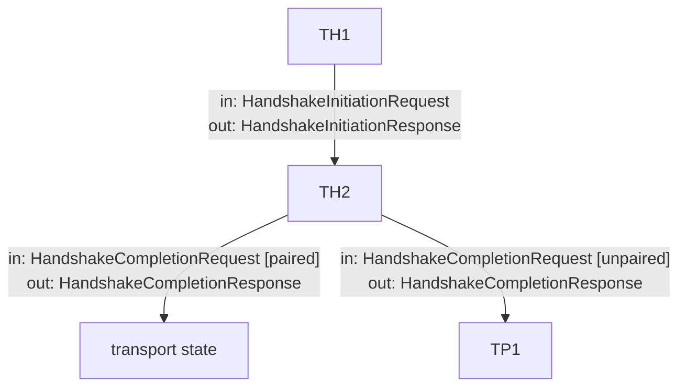

### State TH1

The behavior of the Trezor in the state TH1(*device_properties*, *trezor_static_pubkey*, *trezor_static_privkey*) is defined as follows:

When the message HandshakeInitiationRequest(*host_ephemeral_pubkey*) is received, take the following actions:
1. Generate a new ephemeral X25519 key pair (*trezor_ephemeral_privkey*, *trezor_ephemeral_pubkey*).
2. Set *h* = SHA-256(*protocol_name* || *device_properties*).
3. Set *h* = SHA-256(*h* || *host_ephemeral_pubkey*).
4. Set *h* = SHA-256(*h* || *try_to_unlock*).
5. Set *h* = SHA-256(*h* || *trezor_ephemeral_pubkey*).
6. Set *ck*, *k* = HKDF(*protocol_name*, X25519(*trezor_ephemeral_privkey*, *host_ephemeral_pubkey*)).
7. Set *mask* = SHA-256(*trezor_static_pubkey* || *trezor_ephemeral_pubkey*).
8. Set *trezor_masked_static_pubkey* = X25519(*mask*, *trezor_static_pubkey*).
9. Set *encrypted_trezor_static_pubkey* = AES-GCM-ENCRYPT(*key*=*k*, *IV*=0^96 (96 bits), *ad*=*h*, *plaintext*=*trezor_masked_static_pubkey*).
10. Set *h* = SHA-256(*h* || *encrypted_trezor_static_pubkey*).
11. Set *ck*, *k* = HKDF(*ck*, X25519(*mask*, X25519(*trezor_static_privkey*, *host_ephemeral_pubkey*))).
12. Set *tag* = AES-GCM(*key*=*k*, *IV*=0^96, *ad*=*h*, *plaintext*=*empty_string*).
13. Set *h* = SHA-256(*h* || *tag*).
14. Send the message HandshakeInitiationResponse(*trezor_ephemeral_pubkey*, *encrypted_trezor_static_pubkey*, *tag*) to the host.
15. Transition to the state TH2(*h*, *k*, *ck*, *trezor_ephemeral_privkey*).

### State TH2

The behavior of the Trezor in the state TH2(*host_static_public_key*, *h*, *k*, *ck*, *trezor_ephemeral_privkey*) is defined as follows:

When the message HandshakeCompletionRequest(*encrypted_host_static_pubkey*, *encrypted_payload*) is received, take the following actions:
1. Set *host_static_pubkey* = AES-GCM-DECRYPT(*key*=*k*, *IV*=0^95 (95 bits) || 1, *ad*=*h*, *ciphertext*=*encrypted_host_static_pubkey*).
2. Set *h* = SHA-256(*h* || *encrypted_host_static_pubkey*).
3. Set *ck*, *k* = HKDF(*ck*, X25519(*trezor_ephemeral_privkey*, *host_static_pubkey*)).
4. Set *payload_binary* = AES-GCM-DECRYPT(*key*=*k*, *IV*=0^96, *ad*=*h*, *ciphertext*=*encrypted_payload*).
5. Set *h* = SHA-256(*h* || encrypted_payload).
6. Set *payload* = PROTOBUF-DECODE(*type*=HandshakeCompletionReqNoisePayload, *data*=*payload_binary*).
7. If *ValidateCredential*(*cred_auth_key*, *payload.host_pairing_credential*, *host_static_public_key*) == True, then set *trezor_state* = STATE_PAIRED (or STATE_PAIRED_AUTOCONNECT - see [Channel replacement](#channel-replacement)). Otherwise, set *trezor_state* = STATE_UNPAIRED.
8. Set *key_request*, *key_response* = HKDF(*ck*, *empty_string*).
9. Set *encrypted_trezor_state* = AES-GCM-ENCRYPT(*key*=*key_response*, *IV*=0^96, *ad*=*empty_string*, *plaintext*=*trezor_state*).
10. Send the message HandshakeCompletionResponse(*encrypted_trezor_state*) to the host.
11. Set *nonce_request* = 0 and *nonce_response* = 1.
12. Set *encryption_state* = (*key_request*, *key_response*, *nonce_request*, *nonce_response*).
13. If *trezor_state* == STATE_PAIRED, transition to the state TC1. If *trezor_state* == STATE_UNPAIRED, transition to the state TP1(*host_static_public_key*, *h*).

## Host’s state machine

Let (*host_static_privkey*, *host_static_pubkey*) be a X2551thpPairing9 key pair that persists host restarts.

Let *credentials* be a list of pairs consisting of Trezor’s static public key and the corresponding credential.

Let *device_properties* be the Trezor’s properties advertised by the Trezor in ChannelAllocationResponse.

Let *pairing_methods* be the pairing methods supported by the Trezor (retrieved from the *device_properties*).


    ```mermaid
    flowchart TD
      HH0 -- out:&nbsp;HandshakeInitiationRequest --> HH1
      HH1 -- [Trezor&nbsp;is&nbsp;known]<br>in:&nbsp;HandshakeInitiationResponse<br>out:&nbsp;HandshakeCompletionRequest&nbsp;[real&nbsp;key] --> HH2
      HH1 -- [Trezor&nbsp;is&nbsp;unknown]<br>in:&nbsp;HandshakeInitiationResponse<br>out:&nbsp;HandshakeCompletionRequest&nbsp;[dummy&nbsp;key] --> HH3
      HH3 -- in:&nbsp;HandshakeCompletionResponse [trezor&nbsp;is&nbsp;not&nbsp;paired] ---> HP0
      HH2 -- in:&nbsp;HandshakeCompletionResponse [trezor&nbsp;is&nbsp;paired] ---> HC1
      HH2 -- in:&nbsp;HandshakeCompletionResponse [trezor&nbsp;is&nbsp;not&nbsp;paired] ---> HP0
    ```
    

### State HH0

The behavior of the host in the state HH0 is defined as follows:

Take the following actions:
1. Generate a new ephemeral X25519 key pair (*host_ephemeral_privkey*, *host_ephemeral_pubkey*).
2. Send the message HandshakeInitiationRequest(*host_ephemeral_pubkey*) to the Trezor.
3. Transition to the state HH1(*host_ephemeral_privkey*, *host_ephemeral_pubkey*).

### State HH1

The behavior of the host in the state HH1(*host_ephemeral_trezor_privkey*, *host_ephemeral_pubkey*) is defined as follows:

When the message HandshakeInitiationResponse(*trezor_ephemeral_pubkey*, *encrypted_trezor_static_pubkey*, *tag*) is received, take the following actions:
1. Set *h* = SHA-256(*protocol_name* || *device_properties*).
2. Set *h* = SHA-256(*h* || *host_ephemeral_pubkey*).
3. Set *h* = SHA-256(*h* || *try_to_unlock*).
4. Set *h* = SHA-256(*h* || *trezor_ephemeral_pubkey*).
5. Set *ck*, *k* = HKDF(*protocol_name*, X25519(*host_ephemeral_privkey*, *trezor_ephemeral_pubkey*)).
6. Set *trezor_masked_static_pubkey*, *success* = AES-GCM-DECRYPT(*key*=*k*, *IV*=0^96 (96 bits), *ad*=*h*, *plaintext*=*encrypted_trezor_static_pubkey*). Assert that *success* is True.
7. Set *h* = SHA-256(*h* || *encrypted_trezor_static_pubkey*).
8. Set *ck*, *k* = HKDF(*ck*, X25519(*host_ephemeral_privkey*, *trezor_masked_static_pubkey*)).
9. Set *tag_of_empty_string*, *success* = AES-GCM-DECRYPT(*key*=*k*, *IV*=0^96, *ad*=*h*, *plaintext*=*empty_string*). Assert that *success* is True.
10. Set *h* = SHA-256(*h* || *tag_of_empty_string*).
11. Search *credentials* for a pairs (*trezor_static_pubkey*, *credential*) such that *trezor_masked_static_pubkey* == X25519(SHA-256(*trezor_static_pubkey* || *trezor_ephemeral_pubkey*), *trezor_static_pubkey*).
    - If found, then do the following:
        - Find a tuple (*host_static_privkey*, *host_static_pubkey*) associated with the *trezor_static_pubkey*
        - Set *state* = STATE_PAIRED.
        - Set *host_pairing_credential* = *credential*.
    - If not found, then do the following:
        - Generate a new tuple (*host_static_privkey*, *host_static_pubkey*) and associate it with the *trezor_static_pubkey*
        - Set *state* = STATE_UNPAIRED.
        - Set *host_pairing_credential* = *None* (the optional field *host_pairing_credential* in the protobuf message is omitted).
12. Set *encrypted_host_static_pubkey* = AES-GCM-ENCRYPT(*key*=*k*, *IV*=0^95 || 1, *ad*=*h*, *plaintext*=*host_static_pubkey*).
13. Set *h* = SHA-256(*h* || *encrypted_host_static_pubkey*).
14. Set *ck*, *k* = HKDF(*ck*, X25519(*host_static_privkey*, *trezor_ephemeral_pubkey*)).
15. Set *payload_binary* = PROTOBUF-ENCODE(*type*=HandshakeCompletionReqNoisePayload, *host_pairing_credential*).
16. Set *encrypted_payload* = AES-GCM-ENCRYPT(*key*=*k*, *IV*=0^96, *ad*=*h*, *plaintext*=*payload_binary*).
17. Set *h* = SHA-256(*h* || *encrypted_payload*).
18. Send the message HandshakeCompletionRequest(*encrypted_host_static_pubkey*, *encrypted_payload*) to the Trezor.
19. If *state* == STATE_PAIRED, then transition to the state HH2(*ck*). Otherwise, transition to the state HH3(*pairing_methods*, *ck*).

### State HH2

The behavior of the host in the state HH2(*ck*) is defined as follows:

When the message HandshakeCompletionResponse(*encrypted_trezor_state*) is received, take the following actions:
1. Set *key_request*, *key_response* = HKDF(*ck*, *empty_string*).
2. Set *trezor_state*, *success* = AES-GCM-DECRYPT(*key*=*key_response*, *IV*=0^96, *ad*=*empty_string*, *plaintext*=*encrypted_trezor_state*). Assert that *success* is True.
3. Set *nonce_request* = 0 and *nonce_response* = 1.
4. Set *encryption_state* = (*key_request*, *key_response*, *nonce_request*, *nonce_response*).
5. If *trezor_state* == STATE_PAIRED (or STATE_PAIRED_AUTOCONNECT - see [Channel replacement](#channel-replacement)), then transition to the state HC1. Otherwise, transition to the state HP0(*pairing_methods*)*.*

### State HH3

The behavior of the host in the state HH3(*ck*) is defined as follows:

When the message HandshakeCompletionResponse(*encrypted_trezor_state*) is received, take the following actions:
1. Set *key_request*, *key_response* = HKDF(*ck*, *empty_string*).
2. Set *trezor_state*, *success* = AES-GCM-DECRYPT(*key*=*key_response*, *IV*=*0^96*, *ad*=*empty_string*, *plaintext*=*trezor_state*). Assert that *success* is True.
3. Assert that *trezor_state* == STATE_UNPAIRED.
4. Set *nonce_request* = 0 and *nonce_response* = 1.
5. Set *encryption_state* = (*key_request*, *key_response*, *nonce_request*, *nonce_response*).
6. Transition to the state HP0(*pairing_methods*).

## Notes

The purpose of *prefix and padding* is to be compatible with the suite [CPACE-X25519-SHA512](https://www.ietf.org/archive/id/draft-irtf-cfrg-cpace-10.html#CPaceMontgomery) in the [symmetric setting](https://www.ietf.org/archive/id/draft-irtf-cfrg-cpace-10.html#name-responsibilities-of-the-app) as it was in [draft-irtf-cfrg-cpace-10](https://www.ietf.org/archive/id/draft-irtf-cfrg-cpace-10.html) where

- the associated data fields (ADa and ADb) are the empty strings,
- the session identifier (sid) and the channel identifier (CI) are the empty strings
- the password-related string (PRS) is the code that the user rewrites from Trezor to the host and
- *pairing_secret* is the resulting intermediate session key (ISK).

## Pairing phase

Pairing phase protects against potential MITM attacks. Currently, three pairing methods are designed:
- Code Entry - the user must re-write a code displayed on the Trezor to the host device.
- NFC - the host and the Trezor have a short communication using NFC, the host must be in proximity of the Trezor.
- QrCode - the user must scan a QR-Code from the Trezor's display.

As of 2025/10/20, only CodeEntry pairing method is fully supported by Trezor devices. (See GitHub issue: [Add support for more THP pairing methods](https://github.com/trezor/trezor-firmware/issues/6036))

### Messages

The following messages are handled by the application layer.

```protobuf
message ThpPairingRequest {
    required string host_name = 1;     // Human-readable host name (browser name for web apps)
    required string app_name = 2;      // Human-readable application name
}

message ThpPairingRequestApproved {
}

message ThpSelectMethod {
    required ThpPairingMethod selected_pairing_method = 1; // Pairing method selected by the host
}

message ThpPairingPreparationsFinished{
}

message ThpCodeEntryCommitment {
    required bytes commitment = 1;     // SHA-256 of Trezor's random 32-byte secret
}

message ThpCodeEntryChallenge {
    required bytes challenge = 1;      // Host's random 32-byte challenge
}

message ThpCodeEntryCpaceTrezor {
    required bytes cpace_trezor_public_key = 1;  // Trezor's ephemeral CPace public key
}

message ThpCodeEntryCpaceHostTag {
    required bytes cpace_host_public_key = 1;    // Host's ephemeral CPace public key
    required bytes tag = 2;                      // SHA-256 of shared secret
}

message ThpCodeEntrySecret {
    required bytes secret = 1;    // Trezor's secret
}

message ThpQrCodeTag {
    optional bytes tag = 1;       // SHA-256 of the shared secret
}

message ThpQrCodeSecret {
    optional bytes secret = 1;    // Trezor's secret
}

message ThpNfcTagHost {
    optional bytes tag = 1;       // SHA-256 of the shared secret
}

message ThpNfcTagTrezor {
    optional bytes tag = 1;       // Trezor's tag
}
```

### Trezor’s state machine - Option 1

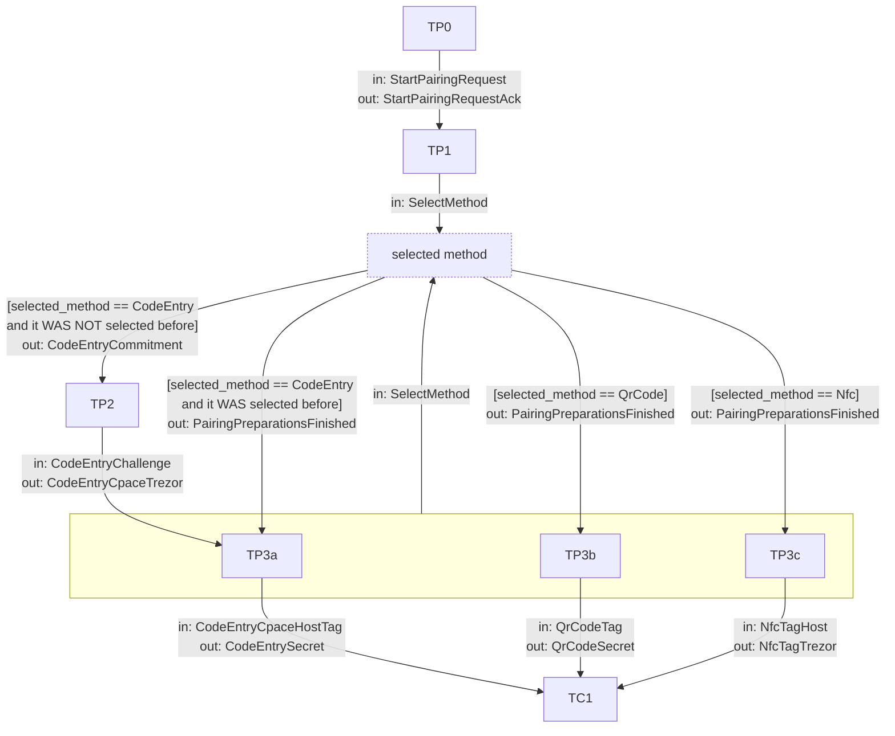

### Trezor’s state machine - Option 2

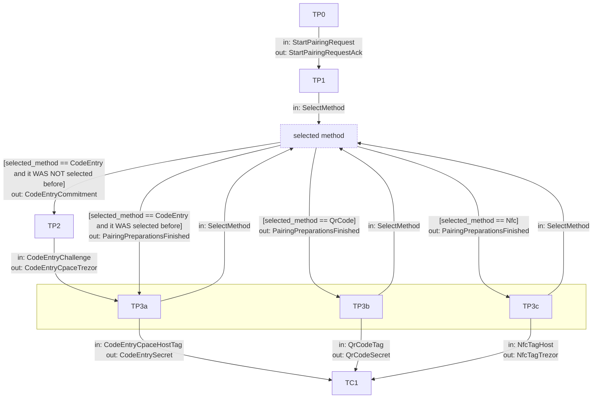

### State TP0

The behavior of Trezor in the state TP0 is defined as follows:

When the message PairingRequest(*host_name*, *app_name*) is received, take the following action:
1. Display a dialog "Allow {*app_name*} on {*host_name*} to pair with this Trezor?" on the screen.
2. Send ButtonRequest message.
3. Wait for ButtonAck Response from the host.
4. Wait for user interaction:
    1. The user cancelled the dialog - end pairing, send ActionCancelled Failure, drop the channel
    2. The user confirmed the dialog - transition to state TP1

### State TP1

The behavior of Trezor in the state TP1is defined as follows:

- When the message SelectMethod(selected_pairing_method) is received, transition to intermediate state “selected method”.

### State “selected method”

1. Read *selected_pairing_method* from the received message SelectMethod(*selected_pairing_method*)
2. Check that selected_pairing_method is allowed and supported by the Trezor. If it is not allowed, raise Exception
- selected_pairing_method is PairingMethod_CodeEntry and it WAS NOT selected before
    1. Generate a random 16-byte *code_entry_secret*.
    2. Set *commitment* = SHA-256(*code_entry_secret*).
    3. Send the message CodeEntryCommitment(*commitment*) to the host.
    4. Transition to the state TP2.
- selected_pairing_method is PairingMethod_CodeEntry and it WAS selected before
    1. Display *code_code_entry* on the Trezor’s screen (Note that *code_code_entry* is created only once per pairing - see State TP2)
    2. Send the message PairingPreparationsFinished() to the host.
    3. Transition to the state TP3a
- selected_pairing_method is PairingMethod_QrCode
    1. Generate a random 16-byte *qr_code_secret*.
    2.  Set *code_qr_code* = SHA-256(PairingMethod_QrCode || *handshake_hash* || *qr_code_secret*)[:16].
    3. Display QR Code on the Trezor’s screen
    4. Send the message PairingPreparationsFinished() to the host.
    5. Transition to the state TP3b
- selected_pairing_method is PairingMethod_Nfc
    1. Generate a random 16-byte *nfc_secret*.
    2. Display “NFC Dialog” on the Trezor’s screen
    3. Enable NFC (read-mode)
    4. Send the message PairingPreparationsFinished() to the host.
    5. Transition to the state TP3c

### State TP2

The behavior of Trezor in the state TP2is defined as follows:

- When the message CodeEntryChallenge(*challenge*) is received, take the following actions:
    1. Set *code_code_entry* = SHA-256(PairingMethod_CodeEntry || *handshake_hash* || *code_entry_secret* || *challenge* || *PairingMethod_CodeEntry*) % 1000000.
    2. Display *code_code_entry* on the screen.
    3. Compute *pregenerator* as the first 32 bytes of SHA-512(*prefix* || *code_code_entry* || *padding* || *handshake_hash* || **0x00***), where *prefix* is the byte-string  0x08 || 0x43 || 0x50 || 0x61 || 0x63 || 0x65 || 0x32 || 0x35 || 0x35 || 0x06, *code_code_entry* is encoded as an ASCII representation of the 6-digit code (with prepended zeroes if needed) (`f"{code_code_entry:06}".encode("ascii")`), and *padding* is the byte-string **0x6f** || 0x00 ^ **111** || 0x20.
    4. Set *generator* = ELLIGATOR2(*pregenerator*).
    5. Generate a random 32-byte *cpace_trezor_private_key*.
    6. Set *cpace_trezor_public_key* = X25519(*cpace_trezor_private_key*, *generator*).
    7. Send the message CodeEntryCpaceTrezor(*cpace_trezor_public_key*) to the host.
    8. Transition to the state TP3a.

### State TP3a

- When the message SelectMethod(selected_pairing_method) is received, transition to the intermediate state “selected method”.
- When the message CodeEntryCpaceHostTag(*cpace_host_public_key*, *tag*) is received, take the following actions:
    1. Clear the screen.
    2. Set *shared_secret* = X25519(*cpace_trezor_private_key*, *cpace_host_public_key*).
    3. Assert that *tag* == SHA-256(*shared_secret*). 
    4. Send the message CodeEntrySecret(*secret*) to the host.
    5. Transition to the state TC1

### State TP3b

- When the message SelectMethod(selected_pairing_method) is received, transition to the intermediate state “selected method”.
- When the message QrCodeTag(tag) is received, take the following actions:
    1. Clear the screen.
    2. Assert that *tag* == SHA-256(*handshake_hash*, *code_qr_code*).
    3. Send the message QrCodeSecret(*qr_code_secret*) to the host.
    4. Transition to the state TC1.

### State TP3c

- When the message SelectMethod(selected_pairing_method) is received, transition to the intermediate state “selected method”.
- When the message NfcTagHost(tag_host) is received, take the following actions:
    1. Clear the screen.
    2. Assert that *tag_host* == SHA-256(PairingMethod_NFC || *handshake_hash* || *nfc_secret_trezor*).
    3. Set *tag_trezor* == SHA-256(PairingMethod_NFC || *handshake_hash* || *nfc_secret_host*).
    4. Send the message NfcTagTrezor(*tag_trezor*) to the host.
    5. Transition to the state TC1.

### Host’s state machine

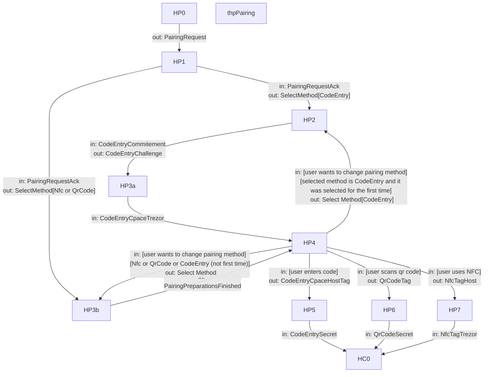

### State HP0

The behavior of the host in the state HP0 is defined as follows:

- Take the following actions:
    1. Send the message PairingRequest to the Trezor.
    2. Transition to the state HP1

### State HP1

The behavior of the host in the state HP1 is defined as follows:

- When the message PairingRequestAck is received, take the following actions:
    1. Set *selected_pairing_method*  to one of the pairing method supported by Trezor from the *device_properties* received during handshake. The selection can be done by the user or by using pre-defined default settings.
    2. Send the message SelectMethod(*selected_pairing_method*) to the Trezor.
    - When the *selected_pairing_method* is CodeEntry, take the following action:
        1. Transition to the state HP2
    - When the *selected_pairing_method* is NOT CodeEntry, take the following action:
        1. Transition to the state HP3b

### State HP2

The behavior of the host in the state HP2 is defined as follows:

- When the message CodeEntryCommitment(*commitment*) is received, take the following actions:
    1. Generate a random 16-byte *challenge*.
    2. Send the message CodeEntryChallenge(*challenge*) to the Trezor.
    3. Transition to the state HP3a.

### State HP3a

The behavior of the host in the state HP3a is defined as follows:

- When the message CodeEntryCpaceTrezor(*cpace_trezor_public_key*) is received, take the following actions:
    1. Transition to the state HP4.

### State HP3b

The behavior of the host in the state HP3b is defined as follows:

- When the message PairingPreparationsFinished() is received, take the following actions:
    1. Transition to the state HP4.

### State HP4

- When changing the pairing method to CodeEntry and CodeEntry is selected for the first time in this pairing process, take the following actions:
    1. Set *selected_pairing_method* to PairingMethod_CodeEntry
    2. Send the message SelectMethod(*selected_pairing_method*) to the Trezor.
    3. Transition to the state HP2
- When changing the pairing method to CodeEntry and CodeEntry is selected for the second time (or more) in this pairing process, take the following actions:
    1. Transition to the state HP3b
- When changing the pairing method to Nfc or QrCode, take the following actions:
    1. Transition to the state HP3b
- When the *selected_pairing_method* is CodeEntry and user enters *code*, take the following action:
    1. Disable all code entry methods.
    2. Compute *pregenerator* as the first 32 bytes of SHA-512(*prefix* || *code* || *padding* || *h*), where *prefix* is the byte-string  0x08 || 0x43 || 0x50 || 0x61 || 0x63 || 0x65 || 0x32 || 0x35 || 0x35 || 0x06 and *padding* is the byte-string 0x50 || 0x00 ^ 80 || 0x20.
    3. Set *generator* = ELLIGATOR2(*pregenerator*).
    4. Generate a random 32-byte *cpace_host_private_key*.
    5. Set *cpace_host_public_key* = X25519(*cpace_host_private_key*, *generator*).
    6. Set *shared_secret* = X25519(*cpace_host_private_key*, *cpace_trezor_public_key*).
    7. Set *tag* = SHA-256(*shared_secret*).
    8. Send the message CodeEntryCpaceHostTag(*cpace_host_public_key*, *tag*) to the Trezor.
    9. Transition to the state HP5.
- When the *selected_pairing_method* is QrCode and host scans the code from Trezor’s display, take the following action:
    1. Set *code* as the data scanned from the Qr Code
    2. Set *tag* = SHA-256(*handshake_hash* || *code*)
    3. Send the message QrCodeTag(*tag*)
    4. Transition to the state HP6
- When the *selected_pairing_method* is Nfc and user brings the device close (nfc communication is possible), take the following action:
    1. Generate a random 16-byte *secret_H*.
    2. Set *handshake_hash_digest_H* as the first 16 bytes of *handshake_hash*.
    3. Send  *secret_H* || *handshake_hash_digest_H* over the NFC.
    4. Read *secret_T* || *handshake_hash_digest_T* from the NFC.
    5. Assert that *handshake_hash_digest_H* == *handshake_hash_digest_T*.
    6. Set *tag_H* = SHA-256(PairingMethod_Nfc || *handshake_hash_H* || *secret_T*).
    7. Send the message NfcTagHost(*tag_H*)
    8. Transition to the state HP7

### State HP5

The behavior of the host in the state HP5 is defined as follows:

- When the message CodeEntrySecret(*secret*) is received, take the following actions:
    1. Assert that *commitment* = SHA-256(*secret*).
    2. Assert that *code* = SHA-256(PairingMethod_CodeEntry || *handshake_hash_H* || *secret* || *challenge*) % 1 000 000 (BigEndian).
    3. Transition to the state HC0

### State HP6

The behavior of the host in the state HP6 is defined as follows:

- When the message QrCodeSecret(*secret*) is received, take the following actions:
    1. Assert that *code* = SHA-256(PairingMethod_QrCode || *handshake_hash* || *secret*)[:16].
    2. Transition to the state HC0

### State HP7

The behavior of the host in the state HP7 is defined as follows:

- When the message NfcTagTrezor(*tag_T*) is received, take the following actions:
    1. Assert that *tag_T* = SHA-256(PairingMethod_Nfc || *handshake_hash_H* || *secret_H*).
    2. Transition to the state HC0.

## NFC pairing sequence

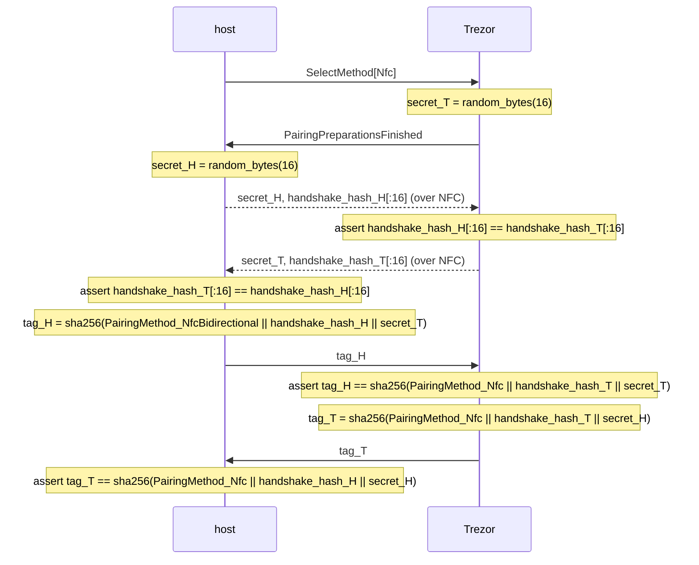

## QR Code pairing sequence

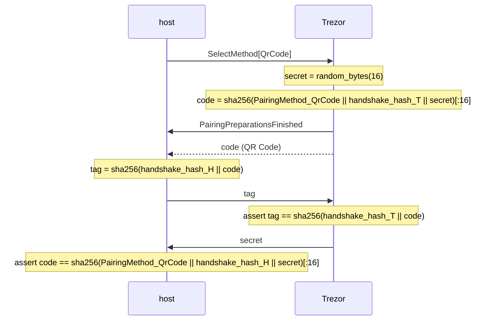

## Code Entry pairing sequence

### Separated diagrams

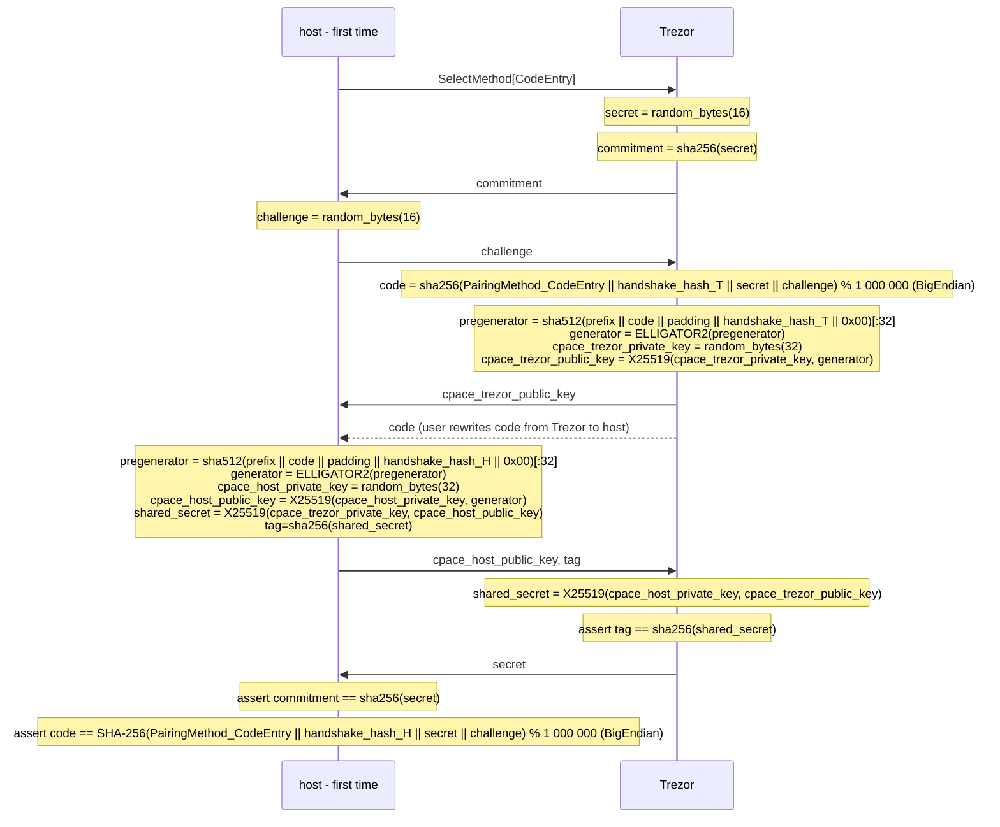

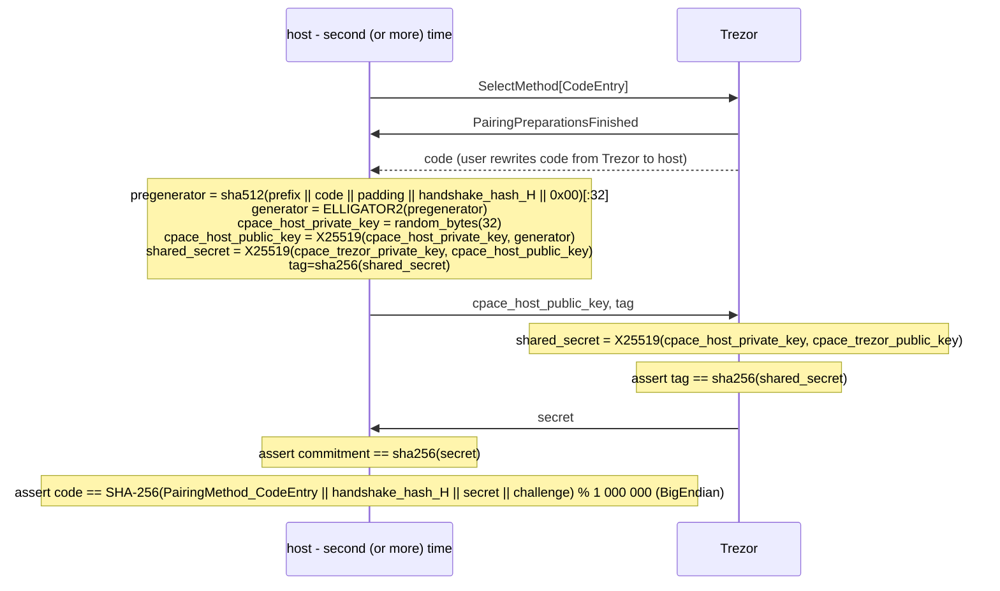

### Combined diagram

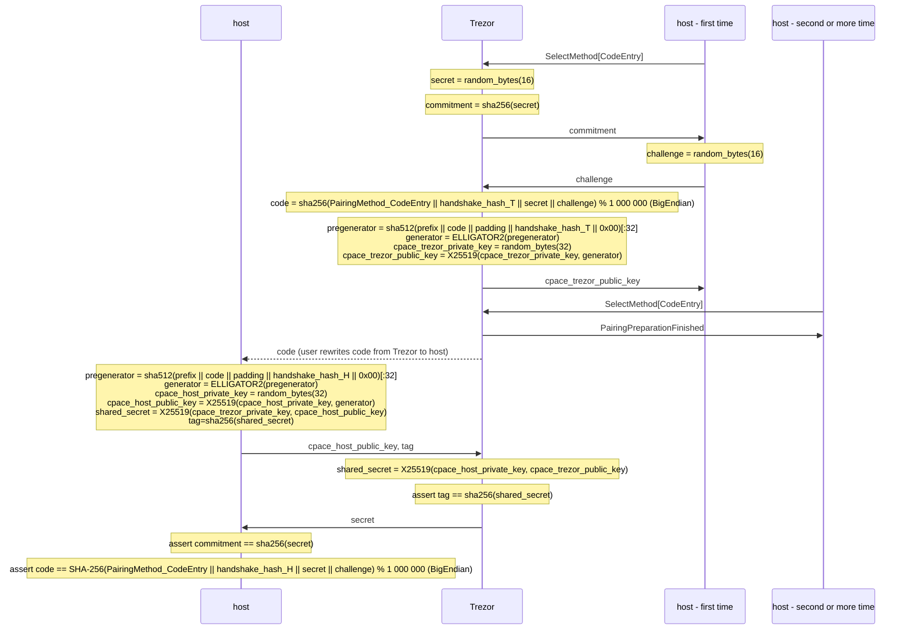

## Credential phase

In credential phase, the host can request a long-term pairing credential (THP credential) from Trezor. THP credential can be used by the host next time in the handshake phase - to avoid the need to go through the pairing procedure. Even when the host is connecting with a credential, a confirmation of connection by user is required (by default). However, when the host has a valid credential available, they can ask Trezor for an *autoconnect credential*. When a valid *autoconnect credential* is used during the handshake phase, no connection confirmation is required from the user .

### Messages

The following messages are handled by the application layer.

```protobuf
message CredentialRequest {
    required bytes host_static_public_key = 1;     // Host's static public key identifying the credential.
    optional bool autoconnect = 2 [default=false]; // Whether the host wants to autoconnect without user confirmation
    optional bytes credential = 3;                 // Host's previous credential
}

message CredentialResponse {
    required bytes trezor_static_public_key = 1; // Trezor's static public key used in the handshake.
    required bytes credential = 2;               // The pairing credential issued by the Trezor to the host.
}

message EndRequest {
}

message EndResponse {
}
```

The following messages are used internally by Trezor - should not be transported over-the-wire or used in the host's implementation. The host should treat the pairing credential as opaque bytes.
```protobuf
message CredentialMetadata {
    option (internal_only) = true;
    required string host_name = 1;     // Human-readable host name (browser name for web apps)
    optional bool autoconnect = 2;     // Whether host is allowed to autoconnect without user confirmation
    required string app_name = 3;      // Human-readable application name
}

message PairingCredential {
    option (internal_only) = true;
    required CredentialMetadata cred_metadata = 1;    // Credential metadata
    required bytes mac = 2;                           // Message authentication code generated by the Trezor
}

message AuthenticatedCredentialData {
    option (internal_only) = true;
    required bytes host_static_public_key = 1;        // Host's static public key used in the handshake
    required ThpCredentialMetadata cred_metadata = 2; // Credential metadata
}
```

### Credential authentication key

For credential issuance and validation, a credential authentication key (*cred_auth_key*) is used. This key is derived from two components - *device secret* and a counter (*cred_auth_key_counter*). The *device secret* is independent of seed and is generated randomly first time it is needed. The *cred_auth_key_counter* is 4 bytes big endian initiated to zero. 

### Credential validation

Let *ValidateCredential*(*cred_auth_key*, *credential_binary*, *host_static_pubkey*) be the function defined as follows:

1. Set *credential* = PROTOBUF-DECODE(*type*=*PairingCredential*, *credential_binary*).
2. Set *authenticated_credential_data* = PROTOBUF-ENCODE(*type*=AuthenticatedCredentialData, *host_static_pubkey*, *credential.cred_metadata*).
3. Set *mac* = HMAC-SHA-256(*cred_auth_key*, *authenticated_credential_data*).
4. Return *mac* == *credential.mac*.

### Credential invalidation

Incrementing the *cred_auth_key_counter* results in a new *cred_auth_key*, invalidating all previously issued THP credentials. The design does not allow to invalidate a single selected credential - only all credentials can be invalidated, or none.

### Credential issuance

Let *IssueCredential*(*cred_auth_key*, *host_static_pubkey*, *credential_metadata*) be the function defined as follows:

1. Set *authenticated_credential_data* = PROTOBUF-ENCODE(*type*=AuthenticatedCredentialData, *host_static_pubkey*, *credential_metadata*).
2. Set *mac* = HMAC-SHA-256(*cred_auth_key*, *authenticated_credential_data*).
3. Set *credential_raw* = PROTOBUF-ENCODE(*type*=*PairingCredential*, *credential_metadata*, *mac*).
4. Return *credential_raw*.

### Autoconnect credential issuance

The host can request an autoconnect credential by sending the *ThpCredentialRequest* message to the Trezor - it is even possible to do when the communication is in the encrypted transport phase. The request must contain an already issued (valid) credential. Trezor does not allow host to request an *autoconnect* credential without the host providing **a** valid credential.

## Trezor’s state machine

    
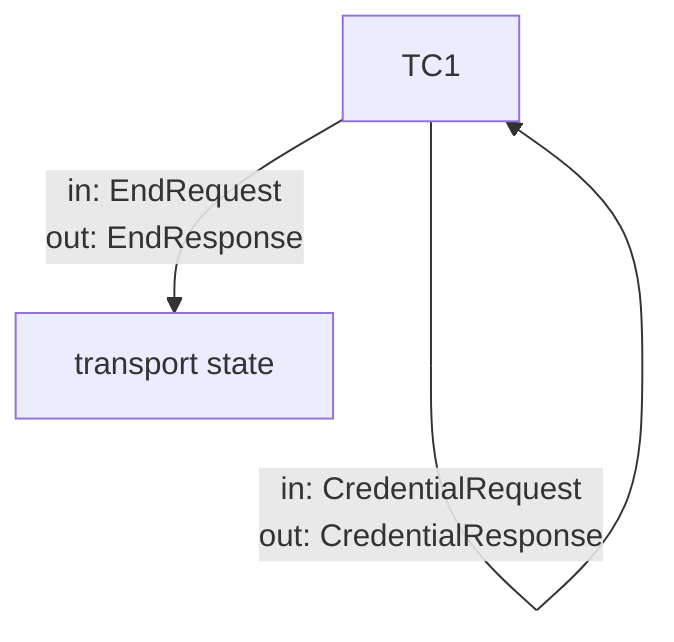
    

### State TC1

The behavior of Trezor in the state TC1(*host_static_pubkey*, *host_name*) is defined as follows:

- When the message EndRequest() is received, take the following actions:
    1. Transition to the transport state.
- When the message CredentialRequest(*host_static_pubkey*) is received, take the following actions:
    1. Set *credential_metadata* = CredentialMetadata(*host_name*).
    2. Set *credential* = *IssueCredential*(*cred_auth_key*, *host_static_pubkey*, *credential_metadata*).
    3. Send the message CredentialResponse(*trezor_static_pubkey*, *credential*) to the host.
    4. Transition to the state TP5(*host_name*).

## Host’s state machine

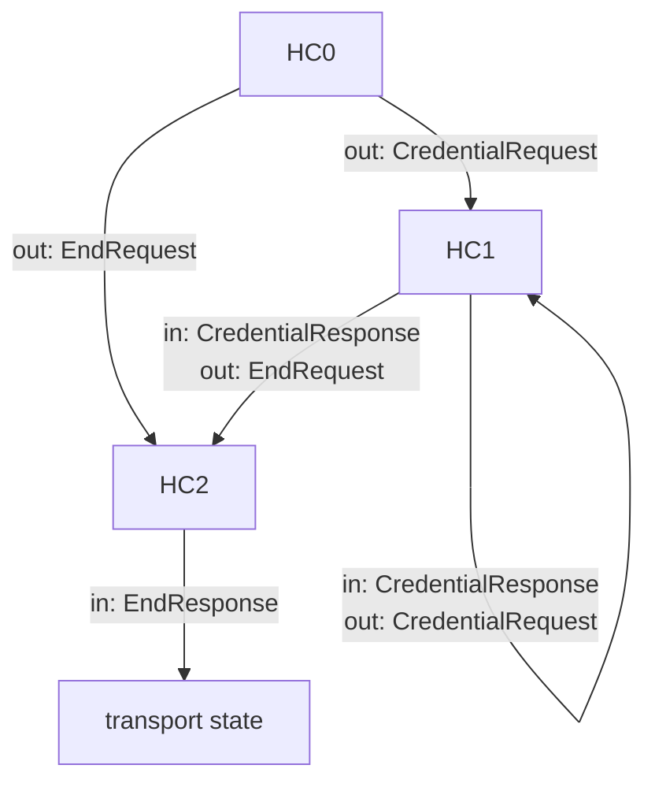

### State HC0

The behavior of the host in the state HC0 is defined as follows:

- Take the following actions:
    1. Send CredentialRequest(*host_static_pubkey*) to the Trezor. Transition to the state HC1
    
    OR
    
    1. Exit the Credential phase by sending EndRequest() to Trezor. Transition to state HC2.

### State HC1

The behavior of the host in the state HC1 is defined as follows:

- When the message CredentialResponse(*trezor_static_pubkey*, *credential*) is received, take the following actions:
    1. Append (*trezor_static_pubkey*, *credential*) to *credentials*.
    
    Then take one of the following actions:
    
    1. Send the message EndRequest() to the Trezor and transition to the state HC2.
    
    OR
    
    1. Send another message CredentialRequest(*host_static_pubkey*) to the Trezor. Keep the state HC1

### State HC2

The behavior of the host in the state HC2 is defined as follows:

- When the message EndResponse() is received, take the following actions:
    1. Transition to the transport state.

# Other features

## Channel replacement

A new `trezor_state` STATE_PAIRED_AUTOCONNECT was introduced. The name is a bit misleading, as it is not used for autoconnect credentials, yet. It is generally the same as STATE_PAIRED with an additional guarantee that there will not be a user confirmation required. It is currently used only when a channel is being replaced.

When a new channel is created and an old channel with the same host static public key is still in the Trezor's cache, all sessions from the old channel are migrated to the new one and the provided credential is treated as if it were autoconnect even if it is not.
It is not used for autoconnect credentials yet, as the host knows whether it used an autoconnect credential and thus whether to expect user confirmation. In the case of channel replacement, the host cannot be sure that the old channel is still in Trezor's cache.
Possible `trezor_state` values:
- STATE_UNPAIRED - Pairing is required. If a credential was used during handshake, it did not pass Trezor's validation (the credential failed verification).
- STATE_PAIRED - Pairing is skipped. User confirmation of the connection might be required - it is determined by the autoconnect field of the credential used.
- STATE_PAIRED_AUTOCONNECT - Pairing is skipped. User confirmation of the connection will not be required.

Channel replacement helps to reduce the number of user confirmations in cases where the host is already trusted and the connection was interrupted (the old channel must be valid - in the ENCRYPTED_TRANSPORT state).
Also, as the sessions from the old channel are migrated to the new one - it allows users to not enter passphrases repeatedly in case of such interruption.

Example usecase - the host application crashes/restarts.

Note: STATE_PAIRED_AUTOCONNECT can be viewed as a special case of STATE_PAIRED.
