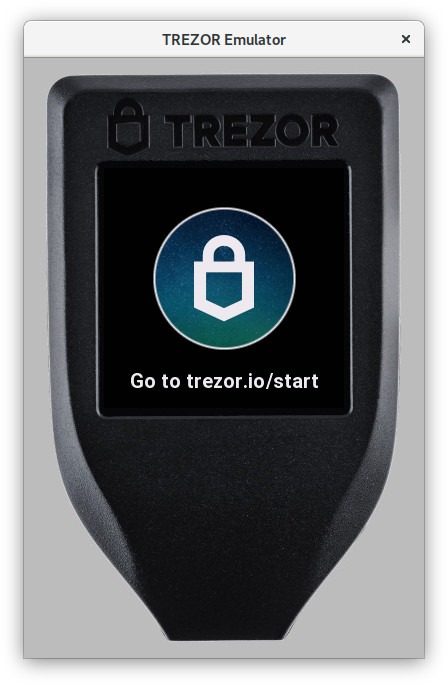
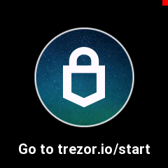

# Emulator

Emulator is a unix version of Core firmware that runs on your computer.



There is neither boardloader nor bootloader and no firmware uploads. Emulator runs the current code as is it is and if you want to run some specific firmware version you need to use git for that (simply checkout the right branch/tag). Actually, maybe we should call it _simulator_ to be precise, because it does not emulate the device in its completeness, it just runs the firmware on your host.

Emulator significantly speeds up development and has several features to help you along the way.

## How to run

1. [build](../build/emulator.md) the emulator
2. run `emu.py` inside the pipenv environment:
   - either enter `pipenv shell` first, and then use `./emu.py`
   - or always use `pipenv run ./emu.py`
3. to use [bridge](https://github.com/trezor/trezord-go) with the emulator support, start it with `trezord -e 21324`

Now you can use the emulator the same way as you use the device, for example you can visit our Wallet (https://wallet.trezor.io), use our Python CLI tool (`trezorctl`) etc. Simply click to emulate screen touches.

## Features

Run `./emu.py --help` to see all supported command line options and shortcuts. The
sections below only list long option names and most notable features.

### Debug and production mode

By default the emulator runs in debug mode. Debuglink is available (on port 21325 by
default), exceptions and log output goes to console. To indicate debug mode, there is a
red square in the upper right corner of Trezor screen.



To enable production mode, run `./emu.py --production`, or set environment variable `PYOPT=1`.

### Initialize with mnemonic words

In debug mode, the emulator can be pre-configured with a mnemonic phrase.

To use a specific mnemonic phrase:

```sh
./emu.py --mnemonic "such deposit very security much theme..."
```

When using Shamir shares, repeat the `--mnemonic` option:

```sh
./emu.py --mnemonic "your first share" --mnemonic "your second share" ...
```

To use the "all all all" seed defined in [SLIP-14](https://github.com/satoshilabs/slips/blob/master/slip-0014.md):

```sh
./emu.py --slip0014
```

### Storage and Profiles

Internal Trezor's storage is emulated and stored in the `/var/tmp/trezor.flash` file by
default. Deleting this file is similar to calling _wipe device_. You can also find
`/var/tmp/trezor.sdcard` for SD card.

You can specify a different location for the storage and log files via the `-p` /
`--profile` option:

```sh
./emu.py -p foobar
```

This will create a profile directory in your home `~/.trezoremu/foobar` containing
emulator run files. Alternatively you can set a full path like so:

```sh
./emu.py -p /var/tmp/foobar
```

You can also set a full profile path to `TREZOR_PROFILE_DIR` environment variable.

Specifying `-t` / `--temporary-profile` will start the emulator in a clean temporary
profile that will be erased when the emulator stops. This is useful, e.g., for tests.

### Logging

By default, emulator output goes to stdout. When silenced with `--quiet`, it is
redirected to `${TREZOR_PROFILE_DIR}/trezor.log`. You can specify an alternate output
file with `--output`.

### Running subcommands with the emulator

In scripts, it is often necessary to start the emulator, run a commmand while it is
available, and then stop it. The following command runs the device test suite using the
emulator:

```sh
./emu.py --command pytest ../tests/device_tests
```

### Profiling support

Run `./emu.py --profiling`, or set environment variable `TREZOR_PROFILING=1`, to run the
emulator with a profiling wrapper that generates statistics of executed lines.

### Memory statistics

Run `./emu.py --log-memory`, or set environment variable `TREZOR_LOG_MEMORY=1`, to dump
memory usage information after each workflow task is finished.

### Run in gdb

Running `./emu.py --debugger` runs emulator inside gdb/lldb.

### Watch for file changes

Running `./emu.py --watch` watches for file changes and reloads the emulator if any
occur. Note that this does not do rebuild, i.e. this works for MicroPython code (which
is interpreted) but if you make C changes, you need to rebuild yourself.

### Print screen

Press `p` on your keyboard to capture emulator's screen. You will find a png screenshot
in the `src` directory.

### Disable animation

Run `./emu.py --disable-animation`, or set environment variable
`TREZOR_DISABLE_ANIMATION=1` to disable all animations.
