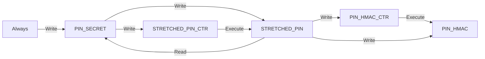

# Optiga data object configuration

The following table outlines the Optiga data object configuration used in Trezor Safe 3 and Trezor Safe 5.

| **OID** | **Name** | **Read** | **Write** | **Execute** | **Type/Usage** | **Size (bytes)** | **Notes** | **Storage version** |
| --- | --- | --- | --- | --- | --- | --- | --- | --- |
| E0E0 | `CERT_INF` | Always | Never | Always | DEVCERT | | Infineon certificate. | |
| E0E1 | `CERT_DEV` | Always | Never | Always | DEVCERT | | Device certificate chain. | |
| E0E2 | `CERT_FIDO` | Always | Never | Always | DEVCERT | | FIDO attestation certificate. | |
| E0E3 | | | | | DEVCERT | ≤ 1728 | Unused public key certificate. | |
| E0E8 | | | | | TA | ≤ 1200 | Unused root CA public key certificate. | |
| E0E9 | | | | | TA | ≤ 1200 | Unused root CA public key certificate. | |
| E0F0 | `KEY_DEV` | Never | Never | Conf(`KEY_PAIRING`) | Sign | | NIST P-256 device private key. | |
| E0F1 | | | | | | | Unused private ECC key. | |
| E0F2 | `KEY_FIDO` | Never | Never | Conf(`KEY_PAIRING`) | Sign | | NIST P-256 FIDO attestation private key. | |
| E0F3 | `PIN_ECDH` | Never | Always | Luc(`PIN_TOTAL_CTR`) | KeyAgree | | NIST P-256 key for ECDH PIN stretching step. | ≥ 3 |
| E120 | `STRETCHED_PIN_CTR` | Always | Auto(`PIN_SECRET`) | Always | UPCTR | 8 | Counter which limits the guesses at `STRETCHED_PIN`. Limit set to 16. | ≥ 3 |
| E121 | `PIN_TOTAL_CTR` | Always | Never | Always | UPCTR | 8 | Counter which limits the total number of PIN stretching operations over the lifetime of the device. Limit set to 600000, meaning 150000 unlock attempts. | ≥ 3 |
| E122 | `PIN_HMAC_CTR` | Always | Auto(`STRETCHED_PIN`) | Always | UPCTR | 8 | Counter which limits the use of `PIN_HMAC`. Limit set to 16. | ≥ 5 |
| E123 | | | | | UPCTR | 8 | Unused monotonic counter. | |
| E140 | `KEY_PAIRING` | Never | Never | Always | PTFBIND | 32 | Shared platform binding secret. | |
| E200 | `PIN_CMAC` | Never | Always | Luc(`PIN_TOTAL_CTR`) | Enc | 32 | Key for AES-CMAC PIN stretching step. | ≥ 3 |
| F1D0 | `PIN_SECRET` | Auto(`STRETCHED_PIN`) | Always | Always | AUTOREF | 32 | Counter-protected PIN secret and reset key for `STRETCHED_PIN_CTR`. | ≥ 3 |
| F1D1 | `PIN_HMAC_V4` | Never | Never | Luc(`PIN_TOTAL_CTR`) | PRESSEC | 32 | Deprecated key for HMAC-SHA256 PIN stretching step. | 3, 4 |
| F1D2 | | | | | | ≤ 140 | Unused data object. | |
| F1D3 | | | | | | ≤ 140 | Unused data object. | |
| F1D4 | `STRETCHED_PIN` | Never | Auto(`PIN_SECRET`) | Luc(`STRETCHED_PIN_CTR`) | AUTOREF | 32 | Digest of the stretched PIN. | ≥ 3 |
| F1D5 | | | | | | ≤ 140 | Unused data object. | |
| F1D6 | | | | | | ≤ 140 | Unused data object. | |
| F1D7 | | | | | | ≤ 140 | Unused data object. | |
| F1D8 | `PIN_HMAC` | Never | Auto(`STRETCHED_PIN`) | Luc(`PIN_HMAC_CTR`) | PRESSEC | 32 | Counter-protected key for HMAC-SHA256 PIN stretching step. | ≥ 5 |
| F1D9 | | | | | | ≤ 140 | Unused data object. | |
| F1DA | | | | | | ≤ 140 | Unused data object. | |
| F1DB | | | | | | ≤ 140 | Unused data object. | |
| F1E0 | | | | | | ≤ 1500 | Unused data object. | |
| F1E1 | | | | | | ≤ 1500 | Unused data object. | |

# Optiga PIN protection

The diagram below summarizes the main relationships between the data objects that play a role in PIN protection.
An arrow from *X* to *Y* indicates that *X* authorizes the specified operation on *Y*.
* If *X* is a monotonic counter, then the specified operation on *Y* is allowed only if the counter value is below the threshold. The operation causes *X* to be incremented.
* If *X* is a secret, then the specified operation on *Y* is allowed only if the host MCU proves knowledge of the value stored in *X*.
* If *X* is Always, then the specified operation is always allowed.



## Stretching pattern

The Optiga's role in PIN protection is to add a series of PIN stretching steps to the process of computing the storage key encryption key (KEK). All stretching operations are limited either by the global counter `PIN_TOTAL_CTR` or by one of the PIN attempt counters `PIN_HMAC_CTR` and `STRETCHED_PIN_CTR`. Each stretching step is wrapped in the following pattern:
```py
digest = hmac_sha256(stretched_pin, "")
output = optiga_operation(..., digest)
stretched_pin = hmac_sha256(stretched_pin, output)
```
In this pattern, the stretched PIN is first processed using a one-way function before sending it to the Optiga. This ensures that in the unlikely case of an attacker recording communication between the MCU and Optiga or extracting the secret in `STRETCHED_PIN`, they will not gain knowledge of the stretched PIN, only its digest. Second, the digest is sent to the Optiga which uses it to generate an output. That output is then used to stretch the PIN. This method ensures that if the user chooses a high-entropy PIN or if at least one of the preceding stretching operations remains secure, then even if the communication link or the Optiga is completely compromised, possibly even malicious, it will not reduce the security of the Trezor any more than if the Optiga was not integrated into the Trezor in the first place.

## Optiga stretching process

The following pseudocode outlines the process of stretching the PIN by Optiga.
```py
optiga_pin_verify(stretched_pin):
    # Stretch the PIN with the secrets in PIN_CMAC and PIN_ECDH.
    PIN_STRETCH_ITERATIONS = 2
    for _ in range(PIN_STRETCH_ITERATIONS):
        # Stretch the PIN with PIN_CMAC and PIN_ECDH secrets in the Optiga.
        digest = hmac_sha256(stretched_pin, "")
        cmac_out = encrypt_sym(SYM_MODE_CMAC, PIN_CMAC, digest)
        point = hash_to_curve(digest)
        ecdh_out = calc_ssec(CURVE_P256, PIN_ECDH, point)
        stretched_pin = hmac_sha256(stretched_pin, cmac_out + ecdh_out)

    # Stretch the PIN with the secret in PIN_HMAC.
    digest = hmac_sha256(stretched_pin, "")
    hmac_buffer = encrypt_sym(SYM_MODE_HMAC_SHA256, PIN_HMAC, digest)
    stretched_pin = hmac_sha256(stretched_pin, hmac_buffer)

    # Authorise using STRETCHED_PIN so that we can read from PIN_SECRET and reset PIN_HMAC_CTR.
    digest = hmac_sha256(stretched_pin, "")
    if not set_auto_state(STRETCHED_PIN, digest):
        raise InvalidPinError
    pin_secret = get_data_object(PIN_SECRET)
    stretched_pin = hmac_sha256(stretched_pin, pin_secret)
    set_data_object(PIN_HMAC_CTR, COUNTER_RESET)

    # Authorise using PIN_SECRET so that we can reset STRETCHED_PIN_CTR.
    set_auto_state(PIN_SECRET, pin_secret)
    set_data_object(STRETCHED_PIN_CTR, COUNTER_RESET)

    return stretched_pin
```

The first step of the stretching process hardens the PIN protection in case a vulnerability is discovered that allows the extraction of the secret value of a data object in Optiga that has a particular configuration, but does not allow extraction for other kinds of data objects. An attacker would need to be able to extract each of the secrets in `PIN_CMAC`, `PIN_ECDH`, `PIN_HMAC` and `PIN_SECRET` to conduct an offline brute-force search for the PIN. Thus it reduces the number of PIN values that the attacker can test in a unit of time by forcing them to involve the Optiga in each attempt, and restricts the overall number of attempts using `PIN_TOTAL_CTR`.

The rest of the process makes use of the data objects that are depicted in the diagram. The configuration of these data objects is designed with the goal of making the system resettable under all circumstances, i.e. even if the previous PIN is forgotten, flash storage is wiped and counters are depleted. There are two PIN attempt counters `STRETCHED_PIN_CTR` and `PIN_HMAC_CTR`, which both have a limit of 16 attempts and have identical values under normal circumstances.

`PIN_HMAC_CTR` limits the number of possible PIN attempts, but together with `PIN_HMAC` it also serves to mitigate a so called *PIN-only* attack. Without this counter it would be possible to partially reset the system by overwriting `PIN_SECRET` and resetting `STRETCHED_PIN_CTR` to gain an unlimited number of attempts at checking for the correct PIN, but without the possibility to derive the correct storage key encryption key, since the `PIN_SECRET` is overwritten. This attack is dangerous in case a user has two devices with the same PIN, because one of the devices could be used to determine the correct PIN and the other could then be unlocked. Note that in order for the mitigation to be effective, write access to `PIN_HMAC_CTR` must be authorized by `STRETCHED_PIN`. This implies that the attacker cannot reset `PIN_HMAC_CTR` without first overwriting `STRETCHED_PIN`, thus ruining the ability of checking for the correct PIN.

`STRETCHED_PIN_CTR` also limits the number of possible PIN attempts. Its presence is actually not necessary, but serves as an additional countermeasure in case a vulnerability is discovered that allows an attacker to read data objects of type PRESSEC, specifically `PIN_HMAC`. In that case, the attacker would still be restricted by the `STRETCHED_PIN_CTR` in the number of PIN attempts they can make. After they depleted the counter, the worst they could do is overwrite `PIN_SECRET` to execute the aforementioned PIN-only attack.

`PIN_SECRET` and `STRETCHED_PIN` play an essential role in making the system resettable, yet secure. Since `PIN_SECRET` is used in the last PIN stretching step, there needs to be a data object that grants read access to `PIN_SECRET`, which is why `STRETCHED_PIN` is needed in the system. Anyone attempting to reset the system must first overwrite `PIN_SECRET` thus losing the value that is necessary to complete the PIN stretching. Suppose there was no `PIN_SECRET` in the system and the PIN, stretched by `PIN_HMAC`, was used directly as the storage key encryption key. Then `STRETCHED_PIN` would have to be writable always, and an attacker could rewrite `STRETCHED_PIN`, reset the `PIN_HMAC_CTR`, and gain an unlimited number of attempts to guess the PIN.
