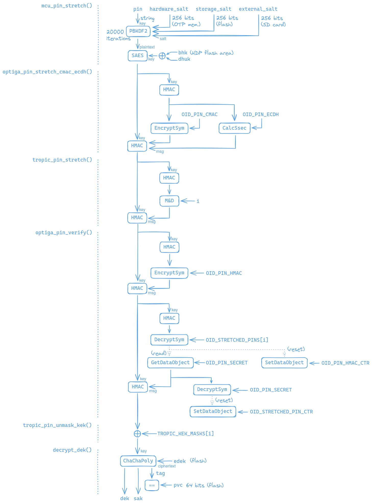
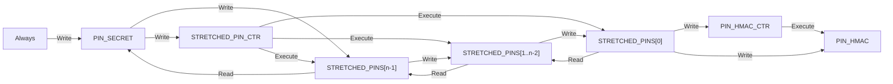
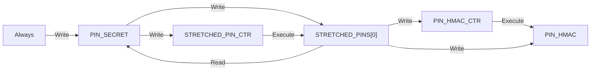

# PIN verification

This document describes how the PIN is verified and how the storage key encryption key (KEK) is derived from it. Two configurations exist:

* **Optiga-only**, used in Trezor Safe 3 (T2B1, T3B1) and Trezor Safe 5 (T3T1).
* **Optiga+Tropic**, used in Trezor Safe 7 (T3W1). Tropic's mac-and-destroy slots impose a hardware ceiling on the number of PIN attempts and Optiga gates the correctness of the PIN.

Throughout this document *n* denotes the number of stretched PIN slots in Optiga, which is 1 in the Optiga-only configuration and 10 when Tropic is present. The PIN attempt index `pin_index` is the number of failed PIN attempts since the last successful unlock, maintained by the MCU in NORCOW storage. In the Optiga-only configuration `pin_index` is always 0.

For the Optiga data object configuration see [Optiga](optiga.md). For the Tropic slot configuration see [Tropic](tropic.md). For the storage layout of `EDEK`, `ESAK` and `PVC` see the [storage documentation](../../storage/index.md).

## Stretching pattern

The role of the secure elements in PIN protection is to add a series of PIN stretching steps to the process of computing the KEK. Each stretching step is wrapped in the following pattern:
```py
digest = hmac_sha256(stretched_pin, "")
output = secure_element_operation(..., digest)
stretched_pin = hmac_sha256(stretched_pin, output)
```
In this pattern, the stretched PIN is first processed using a one-way function before sending it to the secure element. This ensures that in the unlikely case of an attacker recording communication between the MCU and the secure element or extracting the reference value that the secure element holds, they will not gain knowledge of the stretched PIN, only its digest. Second, the digest is sent to the secure element, which uses it to generate an output. That output is then used to stretch the PIN. This method ensures that if the user chooses a high-entropy PIN or if at least one of the preceding stretching operations remains secure, then even if the communication link or the secure element is completely compromised, possibly even malicious, it will not reduce the security of the Trezor any more than if the secure element was not integrated into the Trezor in the first place.

## Verification flow

The figure below shows the data flow during PIN verification in the Optiga+Tropic configuration. In the Optiga-only configuration the `tropic_pin_stretch()` and `tropic_pin_unmask_kek()` steps are absent and the output of `optiga_pin_verify()` is used directly as the KEK.



Each section of the figure corresponds to a function called from `derive_kek_unlock()` in `storage.c`. The steps are described in execution order below.

### `mcu_pin_stretch()`

The PIN is used as the password input to PBKDF2-HMAC-SHA256. The salt is the concatenation of a hardware salt from OTP memory, a storage salt from flash and an optional user-supplied salt from an SD card. Combining the PIN with the storage salt ensures that if the MCU-Optiga communication is compromised, then a user with a low-entropy PIN remains protected against an attacker who is not able to read the contents of the MCU storage. The PBKDF2 iteration count is 20000 in the Optiga-only configuration and 1 when Tropic is present, see the [rationale](#pbkdf2-iteration-count) below.

The PBKDF2 output is then encrypted using the SAES peripheral of the STM32U5 with a hardware key derived from `BHK` and `DHUK`. This key cannot be extracted by software, so even an attacker who has fully compromised both secure elements and bypassed all counters has to involve the STM32U5 in every PIN verification attempt.

### `optiga_pin_stretch_cmac_ecdh()`

The stretched PIN passes through the following stretching steps executed by Optiga:
```py
for _ in range(PIN_STRETCH_ITERATIONS):
    digest = hmac_sha256(stretched_pin, "")
    cmac_out = encrypt_sym(SYM_MODE_CMAC, PIN_CMAC, digest)
    point = hash_to_curve(digest)
    ecdh_out = calc_ssec(CURVE_P256, PIN_ECDH, point)
    stretched_pin = hmac_sha256(stretched_pin, cmac_out + ecdh_out)
```
`PIN_STRETCH_ITERATIONS` is 2 in the Optiga-only configuration and 1 when Tropic is present. Both operations are limited by `PIN_TOTAL_CTR`, which restricts the total number of PIN stretching operations over the lifetime of the device.

This step hardens the PIN protection in case a vulnerability is discovered that allows the extraction of the secret value of a data object in Optiga that has a particular configuration, but does not allow extraction for other kinds of data objects. An attacker would need to be able to extract each of the secrets in `PIN_CMAC`, `PIN_ECDH`, `PIN_HMAC` and `PIN_SECRET` to conduct an offline brute-force search for the PIN. Thus it reduces the number of PIN values that the attacker can test in a unit of time by forcing them to involve the Optiga in each attempt, and restricts the overall number of attempts using `PIN_TOTAL_CTR`.

### `tropic_pin_stretch()`

Present only when Tropic is used. The stretched PIN passes through a mac-and-destroy operation on the Tropic slot assigned to the current `pin_index` (see [Tropic](tropic.md) for the slot assignment):
```py
digest = hmac_sha256(stretched_pin, "")
output = mac_and_destroy(slot, digest)
stretched_pin = hmac_sha256(stretched_pin, output)
```

The mac-and-destroy operation `mac_and_destroy(slot, input)` returns an output which is a deterministic function of the slot index, the input, the previous contents of the slot and an internal chip secret. As a side effect, it overwrites the contents of the slot with a value derived from the input and the slot index. The output is diversified by the slot index, so identical inputs produce distinct outputs for distinct slots.

During PIN setup, each slot is written using a random `reset_key` and the correct mac-and-destroy output for the slot is recorded (see below). During verification, the mac-and-destroy operation reproduces the correct output only if the slot still holds the contents written using `reset_key`. The operation itself destroys those contents, so every attempt, correct or not, burns the slot. A slot can only be restored by executing the mac-and-destroy operation with `reset_key` as the input. Since `reset_key` is stored in flash encrypted under the KEK, restoring the slots requires a successful unlock. A wrong PIN attempt therefore permanently consumes one slot, and after all *n* slots are consumed no PIN can be verified, which imposes a hardware ceiling of *n* attempts that holds even if all MCU-side counters are bypassed. Tropic does not check `pin_index` itself. The MCU supplies it, and the ceiling is enforced by the destruction of slot contents, not by an index check.

Because the mac-and-destroy output differs for each slot, the stretched PIN that emerges from this step is different for every `pin_index`, even though the same PIN entered the step. All subsequent steps must therefore work with *n* different stretched PIN values, which is why Optiga is configured with *n* stretched PIN slots.

### `optiga_pin_verify()`

The stretched PIN passes through one more Optiga stretching step, using the counter-protected key `PIN_HMAC`, and then through the authorization chain that ends at `PIN_SECRET`:
```py
def optiga_pin_verify(pin_index, stretched_pin):
    # Stretch the PIN with the secret in PIN_HMAC. Limited by PIN_HMAC_CTR.
    digest = hmac_sha256(stretched_pin, "")
    hmac_out = encrypt_sym(SYM_MODE_HMAC_SHA256, PIN_HMAC, digest)
    stretched_pin = hmac_sha256(stretched_pin, hmac_out)

    # Authorize using STRETCHED_PINS[pin_index]. This is where an incorrect
    # PIN fails. Limited by STRETCHED_PIN_CTR.
    digest = hmac_sha256(stretched_pin, "")
    if not set_auto_state(STRETCHED_PINS[pin_index], digest):
        raise InvalidPinError

    if pin_index == 0:
        # Write access is authorized by STRETCHED_PINS[0].
        set_data_object(PIN_HMAC_CTR, counter(limit=PIN_MAX_TRIES))

    # Walk the chain to gain read access to PIN_SECRET. Each authorization is
    # limited by STRETCHED_PIN_CTR.
    for i in range(pin_index + 1, n):
        digest = get_data_object(STRETCHED_PINS[i])
        set_auto_state(STRETCHED_PINS[i], digest)

    # Stretch the PIN with the counter-protected PIN secret.
    pin_secret = get_data_object(PIN_SECRET)
    stretched_pin = hmac_sha256(stretched_pin, pin_secret)

    # Authorize using PIN_SECRET and reset the counter.
    set_auto_state(PIN_SECRET, pin_secret)
    limit = PIN_MAX_TRIES if pin_index == 0 else PIN_MAX_TRIES + 1
    set_data_object(STRETCHED_PIN_CTR, counter(limit))

    return stretched_pin
```

The relationships between the data objects are summarized by the following diagram. An arrow from *X* to *Y* indicates that *X* authorizes the specified operation on *Y*.
* If *X* is a monotonic counter, then the specified operation on *Y* is allowed only if the counter value is below the threshold. The operation causes *X* to be incremented.
* If *X* is a secret, then the specified operation on *Y* is allowed only if the host MCU proves knowledge of the value stored in *X*.
* If *X* is Always, then the specified operation is always allowed.



In the Optiga-only configuration, *n* = 1 and the three `STRETCHED_PINS` nodes collapse into a single node:



A successful verification at attempt index `pin_index` performs `n - pin_index` authorizations against `STRETCHED_PINS[*]` objects, each consuming one tick of `STRETCHED_PIN_CTR`. On success the counter is reset to `PIN_MAX_TRIES`, or to `PIN_MAX_TRIES + 1` if `pin_index > 0`, because one extra authorization against `STRETCHED_PINS[0]` will be consumed by the deferred reset of `PIN_HMAC_CTR` (see below). A failed attempt consumes one tick.

### `tropic_pin_unmask_kek()`

Present only when Tropic is used. The KEK is computed as
```
KEK = stretched_pin XOR masks[pin_index]
```
where `masks` is read from the KEK masks slot in Tropic's R-memory. The masks were written during PIN setup as `masks[i] = KEK XOR stretched_pins[i]`, where `stretched_pins[i]` is the stretched PIN value that results from a correct PIN entry at attempt index *i*.

In the Optiga-only configuration the KEK is the final stretched PIN itself, a deterministic function of the PIN, whereas in the Optiga+Tropic configuration the KEK is a random value generated at PIN setup and released by unmasking.

### `decrypt_dek()`

The entry containing `EDEK`, `ESAK` and `PVC` is read from flash and decrypted using ChaCha20-Poly1305 under the KEK, yielding the data encryption key (DEK) and the storage authentication key (SAK). Comparison of the Poly1305 tag with `PVC` provides the final check that the derived KEK is correct. See the [storage documentation](../../storage/index.md) for details.

## Setup and reset

`derive_kek_set()` in `storage.c` mirrors the verification flow. The MCU and CMAC/ECDH stretching steps are performed once and the result is copied into *n* stretched PIN values, which then diverge in `tropic_pin_set()`.

`tropic_pin_set()` increments the change-PIN counter, generates a random `reset_key`, and for each attempt index writes the corresponding mac-and-destroy slot using `reset_key`, executes the mac-and-destroy operation on the digest of the stretched PIN to obtain the correct output for that slot, mixes the output into the stretched PIN, and finally restores the slot contents using `reset_key`.

`optiga_pin_set()` generates a random HMAC stretching secret and computes the `PIN_HMAC` stretching step for all *n* stretched PINs on the MCU before storing the secret in `PIN_HMAC`. It then generates a random `PIN_SECRET`, stores the digest of each stretched PIN in `STRETCHED_PINS[i]`, walking the write-access chain from the last slot to the first, and mixes `PIN_SECRET` into each stretched PIN. `STRETCHED_PIN_CTR` is initialized to `n + PIN_MAX_TRIES`, of which *n* ticks are consumed by the authorizations performed during setup.

In the Optiga+Tropic configuration, a random KEK is generated and `tropic_pin_set_kek_masks()` stores the *n* masks `KEK XOR stretched_pins[i]` in a single R-memory slot.

Two reset keys are kept in flash storage, encrypted under the KEK:

* `TROPIC_MAC_AND_DESTROY_RESET_KEY` is the `reset_key` described above. After a successful unlock, `tropic_pin_reset_slots()` decrypts it and restores the contents of the mac-and-destroy slots consumed since the last successful unlock.
* `OPTIGA_HMAC_RESET_KEY` is the authorization reference of `STRETCHED_PINS[0]`. Write access to `PIN_HMAC_CTR` is authorized by `STRETCHED_PINS[0]`, but a verification at `pin_index > 0` never authorizes against slot 0, since the chain is walked forward only. After a successful unlock with `pin_index > 0`, `optiga_pin_reset_hmac_counter()` decrypts this key, authorizes against `STRETCHED_PINS[0]` and resets `PIN_HMAC_CTR`. This key exists only in the Optiga+Tropic configuration, since `pin_index` is always 0 otherwise.

## Rationale

### Layered defense

The verification flow distributes the rate-limiting and correctness-gating roles across three independent components, so that compromise of any single component does not yield unlimited PIN guesses.

If Tropic is compromised, Optiga still gates the correctness of the PIN via the authorization at `STRETCHED_PINS[pin_index]` and limits the number of guesses via `PIN_HMAC_CTR` and `STRETCHED_PIN_CTR`. The stretching pattern ensures that a malicious Tropic learns only a digest of the stretched PIN and that a low-entropy mac-and-destroy output does not weaken the stretched PIN.

If Optiga is compromised, the mac-and-destroy slots impose a hardware ceiling of *n* attempts, since every attempt destroys the contents of one slot and restoring them requires `reset_key`, which is encrypted under the KEK and thus unavailable without a successful unlock.

If both secure elements are compromised, the attacker still has to involve the STM32U5 in every PIN verification attempt, because the final MCU stretching step uses a hardware key that cannot be extracted by software. The MCU also maintains its own PIN attempt counter in NORCOW storage. A user with a sufficiently long PIN remains protected even if all three components are broken.

### PBKDF2 iteration count

In the Optiga-only configuration, PBKDF2 with 20000 iterations ensures that a complete compromise of Optiga does not reduce the security of the device below that of earlier Trezor models, which use PBKDF2 with the same number of iterations. In the Optiga+Tropic configuration the iteration count is reduced to 1, because the communication with the two secure elements already dominates the unlock latency, and the added brute-force resistance of 20000 iterations is small compared to the protection provided by three components which would either have to be fatally broken, or, if broken only partially, would still provide rate limiting on their own.

### Multiple stretched PIN slots

The mac-and-destroy output is diversified by the slot index, so the stretched PIN that reaches Optiga differs for each attempt index. Optiga's AUTOREF authorization requires the presented value to equal the stored reference exactly, so *n* distinct values require *n* distinct data objects. The slots are arranged in a chain terminating at a single `PIN_SECRET` rather than fanning out to multiple copies of it, at the cost of `n - pin_index` counter ticks per successful verification.

### PIN-only attack

`PIN_HMAC_CTR` limits the number of possible PIN attempts, but together with `PIN_HMAC` it also serves to mitigate a so called *PIN-only* attack. Without this counter it would be possible to partially reset the system by overwriting `PIN_SECRET` and resetting `STRETCHED_PIN_CTR` to gain an unlimited number of attempts at checking for the correct PIN, but without the possibility to derive the correct KEK, since `PIN_SECRET` is overwritten. This attack is dangerous in case a user has two devices with the same PIN, because one of the devices could be used to determine the correct PIN and the other could then be unlocked. Note that in order for the mitigation to be effective, write access to `PIN_HMAC_CTR` must be authorized by `STRETCHED_PINS[0]`. This implies that the attacker cannot reset `PIN_HMAC_CTR` without first overwriting `STRETCHED_PINS[0]`, thus ruining the ability of checking for the correct PIN.

### Redundancy of `STRETCHED_PIN_CTR`

`STRETCHED_PIN_CTR` also limits the number of possible PIN attempts. Its presence is actually not necessary, but serves as an additional countermeasure in case a vulnerability is discovered that allows an attacker to read data objects of type PRESSEC, specifically `PIN_HMAC`. In that case, the attacker would still be restricted by `STRETCHED_PIN_CTR` in the number of PIN attempts they can make. After they depleted the counter, the worst they could do is overwrite `PIN_SECRET` to execute the aforementioned PIN-only attack.

### Presence of `PIN_SECRET`

`PIN_SECRET` and the `STRETCHED_PINS[*]` objects play an essential role in making the system resettable, yet secure. The configuration of these data objects is designed with the goal of making the system resettable under all circumstances, i.e. even if the previous PIN is forgotten, flash storage is wiped and counters are depleted. Since `PIN_SECRET` is used in the last Optiga PIN stretching step, there needs to be a data object that grants read access to `PIN_SECRET`, which is why the `STRETCHED_PINS[*]` objects are needed in the system. Anyone attempting to reset the system must first overwrite `PIN_SECRET`, thus losing the value that is necessary to complete the PIN stretching. Suppose there was no `PIN_SECRET` in the system and the PIN, stretched by `PIN_HMAC`, was used directly as the KEK. Then `STRETCHED_PINS[*]` would have to be writable always, and an attacker could rewrite them, reset `PIN_HMAC_CTR`, and gain an unlimited number of attempts to guess the PIN.

### KEK masking

The KEK masks unify storage. Without them, `EDEK` would have to be stored in *n* versions, one encrypted under each of the *n* per-attempt stretched PINs. The mask is a per-attempt re-encoding of a single random KEK and carries no security claim of its own.
