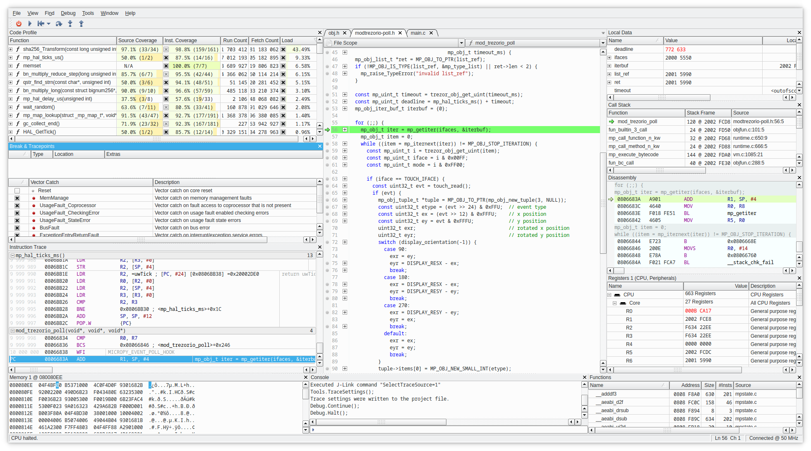

# Debugging events with SystemView and Real-time Terminal (Trezor T only)

Systemview is an utility to debug interrupts or other events, counters, logs
which does not require any extra pin (except the SWD pins attached to CPU).

An example showing two interrupts, and debug log passed via memory instead of UART.

Second example is RTT with color logging (kind of subset what SystemView can do,
sans the colors).

Compared to UART the speed of counters or messages is enormously faster as SystemView
does trick where it stores all in a small location in RAM (cyclic buffer)

This requires JLink/JTrace adapter and [SystemView](https://www.segger.com/products/development-tools/systemview/)
installed. SystemView is available as free/educational or commercial licensed.

## Building with SystemView enabled

Clean build in `core`:

    make clean

### Enable SYSTEM_VIEW

Change in `SConscript.firmware`: `PYOPT` to `0` (not strictly necessary, but you won't see
debug messages otherwise, though this enables to use it also on non-debug build).

Then it's suggested to change `OPTIMIZE` to `-Og` instead of `-Os` which will still
does optimizations, but only a subset that does hinder debug by reordering
instructions.

    PYOPT = ARGUMENTS.get('PYOPT', '0')
    COPT=os.getenv('OPTIMIZE', '-Og')

Then enable the SYSTEM_VIEW feature in `FEATURE_FLAGS`:

    FEATURE_FLAGS = {
        "RDI": True,
        "SECP256K1_ZKP": False,
        "SYSTEM_VIEW": True,
    }

Then in `core/src/trezor/log.py` change color to False, SystemView does not support
colorful messages (lines will be garbled), but if you want colors you can also use
Real-time terminal (RTT, see below)

    set color = False

Then build with (change PYOPT or BITCOIN_ONLY as needed):

    V=1 VERBOSE=1 PYOPT=0 BITCOIN_ONLY=1 SYSTEM_VIEW=1 make build_embed

After flashing with:

    make flash_firmware_jlink

You should be able to conect with SystemView or RTT and collect the data and analyze
them.

### Sending data to RTT instead of SystemView

There are two mutually exclusive macros, first one is turned on by default and sends
data to SystemView. Changing data sending to RTT is just undefining first and defining
second (in theory it could be able to send to both destinations, but never tried it.)

  * `SYSTEMVIEW_DEST_SYSTEMVIEW`
  * `SYSTEMVIEW_DEST_RTT`

Now when you run `JLinkRTTViewerExe` you should see data in the terminal:

It is possible to extend this mechanism to include multiple streams/terminals.
Terminals work like a usual terminal, so you can use it in debugging also for
user input.

## Combining SystemView/RTT with other debug tools

In general you can use SystemView along with GDB/CLion/Ozone or other debugger at the
same time, it's just advised that you keep all connections at the same frequency,
otherwise it may lead to unexpected behavior, weird resets, etc.

So e.g. you can profile the interrupts, DMA in SystemView while also profiling it on
instruction-level scale in Ozone:

