# Trezor Model T Open Source Hardware Reference Documentation

## Photo

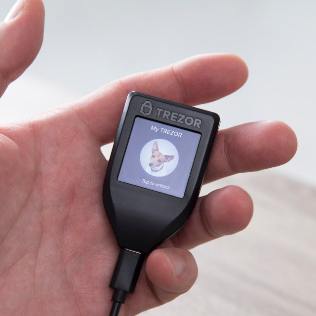

## Photo of assembled board (top)

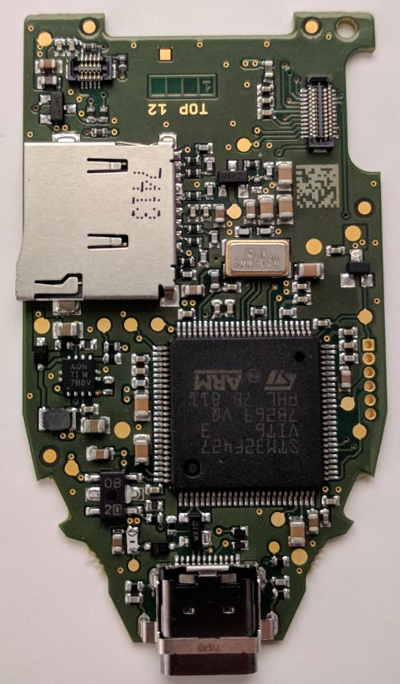

## Photo of assembled board (bottom)

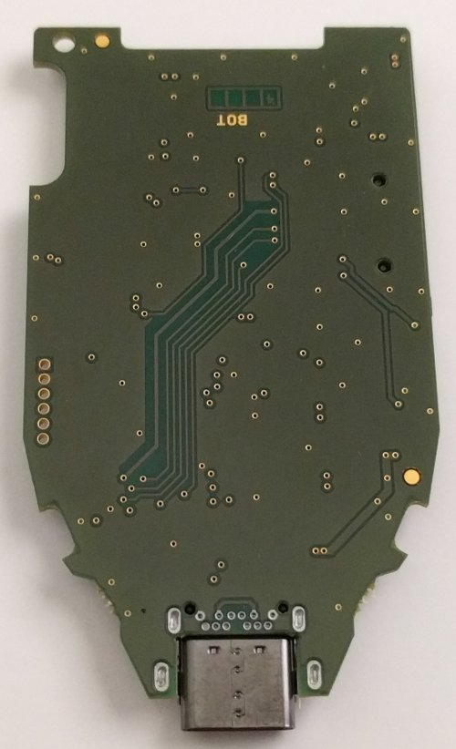

## Photo of assembled TFT LCD display + capacitive touch panel module (top)

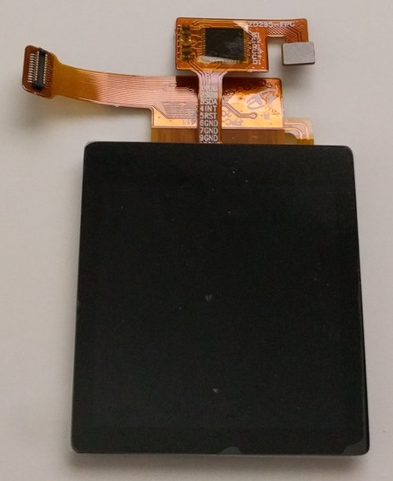

## Photo of assembled TFT LCD display + capacitive touch panel module (bottom)

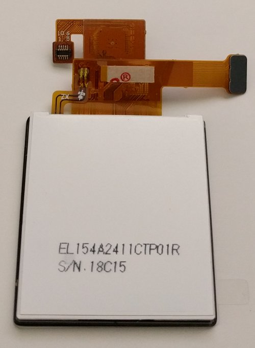

## Photo of disassembled TFT LCD display + capacitive touch panel module (top) (CTPM on left) (TFT LCD broken glass removed)

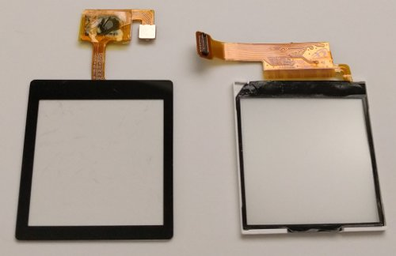

## Photo of disassembled TFT LCD display + capacitive touch panel module (bottom) (CTPM on left) (TFT LCD broken glass removed)

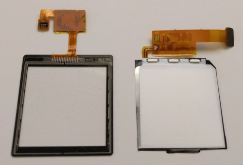

## Bill of Materials / BOM

[BOM](assets/bom.txt)

## Schematic

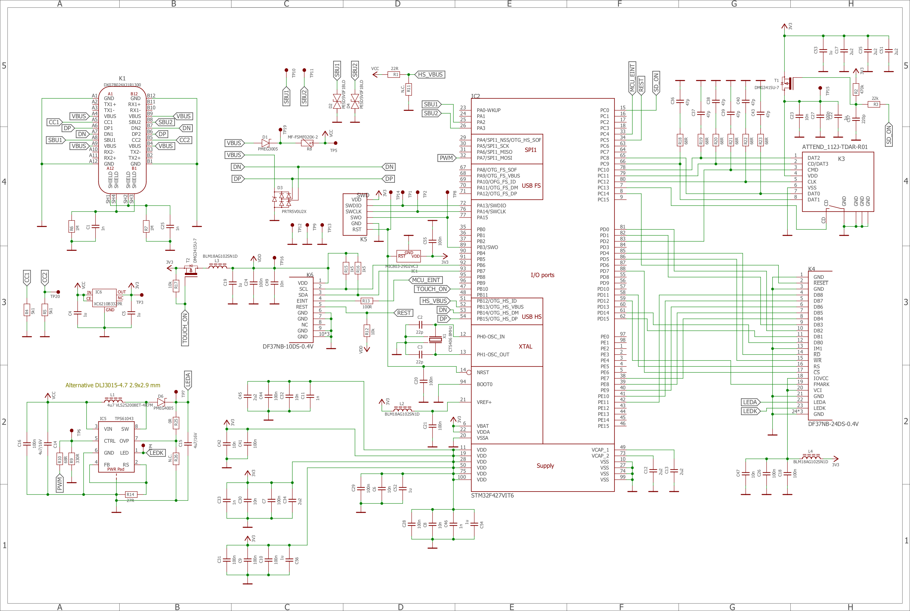

## Developer Kit

* 1 x [STM32F429I-DISC1](https://www.st.com/en/evaluation-tools/32f429idiscovery.html) (note: [Manual with pin to dev board function mapping](https://www.st.com/content/ccc/resource/technical/document/user_manual/6b/25/05/23/a9/45/4d/6a/DM00093903.pdf/files/DM00093903.pdf/jcr:content/translations/en.DM00093903.pdf))
* 1 x USB Cable Type A Plug/Male to Type Mini-B Plug/Male
* 1 x USB Cable Type A Plug/Male to Type Micro-B Plug/Male
* 1 x [ER-TFTM028-4 Display + Capacitive Touch Panel Module](https://www.ebay.com/itm/302049581340) (Note: specify 40-Pin Header, 8080 8-bit Parallel, VDD=3.3V, Capacitive Touch Panel) (note: [Manual](https://www.buydisplay.com/download/manual/ER-TFTM028-4_Datasheet.pdf))
* 1 x [microSD Board](https://www.waveshare.com/product/modules/storage/sd-tf-storage/micro-sd-storage-board.htm)
* 1 x [Pack of 40 Female to female jumper wires with 0.1" header contacts](https://www.adafruit.com/product/266)

### Display

* Resolution: 240px x 240px -OR- 240px x 320px
* Driver IC: ST7789V, GC9307, or ILI9341V (on-chip display data RAM of 240x320x18 bits)
* 18-bit (262,144) RGB color graphic type TFT-LCD
* Bus/Interface: 8080-I 8-bit parallel with 16-bit/pixel (RGB 5-6-5)

#### Pinout

|Description|MCU Pin|Notes|
|-----------|-------|-----|
|LCD_RST|PC14|display module pin 21. benign conflict with unpopulated OSC32_IN on dev board.|
|LCD_FMARK|PD12|tearing effect input; display module pin 22|
|LCD_PWM|PA7|backlight control (brightness); display module pin 29. benign conflict with I2C_EXT_RST on dev board.|
|LCD_CS|PD7|display module pin 23|
|LCD_RS|PD11|register select aka command/data; display module pin 24|
|LCD_RD|PD4|display module pin 26|
|LCD_WR|PD5|display module pin 25|
|LCD_D0|PD14|display module pin 3|
|LCD_D1|PD15|display module pin 4|
|LCD_D2|PD0|display module pin 5|
|LCD_D3|PD1|display module pin 6|
|LCD_D4|PE7|display module pin 7|
|LCD_D5|PE8|display module pin 8|
|LCD_D6|PE9|display module pin 9|
|LCD_D7|PE10|display module pin 10|
|LCD_D8|PE11|not currently used|

### Capacitive Touch Panel / Sensor

* Bus/Interface: I2C
* Driver IC: FT6236 or FT6206
* single touch

#### Pinout

|Description|MCU Pin|Notes|
|-----------|-------|-----|
|TOUCH_ON|PB10|no mapped pin on display module|
|I2C1_SCL|PB6|display module pin 30|
|I2C1_SDA|PB7|display module pin 31|
|EINT|PC4|not currently used. display module pin 39. conflict with USB OTG FS PSO on dev board.|
|REST|PC5|benign conflict with USB OTG FS OC on dev board. no mapped pin on display module.|

### microSD Socket

* Bus/Interface: 4-bit

#### Pinout

|Description|MCU Pin|
|-----------|-------|
|SDIO_D0|PC8|
|SDIO_D1|PC9|
|SDIO_D2|PC10|
|SDIO_D3|PC11|
|SDIO_CK|PC12|
|SDIO_CMD|PD2|
|SD_CARDDETECT|PC13|
|SD_ON|PC0|

### USB Socket

* USB HS (high-speed) peripheral in FS (full-speed) mode

#### Pinout

|Description|MCU Pin|Notes|
|-----------|-------|-----|
|OTG_HS_VBUS|PB13||
|OTG_HS_ID|PB12||
|OTG_HS_DM|PB14||
|OTG_HS_DP|PB15||
|SBU1|PA2|not currently used. conflict with L3GD20 Gyroscope MEMS on dev board.|
|SBU2|PA3|not currently used|

### Dev Board

* [STM32F429ZIT6](https://www.st.com/en/microcontrollers-microprocessors/stm32f429zi.html)
* HSE / High-Speed External Crystal: 8 MHz
* Integrated STMicroelectronics ST-LINK/V2.1 debugger

Note: There are many conflicts between how the software maps GPIO pins and how the dev board maps them to its functions.
Many of the conflicts are resolved by removing the external SDRAM chip and the TFT LCD display + resistive touch panel that come attached to the dev board.
The unresolved conflicts are noted in the pinout descriptions above.
Currently, testing has shown that it is not necessary to remove either the SDRAM or the TFT LCD display + resistive touch panel.
If you choose to remove them, our experience is that the easiest way to remove the SDRAM chip is by first cutting the leads on one side of the chip (e.g.- with an X-Acto knife) and then lifting the chip and rocking it until the leads on the other side break. Be sure that no broken leads short to another pin as this can cause the dev board and/or display to malfunction. If some do, just clean them up so that they are separate again.
This method reduces the amount of knife work, and the chance for slicing other things on the board (or yourself).
To remove the TFT LCD display + resistive touch panel module, lift the module away from the metal tray, bend the metal tray out of the way, then cleanly pull/tear the flex PCB away from the solder connections to the main board (the connections usually break without much force).
The metal tray is attached to the board with double stick tape. You just have to pull that up.

## Photo of dev board before modifications (top)

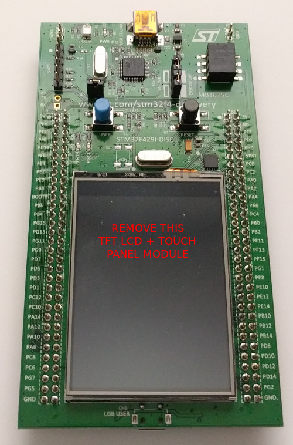

## Photo of dev board before modifications (bottom)

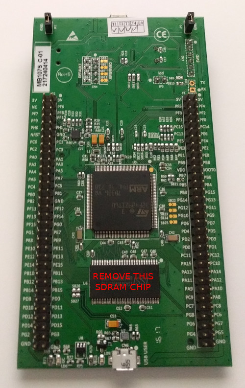

Minimum MCU requirements:

* STM32F4 family [STM32F427VIT6](https://www.st.com/en/microcontrollers-microprocessors/stm32f427vi.html)
* 168 MHz, 8 MHz HSE
* 2048 KB Flash memory
* 192 KB SRAM
* 64 KB CCMRAM
* FMC controller
* TRNG

### Clock Tree

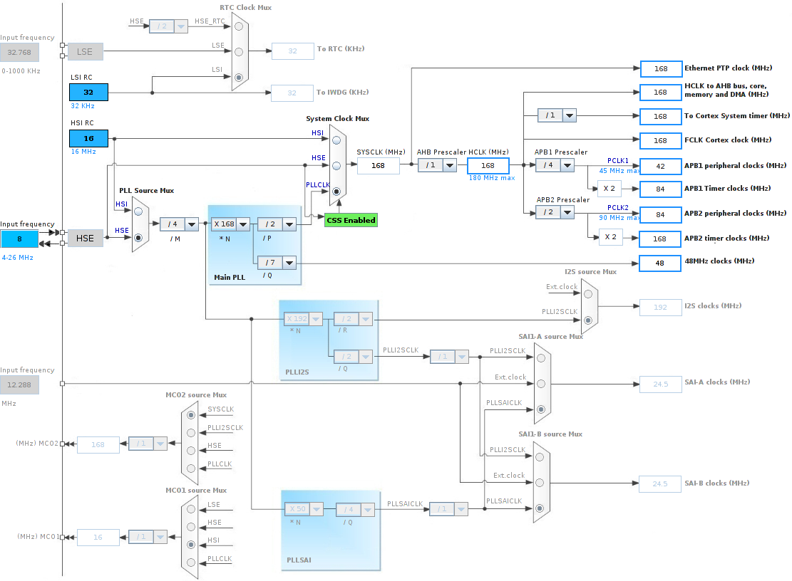
