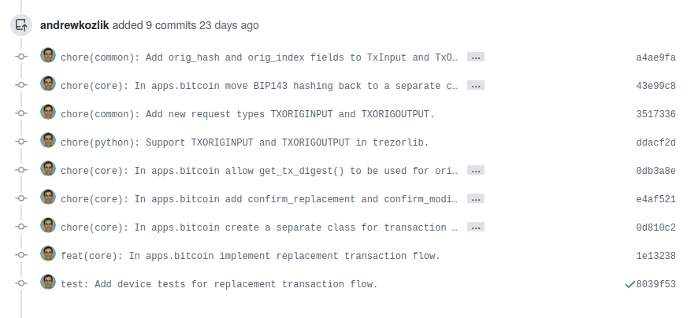
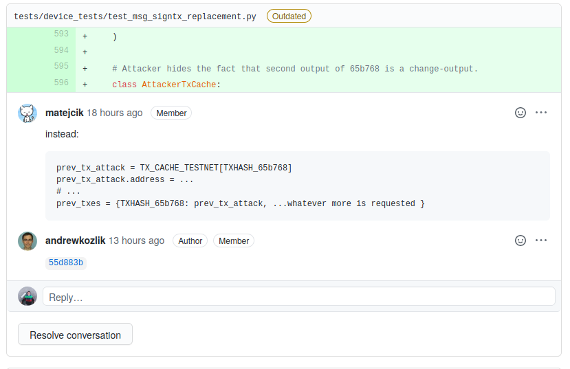
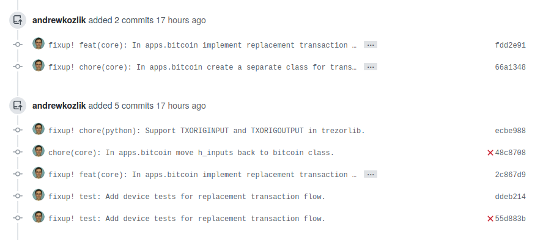
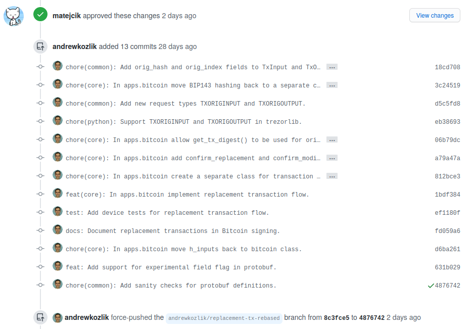

# Review Process

- File a Pull Request (PR) with a number of well-defined clearly described commits.
  Multiple commits per PR are allowed, but please do not include revert commits, etc. Use rebase.
- Do not use merge (e.g. merge trezor/master into ...). Again, use rebase.
- The general review workflow goes as follows:
  1. The author creates a PR. They should make sure it passes lints and anything that can be run
     quickly on their computer. When creating the PR, the author should also add links to any resources
     which might be helpful to the reviewer, namely the issue that the PR resolves or a design document,
     if there is one.
  2. The author assigns a reviewer. In some cases two or more reviewers can be assigned. One reason to do
     this is if the code under review is security-critical and deserves two pairs of eyes. Another reason
     is if the PR touches two very distinct areas of the codebase and the author wants a different specialist
     to review each one. In the latter case the author should clearly state who should review which part.
  3. The reviewer reviews the PR. In case they find something, they create a comment using the Github review
     system.
  4. The author implements the required changes and pushes the new commits. The author should never
     force-push during code review. If an earlier commit needs to be fixed, then instead of fixing it and
     force-pushing, it should be fixed by adding a so called _fixup_ commit. This can be done by
     `git commit --fixup [commithash]` which creates a new commit with the message "fixup! [orig_message]",
     where orig_message is the commit message of the `commithash` it "fixes". If the fixes are across
     multiple earlier commits, then they need to be split into multiple fixup commits.
  5. The author informs the reviewer with a simple comment "done" or similar to tell the reviewer
     their comment was implemented. Bonus points for including a revision of the fixup commit.
  6. The reviewer reviews the modifications and when they are finally satisfied they resolve the Github
     comment.
  7. The reviewer finally approves the PR with the green tick.
  8. The author runs `git rebase -i [main branch] --autosquash` which squashes the fixup commits into
     their respective parents and then force-pushes the rebase branch.
  9. The author makes a final check and merges the PR. If the rebase involved resolving some complicated
     merge conflicts, then the author may ask the reviewer for a final check. GitHub's _Rebase and merge_
     should be used, not _Squash and merge_.
  10. The author deletes their branch.

## Example

If you find the description too difficult, then here is an example to make it more clear.

Andrew tries to add a number of commits very well structured and with nice and consistent commit
messages. These will _not_ be squashed together.

Matějčík starts to review and finds something he would like to improve:

Andrew responds with a commit hash 55d883b informing that he has accepted and implemented the
comment.

This commit is a fixup commit. Since it is a new commit he does not have to force-push. In the
following image he is fixing the "test: Add device tests..." commit.

This way we can end up with number of fixup commits at the end of the review. Note that there is one commit in the following image that is _not_ a fixup commit. That's totally okay in case it makes sense and the author indeed wants it as a separate commit.

Matějčík is happy and approves the PR. After that Andrew squashes his commits via `git rebase -i [main branch] --autosquash`. This command will squash the fixup commits into their respective places modifying the original commits. After this he force-pushes. As you can see the history we end up with is very nice.

We merge the PR and that's it!

## Notes & Rationale

- If you want to fixup the latest commit, just use `git commit --fixup HEAD` as written above. If you want to fixup some older commit, use `git commit --fixup [commithash]`. Or any other reference for that matter.
- More good git rebase tips can be found at this [Atlassian website](https://www.atlassian.com/git/tutorials/rewriting-history/git-rebase).
- Some rationale why we avoid force pushing during code review, i.e. during the period starting with the creation of the PR until the last approval is given:
  1. Force pushing often makes it impossible to see the changes made by the author, so the reviewer has to go through the entire PR again. If it's just an amendment, then GitHub can show the differences, but in more complicated situations it's unable to untangle what happened. Especially if you rebase over master, which adds lots of new changes.
  2. A fixup commit can be easily referenced in the response to the reviewer's comment.
  3. Force pushing often breaks hyperlinks in GitHub comments, which is a real nuisance when somebody is referencing some code in their comment and you have no clue what they are talking about.
  4. It has led to code review comments being lost on multiple occasions. This seems to happen especially if you comment on a particular commit.
- What to do if you really need to rebase over master during an ongoing code review? This happens rarely, but if it's really necessary in order to implement the requested revisions, then:
  1. Try to resolve as many reviewer comments as possible before rebasing.
  2. Ask the reviewers for approval to go ahead with the rebase, i.e. give them time to confirm that the comments have been well resolved, avoiding as many of the problems mentioned above as possible.
  3. Rebase, do the stuff you need, force-push for a second round of review.
