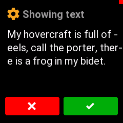
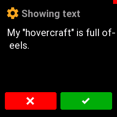
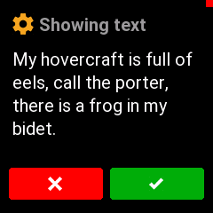
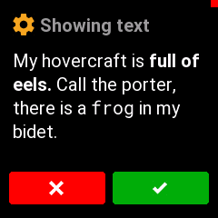
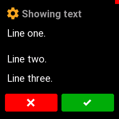
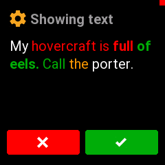

# Displaying text screens on Trezor T

## Requirements

For this feature, you will need a debug-enabled firmware for Trezor T. Usually that
will be the emulator.

You will also need `trezorctl` 0.12 or later. Best bet is to run the version from github
master.

## Trezor T text capabilities

The Trezor T screen has a _header_, with an icon and text. Below it is _body_, which
can fit up to 5 lines of text.

Text can be in one of several colors, and in one of three styles: NORMAL, BOLD, MONO.

It is possible to have multiple styles on the same line, but different styles must be
separated by a space.

I.e., this works fine:

> This word is **bold** and this is `monospaced`.

This will not work:

> Em**bold**ened middle, mono`space`d middle.

A line that is too long to fit on screen will automatically break, using a hyphen (`-`)
character. This is usually undesirable. Instead, a manual line-break should be inserted
in the appropriate place.

## Command line syntax

The most basic way to put words on screen is this:

```sh
trezorctl debug show-text "My hovercraft is full of eels, call the porter, there is a frog in my bidet."
```

The above command will show:



Notice the "quotes" around the text. The whole body text must be enquoted.

To use quotes inside the text, prefix them with backslashes `\`:

```sh
trezorctl debug show-text "My \"hovercraft\" is full of eels."
```



### Line breaks

Let's insert some line breaks. Do that by placing `@@BR` in the appropriate place
in the text:

```sh
trezorctl debug show-text "My hovercraft is full of @@BR eels, call the porter, @@BR there is a frog in my @@BR bidet."
```



Better!

### Text styles

Now let's add some style. Use `@@BOLD` to start printing in bold. Use `@@NORMAL`
to go back to normal text. `@@MONO` works similarly.

```sh
trezorctl debug show-text "My hovercraft is @@BOLD full of @@BR eels. @@NORMAL Call the porter, @@BR there is a @@MONO frog @@NORMAL in my @@BR bidet."
```



### Line spacing

Adding another `@@BR` after a `@@BR` will leave one line empty -- just like pressing
\<Enter\> twice.

If you don't want a full empty line, you can make a half-break with `@@BR_HALF`.

```sh
trezorctl debug show-text "Line one. @@BR @@BR Line two. @@BR @@BR_HALF Line three."
```




### Text colors

To switch to one of the [available colors](../../core/src/trezor/ui/style.py#L14-L47),
use the color name prefixed with `%%`: e.g., `%%RED`, `%%LIGHT_BLUE`...

To switch back to the default color, you can use `%%FG`:

```sh
trezorctl debug show-text "My %%RED hovercraft is @@BOLD full %%GREEN of @@BR eels. @@NORMAL Call %%ORANGE the %%FG porter."
```



### Headers

The default header says "Showing text" with an orange gear icon. It is possible to
change all of that.

To change the text, use `-h` option:

```sh
trezorctl debug show-text -h "Hello world" "My hovercraft is full."
```

To change the icon, you can pick [an icon name from here](../../core/src/trezor/ui/style.py#L50-L70) and specify it with the `-i` option:

```sh
trezorctl debug show-text -i RECEIVE "My hovercraft is full."
```

The icons are defined as shapes, and you can specify a custom color [from the list](../../core/src/trezor/ui/style.py#L14-L47) with the `-c` option:

```sh
trezorctl debug show-text -c RED "My hovercraft is full."
```

### Putting it all together

Here is how to reproduce the confirmation screen after the wallet is created:

```sh
trezorctl debug show-text -h "Success" -i CONFIRM -c GREEN "@@BOLD New wallet created @@BR successfully! @@BR @@BR_HALF @@NORMAL You should back up your @@BR new wallet right now."
```


