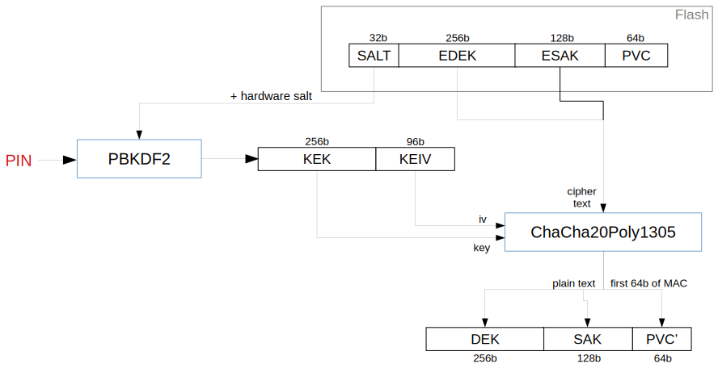

# Trezor Storage

The `storage` folder contains the implementation of Trezor's internal storage, which is common for both Legacy (Trezor One) and Core (Trezor T). This README also contains a detailed description of the cryptographic design.

All tests are located in the `tests` subdirectory, which also includes a Python implementation to run tests against this C production version and the Python one.

## Summary

The PIN is no longer stored in the flash storage. A new entry is added to the flash storage consisting of a 256-bit encrypted data encryption key (EDEK) followed by a 128-bit encrypted storage authentication key (ESAK) and a 64-bit PIN verification code (PVC). The PIN is used to decrypt the EDEK and ESAK and the PVC is used to verify that the correct PIN was used. The resulting data encryption key (DEK) is then used to encrypt/decrypt protected entries in the flash storage. We use Chacha20Poly1305 as defined in [RFC 7539](https://tools.ietf.org/html/rfc7539) to encrypt the EDEK and the protected entries. The storage authentication key (SAK) is used to authenticate the list of (APP, KEY) values for all protected entries that have been set in the storage. This prevents an attacker from erasing or adding entries to the storage.

## Storage format

Entries fall into three categories:

| Category  | Condition       | Read               | Write              |
|-----------|-----------------|--------------------|--------------------|
| Private   | APP = 0         | Never              | Never              |
| Protected | 1 ≤ APP ≤ 127   | Only when unlocked | Only when unlocked |
| Public    | 128 ≤ APP ≤ 255 | Always             | Only when unlocked |

The format of public entries has remained unchanged, that is:

| Data           | KEY | APP | LEN | DATA |
|----------------|-----|-----|-----|------|
| Length (bytes) | 1   | 1   | 2   | LEN  |

Private values are used to store storage-specific information and cannot be directly accessed through the storage interface. Protected entries have the following new format:

| Data           | KEY | APP | LEN | IV | TAG | ENCRDATA |
|----------------|-----|-----|-----|----|-----|----------|
| Length (bytes) | 1   | 1   | 2   | 12 | 16  | LEN - 28 |

The LEN value thus indicates the total length of IV, TAG and ENCRDATA.

The random salt (32 bits), EDEK (256 bits), ESAK (128 bits) and PVC (64 bits) is stored in a single entry under APP=0, KEY=2:

| Data           | KEY | APP | LEN   | SALT | EDEK | ESAK | PVC |
|----------------|-----|-----|-------|------|------|------|-----|
| Length (bytes) | 1   | 1   | 2     | 4    | 32   | 16   | 8   |
| Value          | 02  | 00  | 3C 00 |      |      |      |     |

The storage authentication tag (128 bits) is stored in a single entry under APP=0, KEY=5:

| Data           | KEY | APP | LEN   | TAG |
|----------------|-----|-----|-------|-----|
| Length (bytes) | 1   | 1   | 2     | 16  |
| Value          | 05  | 00  | 20 00 |     |

Furthermore, if any entry is overwritten, the old entry is erased, i.e., overwritten with 0. We are also using APP=0, KEY=0 as marker that the entry is erased (this was formerly used for the PIN entry, which is not needed anymore).

## PIN verification and decryption of protected entries in flash storage

1. From the flash storage read the entry containing the random salt, EDEK and PVC.

2. Gather constant data from various system resources such as the ProcessorID (aka Unique device ID) and any hardware serial numbers that are available. The concatenation of this data with the random salt will be referred to as *salt*.
3. Prompt the user to enter the PIN. Prefix the entered PIN with a "1" digit in base 10 and convert the integer to 4 bytes in little endian byte order. Then compute:

    `PBKDF2(PRF = HMAC-SHA256, Password = pin, Salt = salt, iterations = 10000, dkLen = 352 bits)`

    The first 256 bits of the output will be used as the key encryption key (KEK) and the remaining 96 bits will be used as the key encryption initialization vector (KEIV).

    *Note: Since two blocks of output need to be produced in PBKDF2 the total number of iterations is 20000.*

4. Compute:

    `(dek, tag) = ChaCha20Poly1305Decrypt(kek, keiv, edek)`

5. Compare the PVC read from the flash storage with the first 64 bits of the computed tag value. If there is a mismatch, then fail. Otherwise store the DEK in a global variable.

6. When a protected entry needs to be decrypted, load the IV, ENCRDATA and TAG of the entry and compute:

    `(data, tag) = ChaCha20Poly1305Decrypt(dek, iv, (key || app), encrdata)`

    where the APP and KEY of the entry is used as two bytes of associated data. Compare the TAG read from the flash storage with the computed tag value. If there is a mismatch, then fail.



## Initializing the EDEK

1. When the storage is initialized, generate the 32 bit random salt and 256 bit DEK using a cryptographically secure random number generator.

2. Set a boolean value in the storage denoting that the PIN has not been set. Use an empty PIN to derive the KEK and KEIV as described above.

3. Encrypt the DEK using the derived KEK and KEIV:

    `(edek, tag) = ChaCha20Poly1305Encrypt(kek, keiv, dek)`

4. Store the random salt, EDEK value and the first 64 bits of the tag as the PVC.

## Setting a new PIN

1. If the PIN has already been set, then prompt the user to enter the old PIN value, check the PVC and compute the DEK as described above in steps 1-4.

2. Generate a new 32 bit random salt and prompt the user to enter the new PIN value. Use these values to derive the new KEK and KEIV as described above.

3. Encrypt the DEK using the new KEK and KEIV:

    `(edek, tag) = ChaCha20Poly1305Encrypt(kek, keiv, dek)`

4. Store the new EDEK value and the first 64 bits of the tag as the new PVC. This operation should be atomic, i.e. either both values should be stored or neither. Overwrite the old values of the EDEK and PVC with zeros.

## Encryption of protected entries in flash storage

Whenever the value of an entry needs to be updated, a fresh IV is generated using a cryptographically secure random number generator and the data is encrypted as `(encrdata, tag) = ChaCha20Poly1305Encrypt(dek, iv, (key || app), data)`.

## Storage authentication

The storage authentication key (SAK) will be used to generate a storage authentication tag (SAT) for the list of all (APP, KEY) values of protected entries (1 ≤ APP ≤ 127) that have been set in the storage. The SAT will be checked during every get operation. When a new protected entry is added to the storage or when a protected entry is deleted from the storage, the value of the SAT will be updated. The value of the SAT is defined as the first 16 bytes of

`HMAC-SHA-256(SAK, ⨁i HMAC-SHA-256(SAK, KEY_i || APP_i))`

where `⨁` denotes the n-ary bitwise XOR operation and KEY_i || APP_i is a two-byte encoding of the value of the *i*-th (APP, KEY) such that 1 ≤ APP ≤ 127.

## Design rationale

- The purpose of the PBKDF2 function is to thwart brute-force attacks in case the attacker is able to circumvent the PIN entry counter mechanism but does not have full access to the contents of the flash storage of the device, e.g. fault injection attacks. For an attacker that would be able to read the flash storage and obtain the salt, the PBKDF2 with 20000 iterations and a 4- to 9-digit PIN would not pose an obstacle.

- The reason why we use a separate data encryption key rather than using the output of PBKDF2 directly to encrypt the sensitive entries is so that when the user decides to change their PIN, only the EDEK needs to be reencrypted, but the remaining entries do not need to be updated.

- We use ChaCha20 for encryption, because as a stream cipher it has no padding overhead and its implementation is readily available in trezor-crypto. A possible alternative to using ChaCha20Poly1305 for DEK encryption is to use AES-CTR with HMAC in an encrypt-then-MAC scheme. A possible alternative to using ChaCha20 for encryption of other data entries is to use AES-XTS (XEX-based tweaked-codebook mode with ciphertext stealing), which was designed specifically for disk-encryption. The APP || KEY value would be used as the tweak.
  - Advantages of AES-XTS:
    - Does not require an initialization vector.
    - Ensures better diffusion than a stream cipher, which eliminates the above concerns about malleability and fault injection attacks.
  - Disadvantages of AES-XTS:
    - Not implemented in trezor-crypto.
    - Requires two keys of length at least 128 bits.

- A 32-bit PVC would be sufficient to verify the PIN value, since there would be less than a 1 in 4 chance that there exists a false PIN, which has the same PVC as the correct PIN. Nevertheless, we decided to go with a 64-bit PVC to achieve a larger security margin. The chance that there exists a false PIN, which has the same PVC as the correct PIN, then drops below 1 in 10^10. The existence of a false PIN does not appear to pose a security weakness, since the false PIN cannot be used to decrypt the protected entries.

- Instead of using separate IVs for each entry we considered using a single IV for the entire sector. Upon sector compaction a new IV would have to be generated and the encrypted data would have to be reencrypted under the new IV. A possible issue with this approach is that compaction cannot happen without the DEK, i.e. generally data could not be written to the flash storage without knowing the PIN. This property might not always be desirable.

## New measures for PIN entry counter protection

The former implementation of the PIN entry counter was vulnerable to fault injection attacks.

Under the former implementation the PIN counter storage entry consisted of 32 words initialized to 0xFFFFFFFF. The first non-zero word in this area was the current PIN failure counter. Before verifying the PIN the lowest bit with value 1 was set to 0, i.e. a value of FFFFFFFC indicated two PIN entries. Upon successful PIN entry, the word was set to 0x00000000, indicating that the next word was the PIN failure counter. Allegedly, by manipulating the voltage on the USB input an attacker could convince the device to read the PIN entry counter as 0xFFFFFFFF even if some of the bits had been set to 0.

### Design goals

- Make it easy to decrement the counter by changing a 1 bit to 0.
- Make it hard to reset the counter by a fault injection, i.e. counter values should not have an overly simple binary representation like 0xFFFFFFFF.
- If possible, use two or more different methods of checking the counter value so that an attacker has to mount different fault injection attacks to succeed.
- Optimize the format for successful PIN entry.
- Minimize the number of branching operations. Avoid loops, instead utilize bitwise and arithmetic operations when processing the PIN counter data.

### Proposal summary

Under the former implementation, for every unsuccessful PIN entry we discarded one bit from the counter, while for every successful PIN entry we discard an entire word. In the new implementation we optimize the counter operations for successful PIN entry.

The basic idea is that there are two binary logs stored in the flash storage, e.g.:

```
...0001111111111111... pin_success_log
...0000001111111111... pin_entry_log
```

Before every PIN verification the highest 1-bit in the pin_entry_log is set to 0. If the verification succeeds, then the corresponding bit in the pin_success_log is also set to 0. The example above shows the status of the logs when the last three PIN entries were not successful.

In actual fact the logs are not written to the flash storage exactly as shown above, but they are stored in a form that should protect them against fault injection attacks. Only half of the stored bits carry information, the other half acts as "guard bits". So a stored value `...001110...` could look like `...0g0gg1g11g0g...`, where g denotes a guard bit. The positions and the values of the guard bits are determined by a guard key. The guard_key is a randomly generated uint32 value stored as an entry in the flash memory in cleartext. The assumption behind this is that an attacker attempting to reset or decrement the PIN counter by a fault injection is not able to read the flash storage. However, the value of guard_key also needs to be protected against fault injection, so the set of valid guard_key values should be limited by some condition which is easy to verify, such as guard_key mod M == C, where M and C a suitably chosen constants. The constants should be chosen so that the binary representation of any valid guard_key value has Hamming weight between 8 and 24. These conditions are discussed below.

### Storage format

The PIN log has APP = 0 and KEY = 1. The DATA part of the entry consists of 33 words (132 bytes, assuming 32-bit words):

- guard_key (1 word)
- pin_success_log (16 words)
- pin_entry_log (16 words)

Each log is stored in big-endian word order. The byte order of each word is platform dependent.

### Guard key validation

The guard_key is said to be valid if the following three conditions hold true:

1. Each byte of the binary representation of the guard_key has a balanced number of zeros and ones at the positions corresponding to the guard values (that is those bits in the mask 0xAAAAAAAA).
2. The guard_key binary representation does not contain a run of 5 (or more) zeros or ones.
3. The guard_key integer representation is congruent to 15 modulo 6311.

Key validity can be checked with this function:

```c
int key_validity(uint32_t guard_key)
{
  uint32_t count = (guard_key & 0x22222222) + ((guard_key >> 2) & 0x22222222);
  count = count + (count >> 4);

  uint32_t zero_runs = ~guard_key;
  zero_runs = zero_runs & (zero_runs >> 2);
  zero_runs = zero_runs & (zero_runs >> 1);
  zero_runs = zero_runs & (zero_runs >> 1);
  uint32_t one_runs = guard_key;
  one_runs = one_runs & (one_runs >> 2);
  one_runs = one_runs & (one_runs >> 1);
  one_runs = one_runs & (one_runs >> 1);

  return ((count & 0x0e0e0e0e) == 0x04040404) & (one_runs == 0) & (zero_runs == 0) & (guard_key % 6311 == 15);
}
```

### Key generation

The guard_key may be generated in the following way:

1. Generate a random integer *r* in such that 0 ≤ *r* ≤ 680552 with uniform probability.
2. Set *r* = *r* * 6311 + 15.
3. If *key_validity(r)* is not true go back to the step 1.

Note that on average steps 1 to 3 are repeated about one hundred times.

### Key expansion

The guard_key is read from storage, its value is checked for validity and used to compute the guard_mask (indicating the positions of the guard bits) and guard value (indicating the values of the guard bits on their actual positions):

```c
LOW_MASK = 0x55555555
guard_mask = ((guard_key & LOW_MASK) << 1) |
             ((~guard_key) & LOW_MASK)
guard = (((guard_key & LOW_MASK) << 1) & guard_key) |
        (((~guard_key) & LOW_MASK) & (guard_key >> 1))
```

**Explanation**:

The guard_key contains two pieces of information. The position of the guard bits but also their corresponding values. The bitwise format of the guard_key is `vpvpvp...vp`. The bits labelled `p` indicate the position of each guard bit and the bits labelled `v` indicate its value.

The guard_mask is derived from the guard_key and has the form `xyxyxy...xy` where x+y = 1 (in other words, there is exactly one 1 bit in each pair xy). First, we set the `x` bits:

`(guard_key & LOW_MASK) << 1`

and the `y` bits to its corresponding complement:

`(~guard_key) & LOW_MASK`

That ensures that only one 1 bit is present in each pair `xy`. The guard value is equal to the bits labelled `v` in the guard_key but only at the positions indicated by the guard_mask. The guard value is therefore equal to:

```
        -------- x bits mask --------- & -- guard_key --
guard = (((guard_key & LOW_MASK) << 1) & guard_key) |
        ----- y bits mask ---- & - guard_key shifted to v bits
        (((~guard_key) & LOW_MASK) & (guard_key >> 1))
```

### Log initialization

Each log is stored as 16 consecutive words each initialized to:

`guard | ~guard_mask`

### Removing and adding guard bits

After reading a word from the flash storage we verify the format by checking the condition:

`(word & guard_mask) == guard`

and then remove the guard bits as follows:

```
word = word & ~guard_mask
word = ((word  >> 1) | word ) & LOW_MASK
word = word | (word << 1)
```

This operation replaces each guard bit with the value of its neighbouring bit, e.g. `…0g0gg1g11g0g…` is converted to `…000011111100…` Thus each non-guard bit is duplicated.

The guard bits can be added back as follows:

`word = (word & ~guard_mask) | guard`

### Determining the number of PIN failures

Remove the guard bits from the words of the pin_entry_log using the operations described above and verify that the result has form 0\*1\* by checking the condition:

`word & (word + 1) == 0`

Then verify that the pin_entry_log and pin_success_log are in sync by checking the condition:

`pin_entry_log & pin_success_log == pin_entry_log`

Finally, determine the current number of PIN failures by counting the number of set bits in the evaluation of the following expression:

`pin_success_log xor pin_entry_log`

Note that the number of set bits in a word can be counted using bitwise and arithmetic operations. For a 32-bit word the following can be used:

```c
count = word - ((word >> 1) & 0x55555555)
count = (count & 0x33333333) + ((count >> 2) & 0x33333333)
count = (count + (count >> 4)) & 0x0F0F0F0F
count = count + (count >> 8)
count = (count + (count >> 16)) & 0x3F
```
