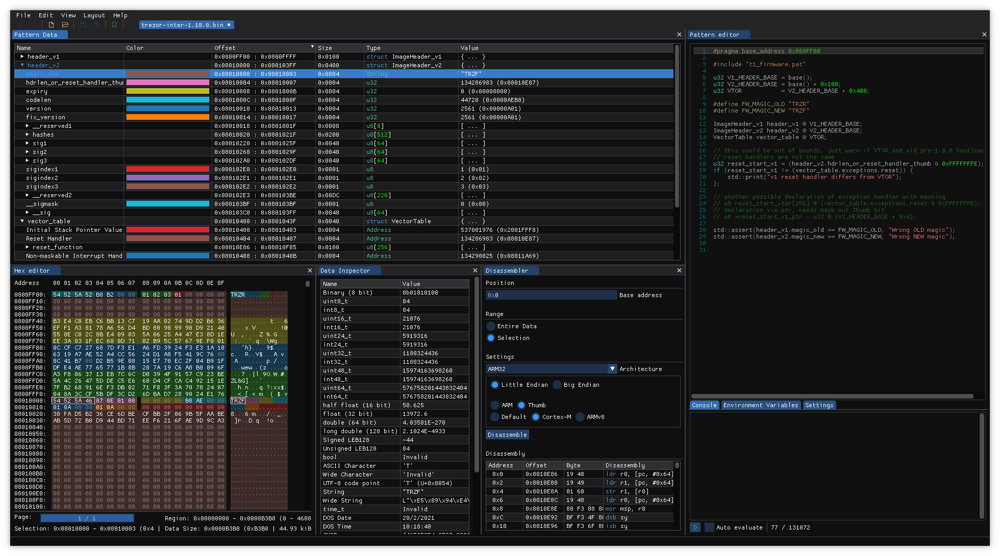

# ImHex patterns for T1 firmware images

ImHex is multiplatform hex editor, with ability to parse binary files
based on patterns.

Here are patterns for decoding binary images, there are 3 types:

1. firmware with both headers (TRZR and TRZF) which we distribute - `t1_firmware_v1+v2.hexpat`
2. firmware built from git (TRZF header) - `t1_firmware_trezor_bin_v2.hexpat`
3. bootloader - `t1_bootloader_bin.hexpat`

## Using ImHex with these patterns

Download ImHex from https://github.com/WerWolv/ImHex or https://imhex.werwolv.net/

### First download base library

You must download standard libraries via menu
`Help->Content Store->Libraries`

### Opening T1 firmware images

In this directory, run `imhex /path/to/some_firmware.bin` (so that patterns can be
found in current directory with includes).

Open pattern via `File->Load Pattern->Browse...` or add the patterns to existing
pattern directories so that you can load without using browse. Pattern dirs are
XDG-BASED, so your dir depending on installation will be something like

* `/usr/share/imhex/patterns`
* `.local/share/imhex/patterns`

or see [where the directories are for other OSes](https://hackersonlineclub.com/imhex-hex-editor-for-reverse-engineers-and-programmers/).

## Sample screenshot

