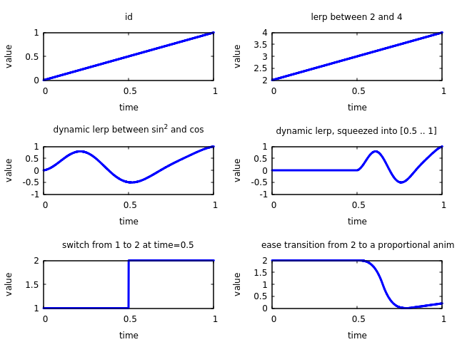

# Pareen
[](https://docs.rs/pareen)
[](https://github.com/leod/pareen/blob/master/LICENSE)
[](https://crates.io/crates/pareen)

Pareen is a small Rust library for *par*ameterized inbetw*een*ing.
The intended application is in game programming, where you sometimes have 
two discrete game states between which you want to transition smoothly for
visualization purposes.

Pareen gives you tools for composing animations that are parameterized by
time (i.e. mappings from time to some animated value) without constantly
having to pass around time variables; it hides the plumbing, so that you
need to provide time only once: when evaluating the animation.

Animations are composed similarly to Rust's iterators, so no memory
allocations are necessary. The downside to this is that it is diffcult to store
pareen's animations. The recommended approach is to construct and evaluate
animations on the fly.

## Current Status
I consider `pareen` to be an experimental approach, and I'm not sure if I'm
still happy with it.  Anyway, the integration of easing functions could use
some love. Contributions are very much welcome!

Unfortunately, it looks like heavily nested animations can cause an exponential
slowdown in compilation time. For now, boxing intermediate animations serves as
a workaround, but this comes with a decrease of both readability and efficiency.

## Examples
```rust
// An animation returning a constant value
let anim1 = pareen::constant(1.0f64);

// Animations can be evaluated at any time
let value = anim1.eval(0.5);

// Animations can be played in sequence
let anim2 = anim1.seq(0.7, pareen::prop(0.25) + 0.5);

// Animations can be composed and transformed in various ways
let anim3 = anim2
    .lerp(pareen::circle().cos())
    .scale_min_max(5.0, 10.0)
    .backwards(1.0)
    .squeeze(3.0, 0.5..=1.0);

let anim4 = pareen::cubic(&[1.0, 2.0, 3.0, 4.0]) - anim3;

let value = anim4.eval(1.0);
```

### Easer
Optionally, you can enable support for integrating easing functions from
[`easer`](https://docs.rs/easer/0.2.1/easer/index.html). 

```rust
let first_anim = pareen::constant(2.0);
let second_anim = pareen::prop(1.0f32);

// Transition from first_anim to second_anim at time 0.5, applying cubic easing
// for 0.3 time units.
let anim = first_anim.seq_ease_in_out(
    0.5,
    easer::functions::Cubic,
    0.3,
    second_anim,
);
```

### Plots
There is an example that shows some animations as plots via
[RustGnuplot](https://github.com/SiegeLord/RustGnuplot) in
[examples/plots.rs](examples/plots.rs). Given that `gnuplot` has been
installed, it can be executed like this:
```bash
cargo run --example plots --feature easer
```

If everything works, you should see something like this:

